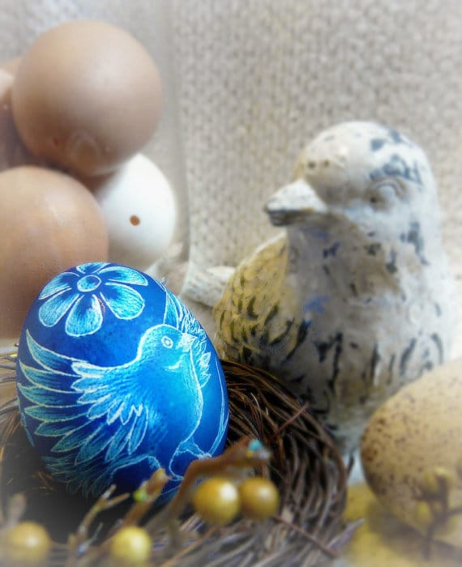
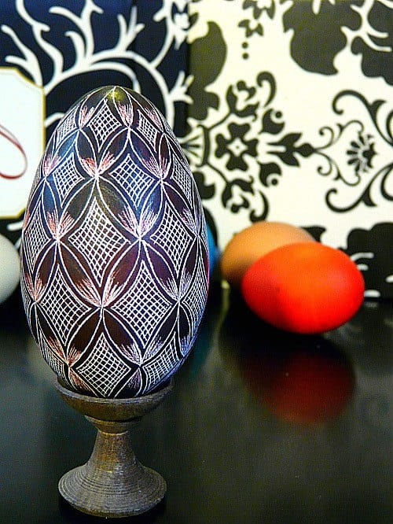
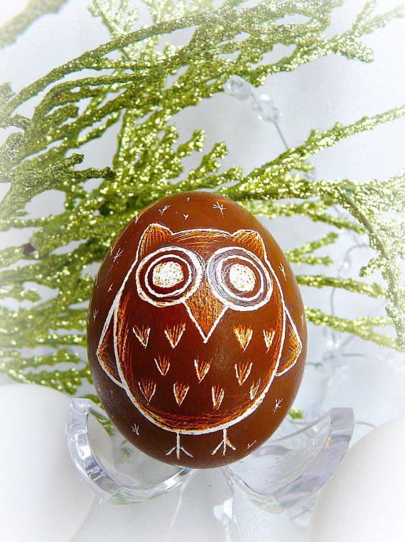
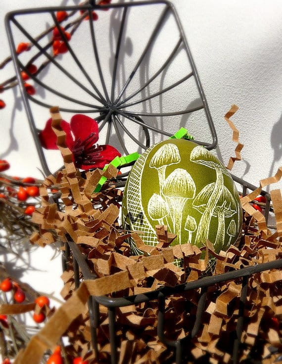
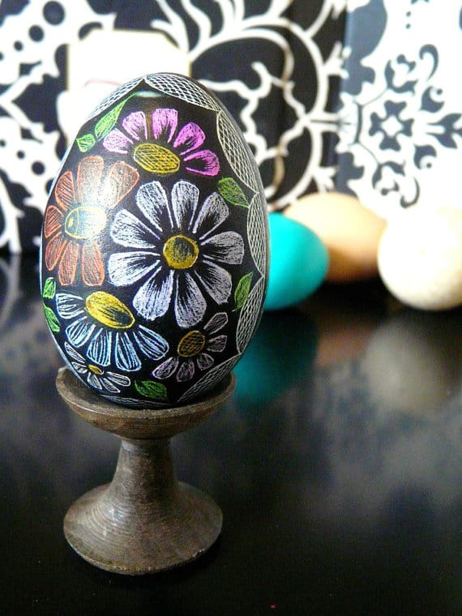

Today’s featured Etsy shop is such a treat! Christine from

[Art By The Dozen](https://www.etsy.com/shop/artbythedozen?ref=pr_shop_more "Art By The Dozen on Etsy")

makes the most breathtaking etched eggs I have ever seen, and I’m thrilled to be able to share them with you (and host a giveaway for one)! I know you are going to love them too- after all,

[Martha Stewart](http://www.marthastewart.com/994136/how-dye-and-etch-eggs "Martha Stewart Etching Easter Eggs")

loved them enough to feature Christine and her gorgeous eggs on her show!

Photo courtesy of the Martha Stewart Show

## Tell us a little about yourself…

_I am Lithuanian. Thus egg art is Lithuanian. When I was 13 my sister was doing a school project about Lithuania. At that point my mom and sister came across scratched egg art. They decided to try it. I also decided to try my hand at egg scratching. I was terrible! I gave up, but not for long. I am stubborn. I tried again and fell in love. Since then, I have not stopped scratching eggs._

## What do you love about your craft?

_I enjoy taking traditional designs and making them modern. I love using eggs from local farmers. It is amazing how an egg shell can turn into art. All my eggs are not wasted. I make quiche and bake to make sure the insides of the eggs are put to good use._

## What item was your favorite to make so far?

_My favorite items so far are the goose egg that is abstract. Also the egg I made for the Martha Stewart show, dandelions fine to seed. These two designs show two totally different types egg art and are both equally unique._

## Where do you find your creative inspiration?

_My creative inspiration comes from everywhere. I take photos of architecture while on vacation. Sometimes I buy cutting books. I take photos of churches in order to try my hand at scratching a traditional church. At times designs from wallpaper or craft paper make great egg designs. Other times I sit with a black egg and start scratching with the hope something new will be born._

## How did you decide to open your Etsy shop?

_Someone told me about Etsy. I started shopping on it when in law school. I thought I’d try and make a shop. I hoped I’d make some money while in school. I put a couple eggs on and went to bed. The next day my shop was empty. I sold out!! From then on I was hooked!_

## Any advice for others who want to start their own Etsy shop, or who are looking to fulfill their passion for crafting?

_I tell people all the time about Etsy. I think its a great way to get you crafts seen! My best advice is to take your time with your items and photos. Photos really are key. People have to see your item clearly and in the most artistic way in order for them to really understand what you have to offer as well as hopefully purchase._

_In the end your shop will look high end when you’re photos are bright and inviting._

Check out more etched egg designs and learn more by following Chrissy here:

Blog:

[www.lithuanianeggart.blogspot.com](http://www.lithuanianeggart.blogspot.com)

Etsy:

[www.etsy.com/shop/artbythedozen](https://www.etsy.com/shop/artbythedozen "Art By The Dozen on Etsy")

Twitter:

[https://twitter.com/teener1416](https://twitter.com/teener1416 "Art By The Dozen on Twitter")

While I take my time to decide which egg I want to buy the most (I LOVE the mushrooms one, but also the dandelions, and also the sunflowers.. oh and all the ones with little birds….), YOU can enter to win a beautiful etched chicken egg of Chrissy’s choosing- that means whoever wins will get a special SURPRISE design! Giveaway ends May 24th at 11:59PM ET. Open to US and Canada only. Please read all terms and conditions!

> _If your entry cannot be verified (or you are a bot and not a human!!), it will be disqualified._

[a Rafflecopter giveaway](http://www.rafflecopter.com/rafl/display/64ecfa7/)
