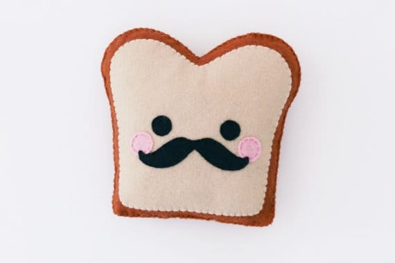
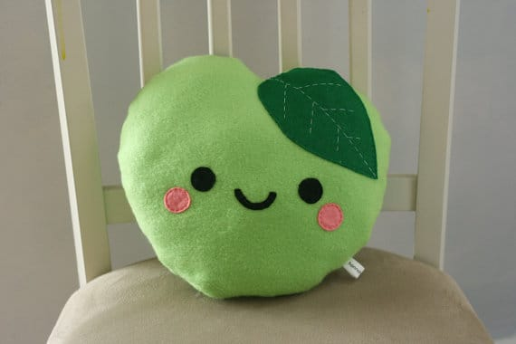
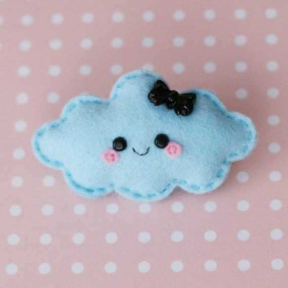

Meet Hannah! \[

_Hi, Hannah!_

] She’s from

[“Handmade by Hannahdoodle”](https://www.etsy.com/shop/hannahdoodle "Hannahdoodle on Etsy")

over on Etsy. She creates the most insanely cute little felt brooches, plushies and more you ever did see. Get ready for your head to explode- and it will when you’ve seen her happy little French-toast-with-a-mustache-brooch!

##

## Tell us a little about yourself…

_My name’s Hannah, I’m from a little town by the sea called Rhyl in the UK. I like sewing, drawing, trying all sorts of new and different food and collecting pens from around the world and everywhere I go. Currently I am working on developing my store and expanding the range of handmade crafts on there, right now I am designing a range of cards that will fit in with the cute theme of my shop._

## What do you love about your craft?

_My brooches and accessories often start as small pencil sketches. I love the transition between paper and creating a finished felt product. Since I sketch ideas in pencil I don’t necessarily decide on colours until I pick out a bunch from my stash of felt. Often the finished product can end up looking miles away from the original sketch, and each piece I make turns out different due to the nature of hand-sewing. I love that handmade items means that each one will be unique._

## What item was your favorite to make so far?

_My favourite item to make so far has definitely been my Neapolitan Ice Cream brooch. I originally got the idea after a day trip at Llandudno pier (a local seaside town) and saw that someone had three different scoops of ice cream towering above their cone. I wondered how that would translate in felt compared to my previous brooches of only one flavour, so quickly began sewing together some classic neapolitan colours. It’s my favourite because it’s a very cheerful, playful looking brooch, and who wouldn’t want an ice cream cone towering with all your favourite flavours?_

## Where do you find your creative inspiration?

_Most of my inspiration admittedly comes from food! I love food, and I’ve always had a very big sweet tooth. Also anything cute! I travelled to Korea a few years ago and was inspired by all the Kawaii stationery I saw and fell in love with._

## How did you decide to open your Etsy shop?

_It was a long summer between finishing my exams at school and attending University, after getting a few compliments at school about the handmade felt brooches that adorned my bag I decided to see if anyone else would be interested in them online. I still remember my first sale on Etsy and how excited it made me feel, someone paying for something I’d made? I could barely believe it. I still get the same feeling every time I make a sale today, and I love making people smile with my creations._

## Any advice for others who want to start their own Etsy shop, or who are looking to fulfill their passion for crafting?

_If you want to start your own Etsy shop, go for it! Even if you don’t think anything will sell, do it anyway! Try not to undervalue your craft, it often takes years to learn how to do something well, think of that time before deciding on prices, most shoppers on Etsy understand that handmade takes love, care and time and will pay a little more. Try everything you can in crafting, you never know where your passion will end up._

In addition to checking out her

[Etsy shop](https://www.etsy.com/shop/hannahdoodle# "Hannahdoodle on Etsy")

, you should make sure to follow Hannahdoodle on these sites as well!

Blog:

<http://hannahdoodle.blogspot.co.uk/>

Twitter:

<https://twitter.com/hannahradio>

Tumblr:

<http://hannahdoodle.tumblr.com/>

If your brain didn’t explode from the cuteness yet, leave a comment and tell us which your favorite Hannahdoodle creation is! We’d love to hear from you!
