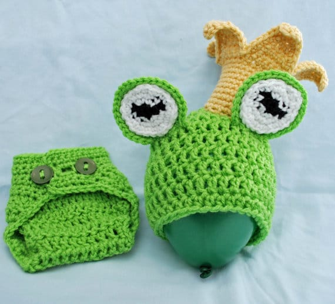
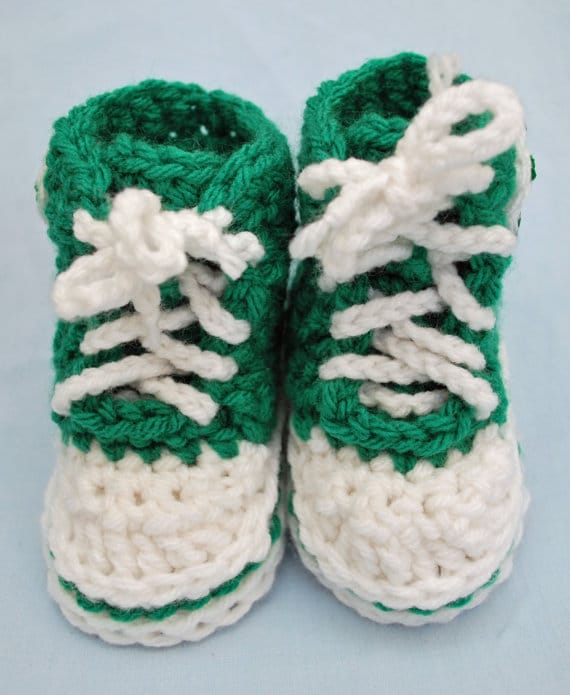

**\&#xA;**

We’re halfway through week two of National Crochet Month! Today’s Featured Etsy shop is

[**Hatt Street**](https://www.etsy.com/shop/hattstreet "Hatt Street on Etsy")

! The owner, Kendra, makes adorable baby hats, props, sandals and more (and her oh-so-cute son models them!) In addition to learning more about this awesome featured shop, Kendra is doing a

**GIVEAWAY****right here**

for a

**CUSTOM**

hat!

## Tell us a little about yourself…

_I grew up on the West Coast of Canada, and moved to Ontario seven years ago with my husband. I have an amazing 9 month old son who is full of smiles and most definitely keeps me on my toes. When I’m not crocheting away his nap time, I occasionally sneak out of the house to go snowboarding (leaving him with a responsible adult, of course!), teach piano, and generally keep myself occupied playing entertainer for my baby._

Seriously? How cute would your kid look in this bunny outfit for Easter?!

## What do you love about crocheting?

_I love the challenge of working out a new pattern. I’ll see something that inspires me, and think about how I can turn it into something crocheted and beautiful. It takes some trial and error, but usually I can get it tweaked to my satisfaction. I’m a bit of a perfectionist, so it is really important to me that everything lives up to my vision. I also love bright colours, so the more of those I can incorporate into my crocheting, the happier I am!_

## What item (or pattern) was your favorite to make so far?

_It’s a tough choice between my frog prince photography prop set, and my peacock photography prop set, though I did love jumping on the minion bandwagon! I think overall my favourites to make are my photo prop sets – there’s just so much room for creativity. I am a little sad, though, that my son is too big to model for me now!_

## Where do you find your creative inspiration?

_Everywhere! Things people say to me, the internet (let’s face it, google image search is amazing!), the seasons, weather, holidays, people on the streets, things I see out snowboarding, custom orders, deadlines…._

## How did you decide to open your Etsy shop?

_Tough question. This has a two part answer, because I’ve technically opened it twice! I first opened my shop in 2009 (or so Etsy tells me!) when I lived on Hatt Street in Dundas, and sold mostly hats (yep, clever). I had a lot of business mostly from friends and family, and they encouraged me to put myself out there, and a friend suggested I try Etsy. I checked it out, and it seemed like a good route to go, so off I went. I did well for the first little bit, but my day job started picking up, and I had less and less time to spend on my crafting. Eventually I just let the shop go, let my listings expire, and went on hiatus for a few years. I still did custom orders for friends and family, but nothing formal. Since my son was born, I’ve been enjoying my maternity leave perhaps a little too much, because now I don’t want to go back to work! However, that’s not exactly practical, so now I’m on a mission to revamp my shop, revamp my inventory, and hopefully spark a little cash flow so I don’t end up raising my child in a cardboard box._

## Any advice for others who want to start their own Etsy shop, or who are looking to fulfill their passion for crafting?

_Be patient! There is so much out there right now, that it’s easy to get lost in the shuffle. But perseverance pays off, and if you believe in your product, others will too. Take pride in your work, because crafting is always one of a kind, and people appreciate that. Handmade is incredibly popular right now!_

__

Kendra is celebrating National Crochet Month with us by offering Katie Crafts readers a chance to WIN a FREE CUSTOM hat of your choosing! Personally, my favorite is the Minion hat.. but then, it’s probably because I want to wear it myself. This raffle is a world-wide one!

\*Note: You can enter to win until

**Monday, March 17th at 11:59PM EST**

. Winner will be announced on Katie Crafts blog (as well as emailed) on Tuesday, March 18th. Winners have 48 hours to contact me so we can get you the prize! If no winner comes forward, I’ll select another. Make sure you

**LIKE**

both

[Katie Crafts](https://www.facebook.com/imkatiecrafts "Katie Crafts on Facebook")**AND**[Hatt Street](https://www.facebook.com/Hatt.Street "Hatt Street on Facebook")

on Facebook before you enter! Click the ‘check mark’ after you’ve completed each entry, or it won’t be counted!

Please read Terms & Conditions for more details!

[a Rafflecopter giveaway](http://www.rafflecopter.com/rafl/display/64ecfa1/)

If you’d like to buy one of Hatt Street’s wonderful crocheted items, they are offering

**FREE SHIPPING**

during the month of March! Use code

**FREEship**

at checkout! And don’t forget to like

[**Hatt Street on Facebook**](https://www.facebook.com/Hatt.Street "Hatt Street on Facebook")

for more updates from one of the cutest shops around!
