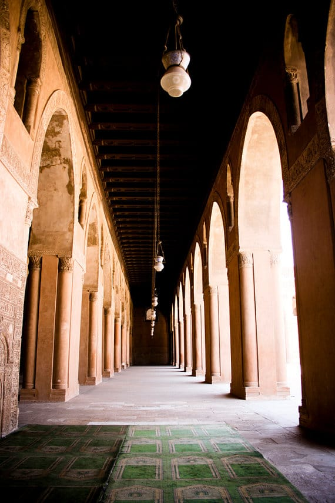
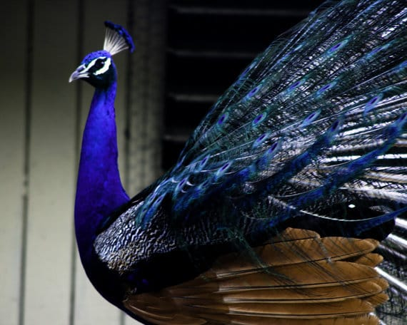

Our featured Etsy artist today is Hena from

[**Hena Tayeb Photography**](https://www.etsy.com/shop/HenaTayebPhotography "Hena Tayeb Photography on Etsy")

! It’s also our first shop post that features fine art photography, so I’m really excited to share it! Hena’s architectural and travel photographs are breathtaking, so enjoy this post, Hena’s work, and the generous coupon she has ready for you readers!

## Tell us a little about yourself…

_I am a Chicago born Pakistani photographer living in New Jersey. I love to find unusual abstracts and angles allowing the ordinary to appear extraordinary. I zoom in and bring light to the details of things around me. Creating abstracts and bringing attention to textures and patterns. My husband and I, along with our three year old boy and newborn love to travel enabling me to capture my adventures in bold, high contrast, dramatic photographs._

## What do you love about your craft?

_I love capturing a moment, I love being able to show people how beautiful and extraordinary the most ordinary things around us can be, the things we overlook so often._

## What item was your favorite to make so far?

_Each one of my photographs has been taken on one of our travels, each one comes with a story, attached to a memory._

## Where do you find your creative inspiration?

_I find inspiration everywhere around me, every new city we travel to, the streets, the architecture, especially the architecture._

## How did you decide to open your Etsy shop?

_I wasn’t quite ready for a website and I was looking for a place where I could try selling my work.. Etsy seemed like the perfect place._

## Any advice for others who want to start their own Etsy shop, or who are looking to fulfill their passion for crafting?

_Be patient, success doesn’t come over night. Take great photographs. Social Media is your friend, use it._

Want to learn more about Hena? Check out all her social media links below!

Etsy:

[www.etsy.com/shop/HenaTayebPhotography](https://www.etsy.com/shop/HenaTayebPhotography "Hena Tayeb Photography on Etsy")\
**Website:**[www.henatayebphotography.com](http://www.henatayebphotography.com)\
**Blog:**[www.henatayeb.blogspot.com](http://www.henatayeb.blogspot.com)\
**Facebook:**[www.facebook.com/henatayebphotography](http://www.facebook.com/henatayebphotography)\
**Twitter:**[www.twitter.com/henatayeb](http://www.twitter.com/henatayeb)

Hena is providing Katie Crafts readers a generous exclusive coupon for

**FREE shipping**

in her

[Etsy shop](https://www.etsy.com/shop/HenaTayebPhotography "Hena Tayeb Photography on Etsy")

! Use code

**KCfreeship**

at check out!

