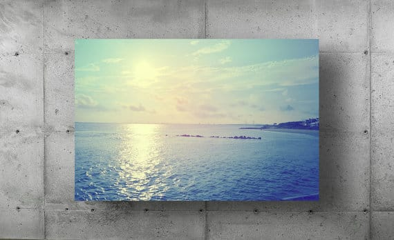
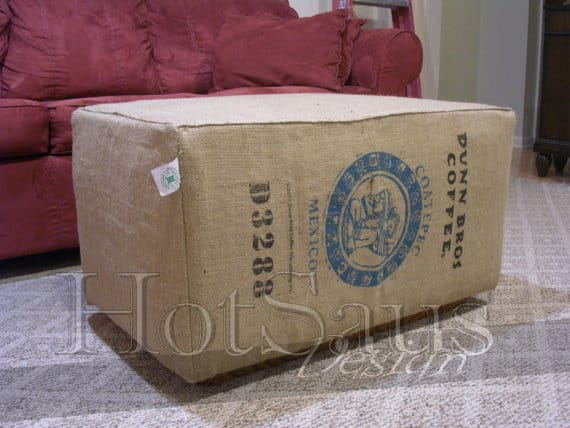
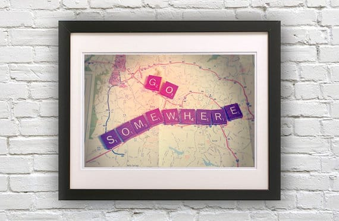
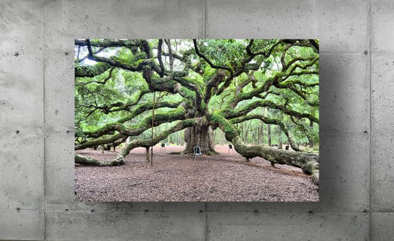

Today’s Wednesday featured artist is a fellow Pennsylvanian, Ron from

[HotSaus Design on Etsy](https://www.etsy.com/shop/HotSausDesign "HotSaus Design")

. The shop specializes in fine art photography and has some really beautiful pieces alongside some totally creative ones (like the amazing

[fireworks](https://www.etsy.com/listing/172083254/andy-warhol-bridge-fireworks-at-night?ref=shop_home_feat_4 "Andy Warhol Bridge Fireworks HotSaus Design on Etsy")

one above!) Check out my favorite photographs from his shop below!

## Tell us a little about yourself…

_Engineering Student from Pittsburgh, PA. Amateur Photographer._

## What do you love about your craft?

_The number one thing I love about photography is that I can capture a tinny sliver of time and make it last forever. In addition, the photograph, while being a fixed point in time, is constantly evolving; you just notice new things every time you look at it._

## What item was your favorite to make so far?

_I only have a few items in my shop that are hand made. The ottoman was by far the most enjoyable to make. I took a number of discarded materials and turned them into a functional piece of furniture. Saving them from being tossed in the landfill._

## Where do you find your creative inspiration?

_In this day and age, I would have to say internet._

## How did you decide to open your Etsy shop?

_People just kept saying I should sell my photography. For me it was something I never considered and more of just a hobby. But the suggestions got the wheels turning and I decided on Etsy._

## 

## Any advice for others who want to start their own Etsy shop, or who are looking to fulfill their passion for crafting?

_Just do it, with Etsy the barrier to entry is so low that anyone can open a shop._

Want to see more HotSaus Designs? Here are other ways to follow!

Facebook:

[Facebook.com/HotSausDesign](http://Facebook.com/HotSausDesign)

Tumblr:

[HotSausDesign.tumblr.com](http://HotSausDesign.tumblr.com)

Pinterest:

[pinterest.com/hotsausdesign](http://pinterest.com/hotsausdesign)

Twitter:

[twitter.com/HotSausDesign](http://twitter.com/HotSausDesign)

