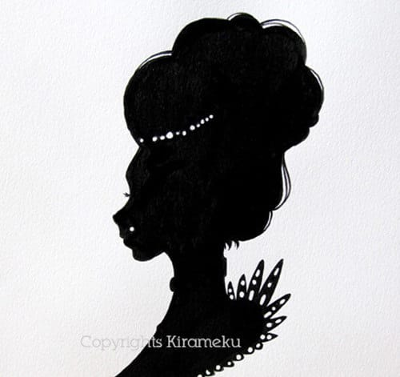
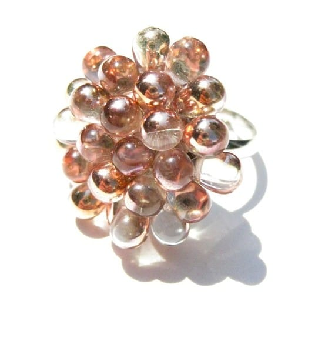

Today’s featured Etsy shop artist, Maxime, is a very special one! Here are three reasons to love Maxime: 1- Her really fun blog,

[“Sparkling & Sweet,”](http://kirameku412.blogspot.ca/ "Sparkling and Sweet")

is one of my sponsors (see her ad right there on the right sidebar?); 2- She has a super cute Etsy shop,

[Kirameku](https://www.etsy.com/shop/kirameku "Kirameku on Etsy")

, filled with beautiful handmade jewelry; 3- TODAY IS HER BIRTHDAY!!! We thought what better way to celebrate than to have our featured shop post be a day early? Happy birthday, my dear!!

## Tell us a little about yourself…

_Hi there, I’m Maxime, nice to meet you all!: ) I’m now 26, I’m a graphic designer by day and illustrator/jewelry maker by night. I’m living with Montreal, Canada. I love baking sweets, shoes and anything that shines! I love to create and I love to share, that is why I was drawn in with Etsy. I have studied Fine Arts for more than 7 years and my favourite mediums are acrylics and inks._

## What do you love about your craft?

_What I love the most about Kirameku is to be able to make your wishes come true! I love making custom orders, imagining the piece for your special occasion. And I simply love making jewelry for weddings, those are my favourite! 😀_

## What item was your favorite to make so far?

_Favorite to make… wow this is a hard question, I love them all!!! If I have to choose only one, I would say I love my new wedding line; I simply love how the pearls and crystals enhance the beauty of the berry charm._

## Where do you find your creative inspiration?

_I think jewelry should be feminine and classy. And I love glamorous and sparkling things! These are my main inspirational guidelines. I would say that my inspiration comes from various fashion magazines or clothes I see in stores, as well as vintage jewelry, especially from the 50’s. I can be shopping and once I’ll be home, I’ll start sketching about this new earrings that would fit for example this fit and flare dress I just saw. I want to have a feminine collection but with bold colors that will give it a modern look._

## How did you decide to open your Etsy shop?

_Whenever I wanted jewelry, I could never find a piece that suited my taste and my budget. So I started sketching, experimenting and eventually discovered the ”Berries”. A friend of mine suggested Etsy as my designs became more and more popular with my entourage, and I loved the concept! 🙂 I wanted to share my creations with women around the world that were also looking for that very unique and hard to find jewelry pieces._

## Any advice for others who want to start their own Etsy shop, or who are looking to fulfill their passion for crafting?

_Start with a plan! As many Etsy sellers I’ve started my Etsy shop with the idea of sharing my craft, but without having a budget plan, or a marketing plan etc. Get informed! There are so much more resources online then when I started 5 years ago, you’ll find plenty of articles with an aspect you haven’t thought about. Draw the basic lines of your project before you start, that will make it so you can start your business with a bang and keep it going! 😉_

If you want to follow Maxime and see what new and beautiful things she creates (I’m obsessed with her berry rings!), you can find her on

[Etsy](https://www.etsy.com/shop/Kirameku "Kirameku on Etsy")

,

[Facebook](https://www.facebook.com/kirameku412 "Kirameku on Facebook")

,

[Pinterest](http://www.pinterest.com/kirameku412/ "Kirameku on Pinterest")

and her blog,

[Sparkling & Sweet](http://kirameku412.blogspot.com/ "Sparkling and Sweet")

.

Maxime is celebrating her birthday with Katie Crafts readers by offering you an exclusive

**20% off**

coupon! You can use coupon code

**FAIR2013**

at checkout in her shop!

_Happy birthday again, Maxime!!_
