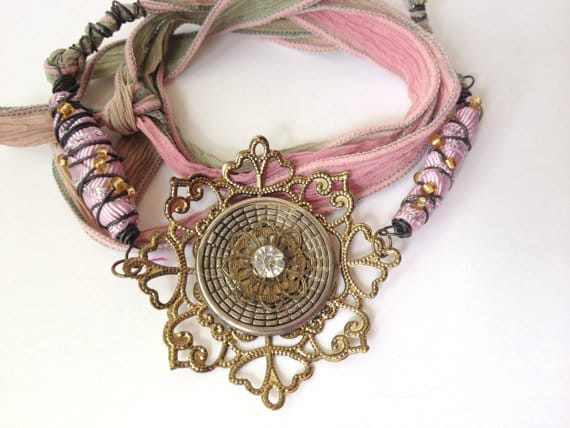
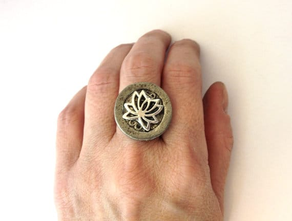
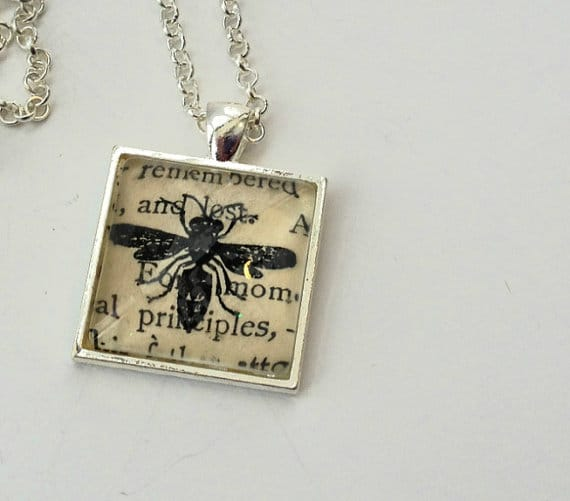
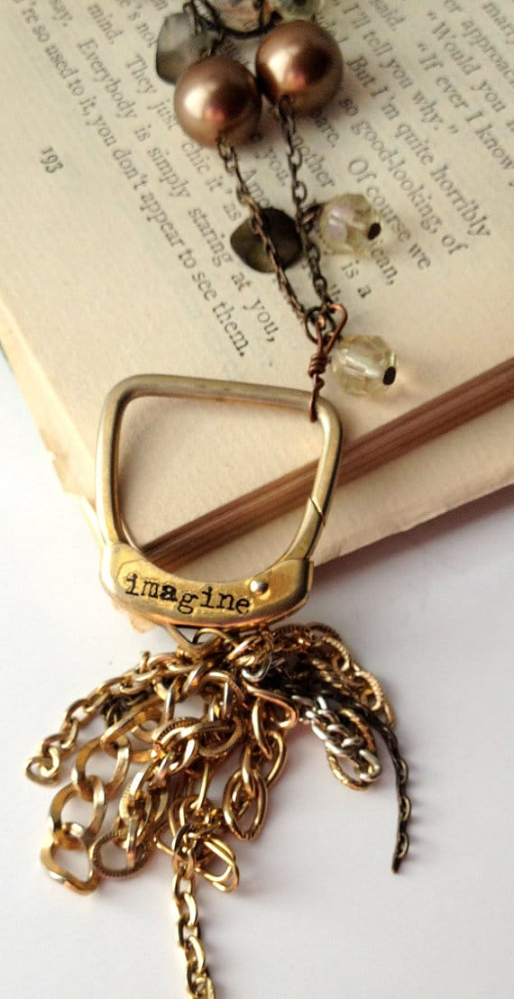

The featured artist of the day is

_Kyle_

from

[**Kyle Looby Jewelry**](https://www.etsy.com/shop/KyleLoobyJewelry "Kyle Looby Jewelry on Etsy")

on Etsy! She is a super talented artisan who recycles everyday items into beautiful unique pieces of jewelry. Read all about her and her work below, and then find out how you can enter to win the gorgeous hand stamped bracelet above reminding you to

[_“Be Brave”_](https://www.etsy.com/listing/190882447/reserved-fabric-wrapped-hand-stamped?ref=shop_home_active_8 "Be Brave Bracelet on Kyle Looby Jewelry")

!

## Tell us a little about yourself…

_Kyle Looby is a jewelry artist living and working in Springfield, Illinois. She was born in 1970 in Mt. Vernon, Illinois. Her B.A. in English was received from Southern Illinois University, her M.A. from University of Illinois-Springfield. Largely self-taught, Looby began her design career in 2010 at the age of 40 as a creative outlet from her career in legislation for the State of Illinois. Her eclectic designs using recycled materials immediately gained attention locally and in 2010, Looby opened her Etsy shop and began exploring retail markets._

_After a three year hiatus from designing, Looby immersed herself in her jewelry work and expanded access to her designs through wholesale opportunities and by joining a locally-owned artist co-op. Her first show in three years was the juried Gazebo Art Festival in Macomb, Illinois, where her unusual designs were a big hit. In 2014, she began shipping out pieces all over the United States via her Etsy shop and appearing at numerous local art and craft shows. Her work is currently located at the Studio on 6th in Springfield, Illinois, and Tossed and Found retail store also in Springfield._

## What do you love about your craft?

_The very best thing about what I do is the look on someone’s face when they find a piece of jewelry that speaks to them. At a show last year a young woman was browsing and suddenly snatched up a watch in which I had replaced the face with a tiny rhinestone brooch. She turned to me, her face all aglow, and said, “My grandmother wore this exact same watch all the time. She died last year. And now I can wear one, too.” That is exactly why I do this. Not everyone has family heirlooms but if I can help them find something that reminds them of their past, that is the most awesome feeling in the world._

## What item was your favorite to make so far?

_A necklace made with a small, ornate clock key. My grandfather collected clocks, among other antiques. My grandparents’ living room walls were covered ceiling to floor with shelves of clocks. He died when I was in college and my key necklace reminds me of him. I wear it almost every day. It’s one of the few pieces of my jewelry that I have kept for myself._

## Where do you find your creative inspiration?

_The “junk” itself inspires me. I rarely have a design in mind when I shop for supplies. It’s more that I prowl through thrift stores, antique malls, and yard sales to find things that speak to me. I often have no idea how I will use them until I sit down with my junk all around me and starting fitting the pieces together._

_And of course, I find inspiration in other artists. Diana Frey, Deryn Mentock, and Audrey Charlton (Principessa Jewels) are amazingly talented women who do what I do, but do it much better._

## How did you decide to open your Etsy shop?

_I was getting so much positive feedback from friends about my work and one friend suggested I sell on Etsy. I hadn’t sold to anyone but friends and family at that point, but of course I loved the idea of making money from the thing I loved doing best so I could buy more junk! The work is the main thing for me; making money from it is icing on the cake._

## Any advice for others who want to start their own Etsy shop, or who are looking to fulfill their passion for crafting?

_I had not a clue what I was doing when I started Etsy and I’m still learning all the time. My best advice, and what I wish I had done from the very beginning, was do your research. Know who else is doing what you do; study them; and find a way to distinguish yourself. Be different and find your niche. Then be prepared to work your butt off every day by taking great photos and writing thoughtful descriptions. Learn everything you can about SEO optimization._

_Also, get out into your community. Do craft shows and join an artist co-op if you can. It’s so important to have other artists to talk to you and to get feedback–good and bad–from your customers. Craft shows are pure market research._

Today, Kyle Looby Jewelry is giving away

[this beautiful bracelet](https://www.etsy.com/listing/190882447/reserved-fabric-wrapped-hand-stamped?ref=shop_home_active_8 "Wrapped Hand Stamped Bracelet from Kyle Looby Jewelry")

! If you don’t want to wait to see if you win, you can buy something from her shop for

**25% off**

right now if you spend

**$20.00**

or more! Just use coupon code

_**KatieCrafts**_

at checkout! (Bonus: all Facebook fans get free shipping on their orders!)

Check out all of Kyle’s social media accounts and then sign yourself up for the free bracelet giveaway!

[Facebook](https://www.facebook.com/KyleLoobyJewelry "Kyle Looby Jewelry on Facebook")

♥︎

**[Pinterest](http://www.pinterest.com/kylooby/ "Kyle Looby Jewelry on Pinterest")**♥︎**[Twitter](https://twitter.com/KyleLoobyJewelr "Kyle Looby Jewelry on Twitter")**♥︎**[Blog](http://www.kyleloobyjewelry.com/ "Kyle Looby Jewelry's Blog")**♥︎**[Instagram](http://instagram.com/kylelooby "Kyle Looby Jewelry on Instagram")**

_Please read all terms and conditions before signing up for the raffle! If you are a bot or your entry cannot be easily verified, you will be disqualified. Giveaway open to US residents only._

[a Rafflecopter giveaway](http://www.rafflecopter.com/rafl/display/64ecfa14/)
