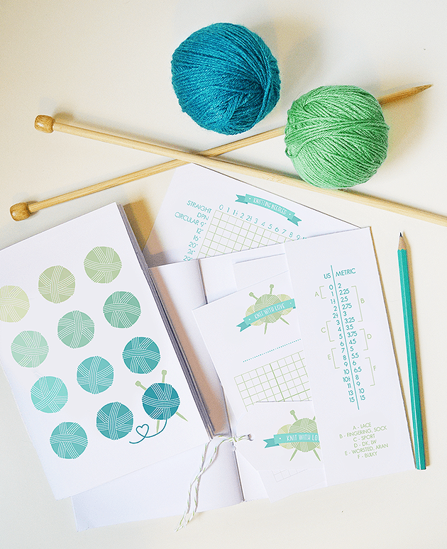
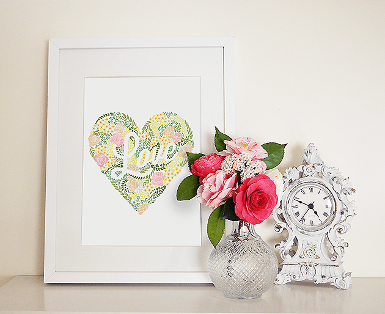
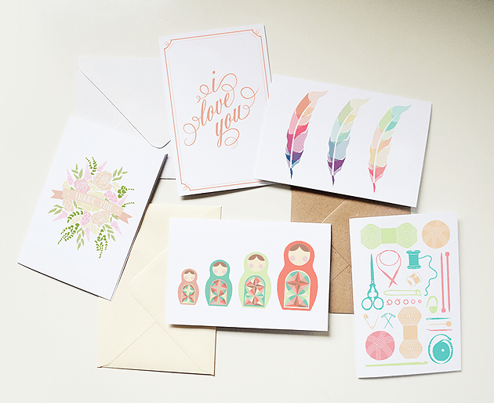

Our featured artist today is Holly over at Lucky Ink. You’ll find gorgeous stationary, prints, notebooks and more in her

[Etsy shop](https://www.etsy.com/shop/LuckyInkDesign "Lucky Ink Design on Etsy")

, and tons of inspiration over at her

[blog](http://luckyink.org/ "Lucky Ink")

! I adore the clean lines and simple beauty of Holly’s items, and I know you will too! I also know you’ll totally flip for the amazing giveaway she has in store for us below… 😉

## Tell us a little about yourself…

_Hello, I’m Holly! I’m currently living in Portugal, but I was born and raised in California. I absolutely love graphic design, DIY, knitting, baking, and travelling._

## What do you love about your craft?

_Being able to make something that will hold a lot of meaning for someone, whether it’s a personalized Birthday card or stationery, or a wedding suite. I love the idea of that my work is part of a special moment!_

## What item was your favorite to make so far?

_Design wise, I’d definitely say my floral collage deer art print. I sketched the idea with no detail, not sure how I would actually pull it off. It turned out even better than I could have imagined and I’m really proud of it!_

_Craft wise, I am really proud of my notebooks. This was another idea I wasn’t sure I could make, and I didn’t think I had the skills to do it right. Once I got everything I needed, and after much trial and error, I was so happy with how it came out._

## Where do you find your creative inspiration?

_From anything, really! I’m very much inspired by patterns and shapes, but sometimes it’s as simple as a color palette that inspires me. Traditional prints, vintage/retro patterns, sometimes even fabric or jewelry, really anything that has nice lines and bold shapes._

## How did you decide to open your Etsy shop?

_I have had an Etsy shop together with my mom since 2006 (sewing bags), but I always knew I wanted a store of my own one day. I think the hardest thing was deciding what I was going to make to sell, because I love making so many different things. Once I realized my biggest passion was graphic design, stationery was an easy choice!_

## Any advice for others who want to start their own Etsy shop, or who are looking to fulfill their passion for crafting?

_Don’t doubt yourself! The reason it took me so long to open my store is because I was constantly second guessing myself. Etsy is full of amazing, talented people, which can be intimidating, but the reality is: everyone brings their own talents, aesthetic, style and skills to their store, so your store will never be like anyone else’s. As long as you’re willing to put in the hard work (customer service, promoting, SEO, networking, making new stock etc.) and are truly passionate about what you do (so it doesn’t feel like hard work!) you will be successful!_

Please check out Holly on

[her blog](http://luckyink.org/ "Lucky Ink")

,

[Instagram](http://instagram.com/luckyinkdesign# "Lucky Ink Design on Instagram")

,

[Twitter](https://twitter.com/LuckyInkDesign "Lucky Ink Design on Twitter")

and

[Facebook](https://www.facebook.com/LuckyInkDesign "Lucky Ink Design on Facebook")

accounts, too!

Holly is giving one lucky Katie Crafts reader a really great gift: $30 store credit

_OR_

3 art prints! We want everyone to have a chance to enter this special raffle, so we’re extending it right off the bat- you until April 28th at 11:59PM to enter to win this wonderful prize!

\*This raffle is open internationally. Please check terms and conditions for details. Good luck!

[a Rafflecopter giveaway](http://www.rafflecopter.com/rafl/display/64ecfa4/)
