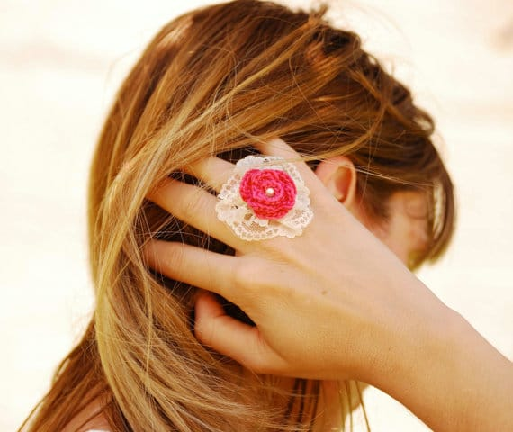

Yay! Our Etsy Features posts are finally back with a new permanent day: Thursdays! We pick back up tradition with a fabulous Etsysian named Lia and her shop called

[Me and Mama Creations](https://www.etsy.com/shop/MeandMamaCreations "Me and Mama Creations")

. Check out Lia’s interview below and find out how you can enter to win one of her awesome items!

## Tell us a little about yourself…

_As the shop name suggests “me and mama creations” all the jewelry and accessories you will find in our shop are handmade by me and my mother. My mother specifies in crochet projects, while I prefer the bead work. The idea of making jewelry started in 2008 when I took beading lessons. When I show my mothers a few techniques we both agreed that we liked that hobby that it finally ended in making so much of them that we started to sell to our colleagues and friends, until I found “_

_[etsy.com](http://etsy.com/).“_

## What do you love about your craft?

_What I love about crafting is that I can make decorations, jewellery and things for my children with my own hands._

_Ever since I decided to make jewellery and accessories I had the opportunity to make gifts for my friends and family. The fact that they enjoy wearing and having something that I made especially for them with care and love gives me the motive to continue crafting._

## What item was your favorite to make so far?

_A colourful, playful long necklace with crochet miniature tops (_

_[pictured below](https://www.etsy.com/listing/157629406/handmade-crochet-jewelry-colorful-long?ref=shop_home_feat_4 "Crochet Long Necklace from Me and Mama Creations on Etsy"))_

## Where do you find your creative inspiration?

_Inspiration has no limits. Sometimes I get inspired from the nature, a painting but most of the times from the materials I have in my cupboard_

_._

## How did you decide to open your Etsy shop?

_I talked with friends of mine who already opened a shop and they persuaded me that it has better to open a shop where there is already a customer base, than to strive alone with a website where you should build you customer list from zero._

## Any advice for others who want to start their own Etsy shop, or who are looking to fulfill their passion for crafting?

_Have faith at their work and patience, because it needs a lot of time and hard work until you finally get your first sales coming!_

Be sure to check out Me and Mama Creations on their social media accounts!

[Etsy](https://www.etsy.com/shop/MeandMamaCreations "Me and Mama Creations on Etsy")

**♥[Pinterest](http://www.pinterest.com/eoikonom/ "Me and Mama Creations on Pinterest")**♥**[Facebook](https://www.facebook.com/meandmamacreations "Facebook Me and Mama Creations")**

Ready to win one of

_Me and Mama’s Creations_

? You can enter to win this beautiful hot pink bow ring with lace! This giveaway is open for anyone

_18 and older, worldwide_

! It will run until

_11:59PM ET on November 16th_

! Please read contest rules for all details. Good luck!

[a Rafflecopter giveaway](http://www.rafflecopter.com/rafl/display/64ecfabc22/)

Do you want to be featured on a Thursday post? Email me!
