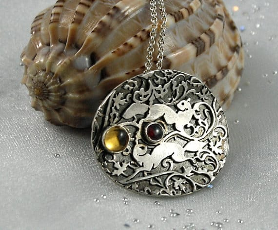
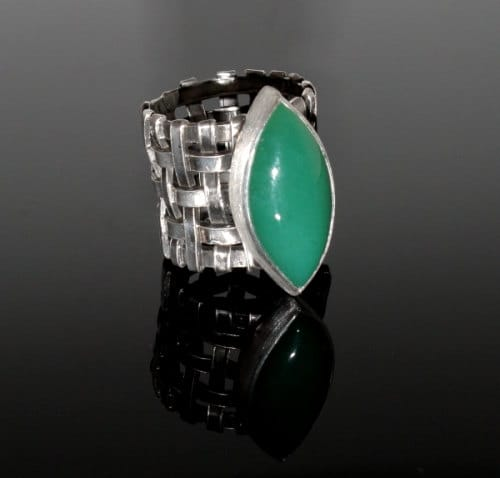
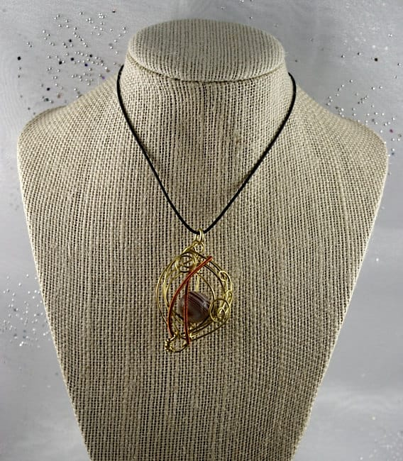

Today’s featured Wednesday artist is one you all know and love:

[**Natalia Khon**](https://www.etsy.com/shop/nataliasjewellery "Natalia's Jewellry on Etsy")

! I’ve loved Natalia’s fine jewelry since the first time I saw it a few months ago, and am very excited to host a giveaway of one of her unique pieces! Learn more about Natalia below, and find out how you can sign up to win!

## Tell us a little about yourself…

_Russian-born artist Natalia Khon began designing jewelry at the age of sixteen but considered her passion for art a hobby so pursued a degree in finances instead. When Natalia immigrated to British Columbia in 2002, nature became an inexhaustible source of inspiration for her, which made the young artist realize herself a jeweler not a financial advisor._

_As a result Natalia enrolled herself in the two-year Jewelry Art and Design program at Vancouver Community College, graduating in 2005 a jewelry-technician, well versed in a myriad of jewelry techniques. The artist explores design by combining and developing these diverse techniques using beads, clay, wire and metal plate._

_When Natalia is away from her studio, she is busy sharing her knowledge of silver-smithing with her students; she enjoys the joy of experimentation and development through teaching. Natalia’s work has been exhibited at art and fashion shows and is available in galleries and boutiques throughout the Lower Mainland._

\
What do you love about your craft?
----------------------------------

_I love working with the metal. It is a long term passion that did not come overnight. I loved making jewelry and signed up for a 2-year course without knowing anything about metalwork. When I started learning… I hated it! I could not saw a straight line and could not solder a ring. I prepaid for the course and did not dare to drop out. That kept me going and made me learn. The techniques that I hated the most have become my favorites over time. I’ve mastered my metal piercing and my soldering technique that I use to make my signature designs now with._

\
What item was your favorite to make so far?
-------------------------------------------

_I had to think for a few seconds. There are so many interesting designs that have a story behind them! I enjoyed making all of them. I think, though, my_

_[squirrel design](https://www.etsy.com/listing/160531749/sterling-silver-squirrel-necklace-wild "Sterling Silver Squirrel Necklace by Natalia Khon on Etsy")will be my forever favorite_

\[pictured above.]

_I knew I would make it a long time before I had the skills for it. I had my grandma’s book about housekeeping. In 1950s that was a great book about everything: recipes, knitting, sawing, wood carving, etc. The squirrels (and deer, that I also made into jewelry) were part of a design for a wooden jewelry box. I still do not know what I would be making if it was not for those squirrels and deer. They made a great impact on my jewelry design!_

## Where do you find your creative inspiration?

_When I begin working on a new piece of jewelry, I am reminded of my love for nature and the necessity for the new piece to be comfortable on the wearer and become part of their everyday life. When people see my work, I hope that they are reminded of nature in all its beauty and are reminded of their soulful connection to nature. I want my nature-inspired jewelry to enhance the wearer’s beauty. I am happy if I succeed in making a piece that the wearer does not have to wait for a special occasion to wear._

\
How did you decide to open your Etsy shop?
------------------------------------------

_Deciding to open was easy. Artists at the craft fairs would always put their Etsy shop address in their business cards. However, it did not work for me at that time. It was a long journey to re-open the shop. I’ve met a few people who were doing well. They inspired me to look at the opportunity again. When I’ve become a mother of a young baby, then I realized that was my chance to work from my home studio and spend more time with him._

## Any advice for others who want to start their own Etsy shop, or who are looking to fulfill their passion for crafting?

_Etsy is a great place that lets you start even if you have just a few things to sell. You start little by little, no rush, no pressure. Join as many teams as you can, read on SEO and participate in the promotional games. It takes some work to get noticed. If you are willing to work you will get sales._

Follow

[Natalia](https://www.etsy.com/shop/nataliasjewellery "Natalia's Jewellry on Etsy")

on all her social media sites below!

[Blog](http://magicjewellerybox.blogspot.ca/ "Natalia Khon's Blog")

♥︎

[Facebook](https://www.facebook.com/natalia.khon.jewellery "Natalia Khon Jewellry on Facebook")

♥︎

[Twitter](https://twitter.com/nataliakhon "Natalia Khon on Twitter")

♥︎

[Pinterest](http://www.pinterest.com/jewelleryfan/ "Natalia Khon Jewellry on Pinterest")

You can win this!!

Now is your chance to get one of Natalia’s wearing works of art for yourself! This

[unique pendant](/www.etsy.com/ca/listing/161601763/wire-wrapped-necklace-made-of-copper/ "Wire Wrapped Necklace from Natalia Khon")

\[above] is a wire wrapped Botswana agate bead. The metals are copper and brass. This is one of a kind pendant! This giveaway is open for anyone

_18 and older, worldwide_

! Will run until

_11:59PM ET on August 5th_

! Please read contest rules for all details. Good luck!

[a Rafflecopter giveaway](http://www.rafflecopter.com/rafl/display/64ecfabc18/)

Don’t forget about the other

[giveaway](/giveaway-chelsea-victoria/ "Giveaway with Chelsea Victoria")

going on this week, too! Two giveaways in three days- must be a lucky week!
