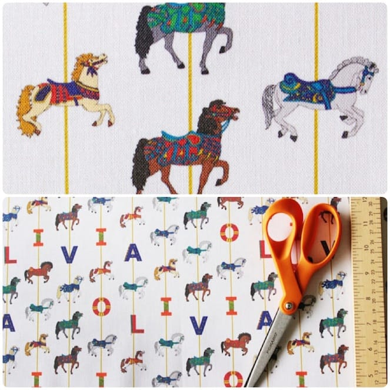
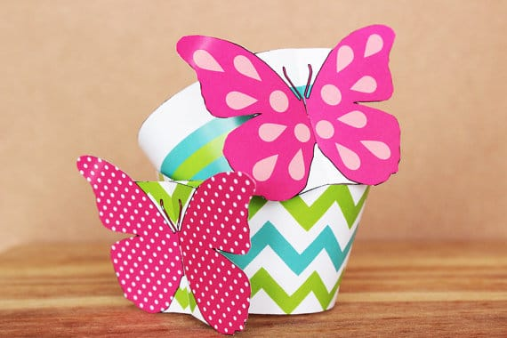
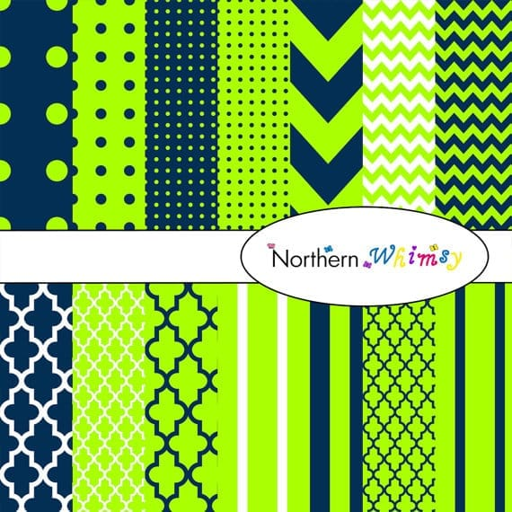
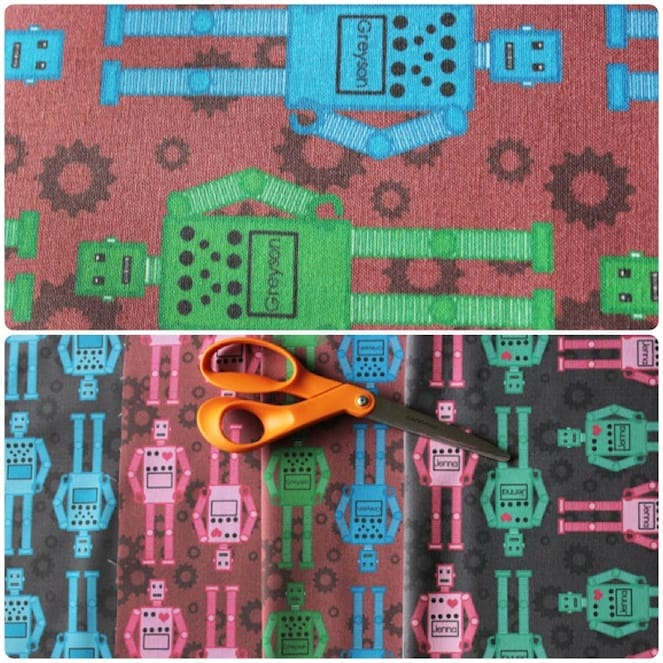

Happy Wednesday! Today I’m pleased to present to you the lovely

**Jess**

from

**[Northern Whimsy Design on Etsy](https://www.etsy.com/shop/NorthernWhimsyDesign?ref=shop_name_search_sugg "Northern Whimsy Design")**

! Jess has a fantastic shop and full summer ahead of her: including a brand new baby on the way! Check out her adorable custom fabrics, digital scrapbooking pages and cupcake wrapper selection! Then enter to win a super generous giveaway from Northern Whimsy!

##

## Tell us a little about yourself…

_I’m Jess from Northern Whimsy Design. I live on an acreage in a very rural area of Saskatchewan, Canada, with my husband and business partner Trevor, our 2 year old son, and a variety of pets and livestock, including two dogs, five cats, a flock of chickens, and a dozen goats. We’ll be adding a new (human) baby to the mix in July, so it will be a busy and exciting summer for us! I love to travel, and have backpacked in Europe, North Africa, and Central America. We’re dreaming about our next trip already, though I expect it will be a while before we’re ready to travel with the little ones._

## What do you love about your craft?

_I enjoy the whole design process from start to finish, but I especially love seeing the end result in action. I’m delighted when scrapbooking friends show me their finished pages, or I get to see a completed fabric project!_

## What item was your favorite to make so far?

_That’s a tough one! It’s a toss-up between the 3-D cupcake wrappers and the carousel horse fabric. Both were surprisingly technical, and I ended up having to dust off some serious math skills to take them from concept to a reality that ‘worked’. I tend to really enjoy a challenge, so both stick out as being very rewarding once I worked out the flaws._

## Where do you find your creative inspiration?

_Everywhere, really, but especially from my friends and family. I tend to share what I’m doing with the people around me, and they often make comments that trigger whole new horizons of ideas for me. For instance, I started out with the fabric design idea when I couldn’t find anything I liked for our son’s nursery, and a friend suggested I make my own stuff. I didn’t end up pursuing it at the time, as I got busy with other things, but when I got pregnant again and found out we were having a daughter, I went back to the drawing board…I am not a girly girl, and don’t like pink, so I wanted something that fit our style better. That’s where the carousel horse fabric came from. I was showing off some fabric samples at work, and a colleague suggested that the patterns would make great digital paper, which sounded like an interesting project, and set me off in a whole new direction. Then my step-mother, who does a lot of cake decorating, made a comment about cupcake wrappers that got me thinking again. I like experimenting, so when someone tosses out an idea, I’ll give it a try to see if it’s something I want to follow up on; this way, I get to tap everyone else’s creativity, as well as my own!_

## How did you decide to open your Etsy shop?

_Again, it was sort of based on friends’ suggestions. People were impressed with the fabric, and I had requests for some custom stuff, so I thought it would be worth opening an actual shop to sell through. My sister absolutely loves Etsy (her husband jokes their wedding was entirely handcrafted and delivered by Etsy!), so I’d heard a lot about it from a buyer’s perspective, and it sounded like a great fit for what I was doing._

## Any advice for others who want to start their own Etsy shop, or who are looking to fulfill their passion for crafting?

_Well, I’m still very new at this, so take my advice for what it’s worth 🙂 I’d say you need to really be in it for the long haul, and ready to tough it out – I spent months doing research, testing samples, and generally getting prepared before I actually went ahead and opened a formal shop. Even with all of that, and a lot of promotion prior to opening, things have started out a little slower than I would have liked. My other suggestion would be to stay flexible. By exploring the digital paper and cupcake wrapper ideas, I’ve been able to really expand our inventory and get some sales going; those are what are really selling for us right now. If the personalized fabrics gain traction (and I really hope they do, as they are a lot of fun to create), then I’ll throw myself into that for a while, but if they don’t, we’ll work on other ideas and expand the digital downloads. Either way, I’m designing fun patterns and doing something I love, but I’m also staying open to what will actually do well on the market, rather than getting hung up on what I think should work._

After you’ve browsed

**[Jess’s Etsy shop](https://www.etsy.com/shop/NorthernWhimsyDesign?ref=shop_name_search_sugg "Northern Whimsy Design")**

for your favorite items (and trust me, there will be many!) please check out her other social media links for more info and fun from Northern Whimsy!

[Facebook](https://www.facebook.com/NorthernWhimsyDesign "Northern Whimsy Design on Facebook")

♥︎

**[Pinterest](http://www.pinterest.com/northernwhimsy/ "Northern Whimsy on Pinterest")**♥︎**[Wanelo](http://wanelo.com/northernwhimsy "Northern Whimsy on Wanelo")**♥︎**[Email Newsletter](http://www.firedrummarketing.com/public_member_add.jsp?clientid=00004527 "Northern Whimsy Design's Newsletter")**

How perfect would some of these cupcake wrappers be for a summer party or picnic!? Love them!

Now for the giveaway! Northern Whimsy has a really great offer for you! One lucky Katie Crafts reader will win a

_digital download trio_

! You’ll be able to choose

**ANY THREE**

downloads from Northern Whimsy’s shop! Giveaway is open worldwide for anyone 18 years and older. Please read terms and conditions for more rules. Your entry must be easily verified (and you must be a real live human!) or you will be disqualified.

[a Rafflecopter giveaway](http://www.rafflecopter.com/rafl/display/64ecfa10/)

If you don’t want to wait to see if you’re a winner and want something from Jess’s shop pronto, you can use the special coupon she made just for us! Just use

**KATIE10**

at checkout for a

**10% discount**

on anything in the shop. It will run until

**June 30th**

.
