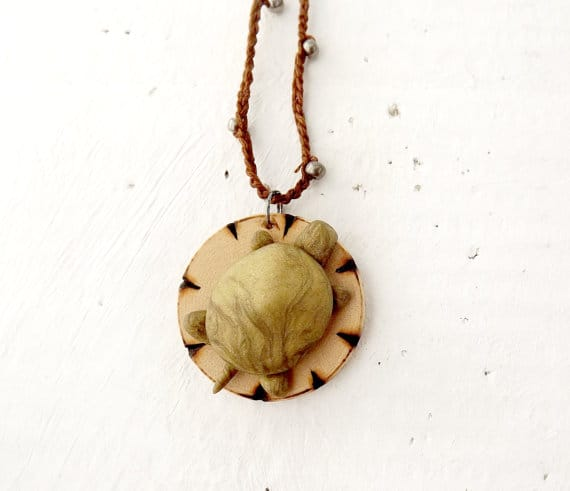
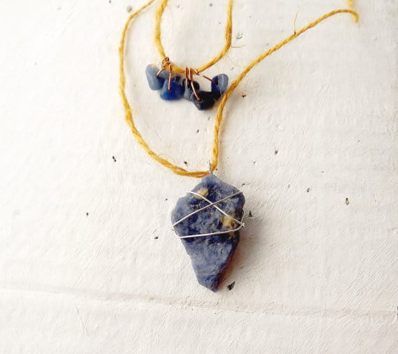
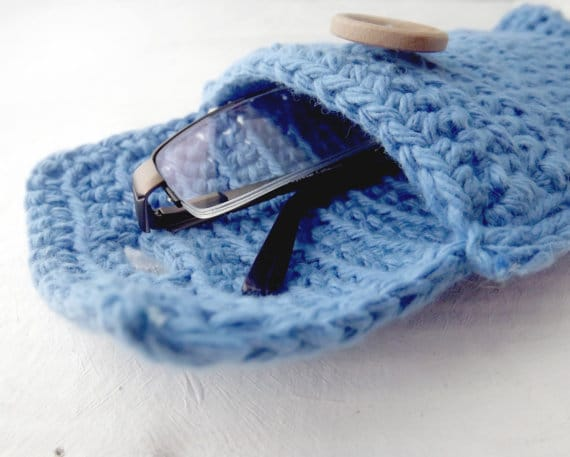
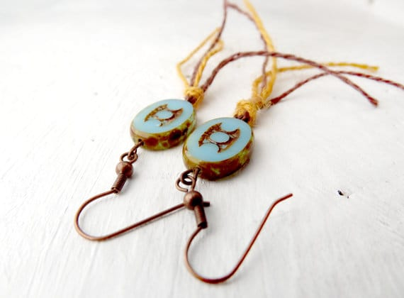

Happy Wednesday! We are halfway through the week with great news on one of the properties we looked at (but I won’t divulge anything because I don’t want to jinx it!) and two more properties lined up to see on Friday. Oh boy! In addition to all this fun stuff, it’s also featured artist day, yay! Today’s shop is

[_Obscure Gems on Etsy_](https://www.etsy.com/shop/ObscureGems?ref=pr_shop_more "Obscure Gems on Etsy")

, composed of a mom and daughter team, Nancy and Frances! Come meet them!

## Tell us a little about yourself…

_We are ObscureGems, a small, handmade business run by mother/daughter duo Nancy and Frances Bukovsky. We’re from Springfield Center, NY where we live with our cats, rats, fish, dog, husband/father Chris, and son/brother Alex._

## What do you love about your craft?

_We love being able to express ourselves through design and make personal connections with people through a love of art all over the world. It is exciting to ship off a little piece of ourselves and know that someone loved it enough to purchase it!_

## 

## What item was your favorite to make so far?

_This is a little bit of a tough one as we both specialize in different areas. I (Frances) really enjoyed making the Raw Sodalite Necklace because of the variety of materials and interesting textures. Gold yellow and dark blue is also my favorite color combination. Nancy’s favorite piece is the polymer clay turtle necklace because she loves animals and it reminds her of warm, sunny days at the beach._

## Where do you find your creative inspiration?

_We both find creative inspiration from unusual color combinations, textures, and shapes. Even our materials inspire us; often when we are looking for new yarn, stones, or glass beads to work with, we’ll get an idea for a project from the color, texture, or shape of that material._

## How did you decide to open your Etsy shop?

_I was more of the driving force behind opening a shop. Both of us had been making jewelry for the year prior, however being in a rural area we didn’t find many outlets to sell our work. After finding Etsy, I pushed Nancy towards opening a shop to be able to offer ObscureGems items to a wider audience. The overwhelming sense of community and creativity really drew us to Etsy._

## Any advice for others who want to start their own Etsy shop, or who are looking to fulfill their passion for crafting?

_Do your research. One of the biggest mistakes we made was jumping right in without really reading anything about shop photography, SEO, or pricing. Even though I shoot creative photography, I had no idea about what would sell the items. We struggled a lot with pricing because we didn’t value our items as much as we should have (I mean, we love what we do so counting the hours spent on each piece wasn’t really in the equation) and had no idea how to write a functioning description. Our first year was tough and didn’t set us up very well. Now that we have more education, we constantly work on how to get on the right track and expand our business._

After you’ve taken a peek at all the other goodies in

[**Obscure Gems’ shop**](https://www.etsy.com/shop/ObscureGems "Obscure Gems on Etsy")

, follow them on these social media sites!:

[**Facebook**](https://www.facebook.com/pages/ObscureGems/261731287265760?ref=hl "Obscure Gems on Facebook")

**♥︎**[**Twitter**](https://twitter.com/ObscureGems "Obscure Gems on Twitter")**♥︎**[**Instagram**](http://instagram.com/obscuregems "Obscure Gems on Instagram")

Nancy and Frances are offering all Katie Crafts readers

**15% off**

their entire order! Just use coupon code

**KC15percent**

at checkout!

What item is your favorite from

**Obscure Gems**

‘ shop?
