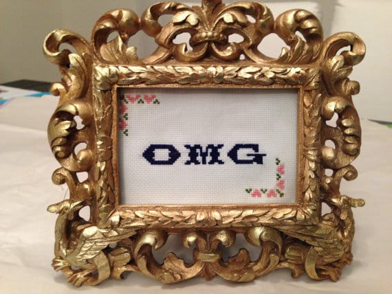

It’s officially the last Wednesday of March, thus the end of National Crochet Month is nearing. Fear not, though! That doesn’t mean Etsy Featured Shops are a thing of the past. In fact, there are a few more already lined up, so stay tuned! For now, we will close out National Crochet Month with an interview by an extremely talented (and awesome!) Etsy newcomer: Allison from

**[omgsrsly: handcrafted sass!](https://www.etsy.com/shop/omgsrsly?ref=pr_shop_more "omgsrsly on Etsy")**

## Tell us a little about yourself…

_My name is Allison, and I’ve been knitting and crocheting for about ten years. I live in Pennsylvania, but was raised in New York. I absolutely love crafting, and have been gifting my goods for as long as I’ve been making them. I work in pharmaceuticals, and love cooking, baking, photography, gardening, and my dog._

## What do you love about crocheting?

_I love the ability to turn something so simple as a skein of yarn into anything imaginable. I was originally a knitter, but once I taught myself to crochet, I fell in love with its speed and simplicity._

## What item (or pattern) was your favorite to make so far?

_I really love making big chunky cowls, as you can see from my etsy shop. They’re so cozy, and have made the long winter this year a lot more bearable._

## Where do you find your creative inspiration?

_I draw inspiration for my crocheting and knitting from the desire for comfort. It’s important to me that all of the things I make instantly feel like home._

## How did you decide to open your Etsy shop?

_I’ve been creating crafts for years now, and it was only after several of my friends who have been on the receiving end of my creative outlet, whether it was a scarf or a sassy cross stitch, suggested that I open a shop that I got serious about it. I spent some time creating an inventory, and here we are today!_

## Any advice for others who want to start their own Etsy shop, or who are looking to fulfill their passion for crafting?

_I’ve only recently opened my shop, so I don’t have too much in the way of veteran advice just yet. As for advice about crafting in general, I would say that it’s important to find something you love. I knit for years before I discovered the simple pleasures of crochet. I work hard in a fast-paced job, and the meditative pace of crochet really relaxes me and gives me a great sense of accomplishment._

Allison’s shop,

[**omgsrsly**](https://www.etsy.com/shop/omgsrsly?ref=pr_shop_more "omgsrsly on Etsy")

, is super mega brand new to the Etsy marketplace, so be sure to pop on over to her page, check out her stuff, and give her a few faves! If you fall in love with one of her amazing infinity scarves (or super sassy cross stitches!), you can use our

**exclusive coupon code****KATIESCRAFTS**

to get

_15% off of ANY order_

!! As soon as I’m done writing this post, I’ll be heading over and getting something myself!
