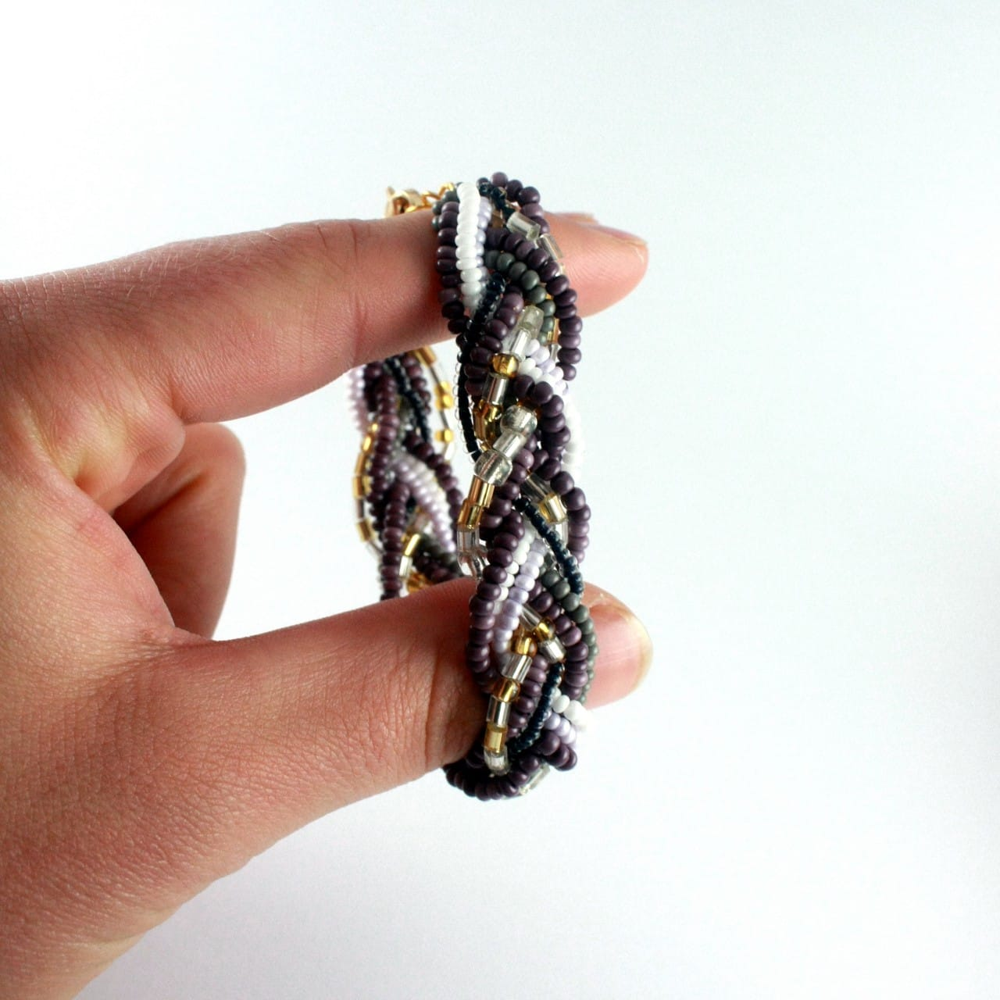
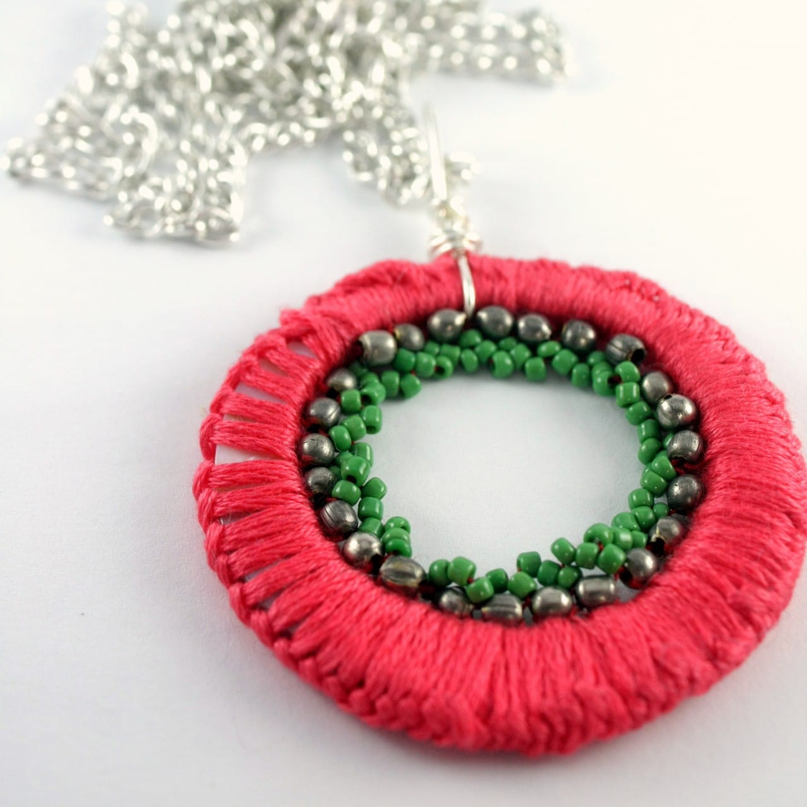
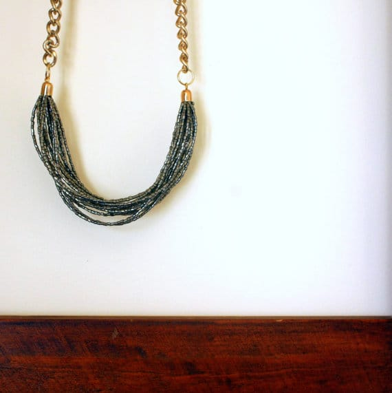
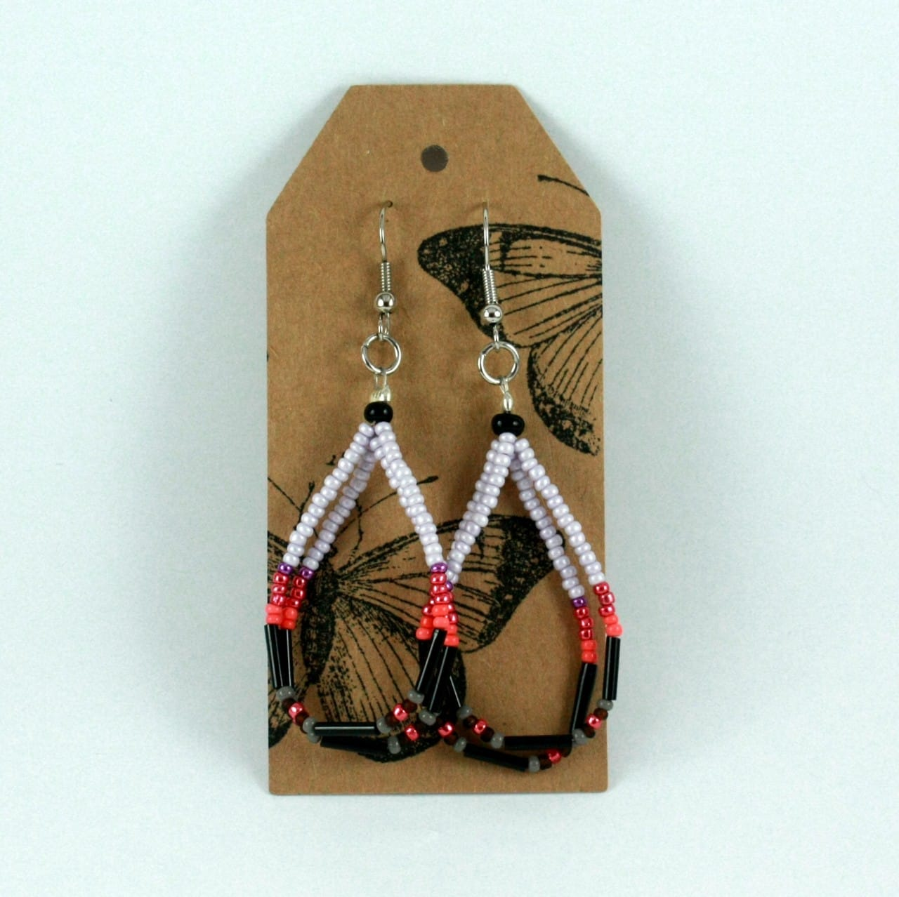

I’m back with Wednesday featured artists! Today you can meet

_Shalane_

from

[**Paper Kite Creations on Etsy**](https://www.etsy.com/shop/PaperKiteCreations "Paper Kite Creations on Etsy")

! She makes the most beautiful (and completely unique) jewelry! Seriously, how crazy gorgeous is that

[**necklace above**](https://www.etsy.com/listing/152673785/intricate-beaded-circle-feature-bib?ref=shop_home_active_5 "Beaded Circle Bib Necklace on Paper Kite Creations")

?! Check out our interview below and see how you can get free shipping in her shop just for being a Katie Crafts reader!

## Tell us a little about yourself…

_I’m originally from Canada, but upon doing some travelling I came to New Zealand, fell in love with it and haven’t left since. I am now based out of Wellington and work full time in the disability sector. I love what I do, but as time has gone on I have begun to realize just how much I truly love being creative. I opened up my Etsy Shop a year ago and have spent that time pushing myself up the learning curve of creating a small business that might be viable enough for me to quit my day job._

## What do you love about your craft?

_I love that I create one of a kind pieces – it helps me to keep things fresh and interesting. I tend to get bored easy, so the idea that I could create each piece differently from the previous means I get to keep the creative wheels turning while using each piece’s uniqueness to represent the individuality of women worldwide._

## What item was your favorite to make so far?

_I definitely have a few. I suppose any of my statement necklaces are faves just because they took me a lot more time and I tended to be exploring different techniques in my work. The beaded circle necklace (in top photo) is one I am particularly proud of and intend to make some future pieces with a similar style of beadwork to create a bit of a collection._

## Where do you find your creative inspiration?

_Everywhere really. Pinterest is a great resource in a pinch, but overall my inspiration comes from colours in nature, music on the radio, food I eat, magazines, photos, a feeling I have. I tend to pick something that catches my eye and then I roll around the idea in my head until it becomes my own and I know what I need to make._

## How did you decide to open your Etsy shop?

_Coming from Canada, Etsy was always something I had heard about as it is quite popular there. When I decided to start getting serious about my jewellery, I knew I wanted to sell online as it worked best given I still have a full time job. It didn’t take very long to connect the dots back to Etsy._

## Any advice for others who want to start their own Etsy shop, or who are looking to fulfill their passion for crafting?

_Take it one step at a time. It’s not going to happen overnight and unless you have a background in business and marketing, there is a MASSIVE learning curve that goes with it. But it’s worth it – never back down from the quality or standard of craft you want to do. Also – never be afraid to ask for help – connecting with the Etsy community has been one of the best things I have ever done to support myself in getting better at how I do what I do._

If you’d like to learn more about

**Shalane**

and

[**Paper Kite Creations**](http://www.paperkitecreations.com/ "Paper Kite Creations")

, you should definitely follow her social media accounts!

[**Blog**](http://paperkitecreations.blogspot.co.nz/ "Paper Kite Creations Blog")

♥︎

[**Facebook**](http://www.facebook.com/PaperKiteCreations "Paper Kite Creations on Facebook")

♥︎

[**Pinterest**](http://www.pinterest.com/PaperKiteCreate "Paper Kite Creations on Pinterest")

♥︎

[**Twitter**](https://twitter.com/paperkitecreate "Paper Kite Creations on Twitter")

Totally adore something in

[**Paper Kite Creation’s shop**](https://www.etsy.com/shop/PaperKiteCreations?ref=l2-shopheader-name "Paper Kite Creations on Etsy")

? Of course you do! Here is your chance to get

_FREE SHIPPING on all orders over $50_

! Just enter the exclusive to

**Katie Crafts**

coupon code

**FR33SH1PP1NG**

upon checkout. Offer expires

_September 30, 2014_

!

Which piece of Shalane’s is your favorite? Tell us in the comments!
