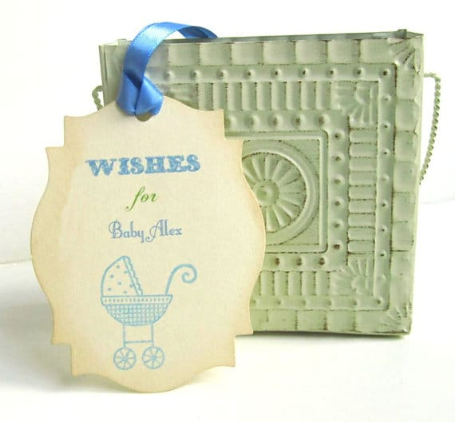
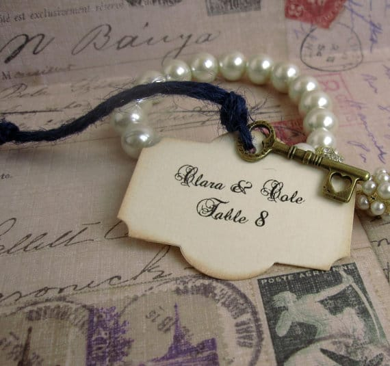
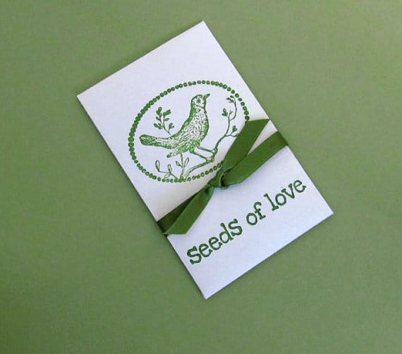
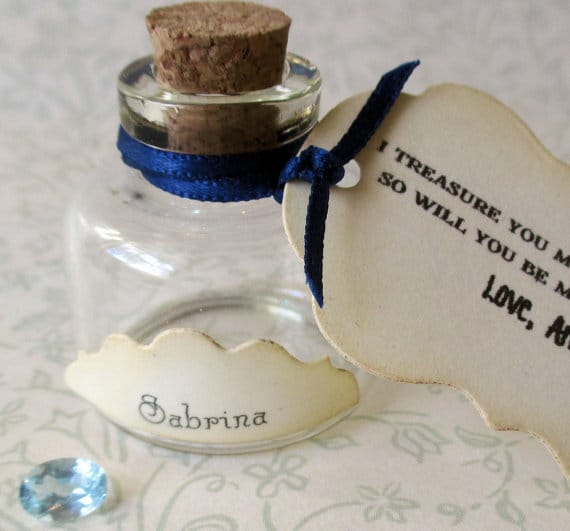
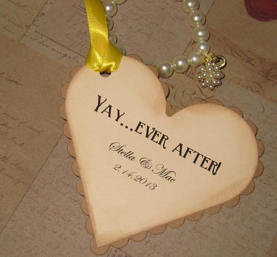

Today’s featured artist is Janice from

[Pedoozle](https://www.etsy.com/shop/Pedoozle "Pedoozle")

! She specializes in beautiful wedding favors and the like- and is super talented at it! Her shop is filled with wonderful options for a couple to use on their big day, a mom-to-be to have at her baby shower, and more! Check out our interview below, and enter to win a set of eight 4×6 inch hand stamped satin bags.

##

## Tell us a little about yourself…

_My name is Janice Chambers and I own Pedoozle. Currently, I specialize in Wedding accessories, corporate event and shower favors. In my spare time, I’ve been writing a funny new chick lit series with my husband. It’s based off of the premise of what Jane Austen’s Emma might be like if she were alive today and surrounded by zany characters that would feel at home in a Janet Evanovich novel._

## What do you love about your craft?

_Since 90% of my business is weddings…I love being a small part of one of the most important days of someone’s life. Especially when brides share their dreams of their wedding and how they’ve been planning it since they were eight years old. It’s a humbling experience to be a part of such a momentous occasion._

## What item was your favorite to make so far?

_I usually end up loving most of my items. Currently, because rustic weddings and destination weddings are so in vogue, I like my Burlap Welcome Bags. They are personalized, a great size and as opposed to the more traditional gable boxes, the guests will probably take them back home as a reminder of that special day. Also, they are a good way to go green, since the recipients will probably find a new use for them._

## Where do you find your creative inspiration?

_I find inspiration everywhere. I know everyone says that, but it’s true. I happened to see a burlap bag full of coffee beans in a store and that was the inspiration to my number one seller, “The Perfect Blend” burlap favor bags for coffee beans. Then, the burlap line just kept expanding._

## 

## How did you decide to open your Etsy shop?

_I had a shop on eBay that did great, but then my wholesalers started selling on eBay and it was just impossible to compete. I’ve always loved making jewelry, so I thought I would give Etsy a shot. I did okay, but I felt like I was following the pack instead of leading it. Somehow, I found my way into weddings and I really love it. When I was making jewelry, I was trying to do my own version of whatever was hot. Now, I try to come up with the next hot wedding item, based on the wedding themes I see trending._

## Any advice for others who want to start their own Etsy shop, or who are looking to fulfill their passion for crafting?

_Find a way to follow that dream. Find your own voice in whatever art or craft you’re passionate about. Although it may seem like the more expedient path would be to follow the current trend, you will be a lot happier and in the end more successful, if you follow your own vision._

_If you want to do it full time, you are going to have to pay your dues, by doing some homework. This isn’t an “if you build it, they will come” situation. You have to find ways to market yourself because you’re competing with a million shops. So start that blog, dust off your Facebook page, start following people on Twitter and Pinterest and get involved in Etsy teams. See which things bring you the most traffic and concentrate on those._\
_Also, take great pictures and work on your SEO ranking. If you don’t understand how the search engines rank items, go to Amazon and read one of their books. It will only take you an hour or two and it will be time well spent. About half of my customers find me on Google and Pinterest._\
_Think outside the box. One of the things that put me on the map locally was doing a big charity event. Afterwards, one of the hostesses gave my cell phone number out to all of her philanthropic friends. My phone was ringing so often, I thought I might have to change my number._

Check out all of Janice’s social media accounts to see what else she is up to!

Etsy:

[https://www.etsy.com/shop/Pedoozle](https://www.etsy.com/shop/Pedoozle "Pedoozle on Etsy")

Pinterest:

[www.pinterest.com/Pedoozle/](http://www.pinterest.com/Pedoozle/)

Twitter:

[twitter.com/Pedoozle](http://twitter.com/Pedoozle)

Blog:

[jaybeachambers.blogspot.com/](http://jaybeachambers.blogspot.com/)

Now is your chance to win something awesome! One lucky Katie Crafts reader will win a

_sampler bag set of eight 4×6 hand stamped satin bags_

! Perfect for all occasions! This raffle is open to US and Canada only; must be 18 or older to enter; giveaway ends at

**11:59PM ET**

on

**May 30th**

! If your entry cannot be verified, or you are a bot, it will be disqualified. Please read terms and conditions for other important information! Good luck!

[a Rafflecopter giveaway](http://www.rafflecopter.com/rafl/display/64ecfa9/)
