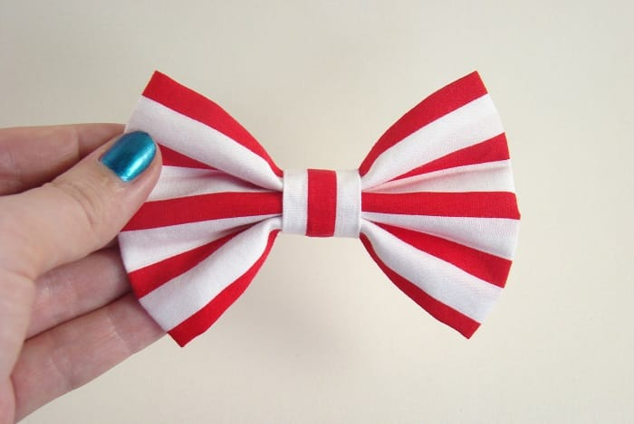
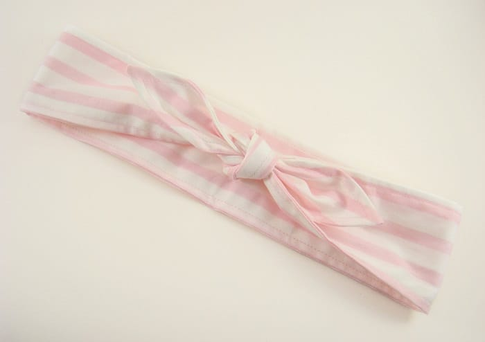
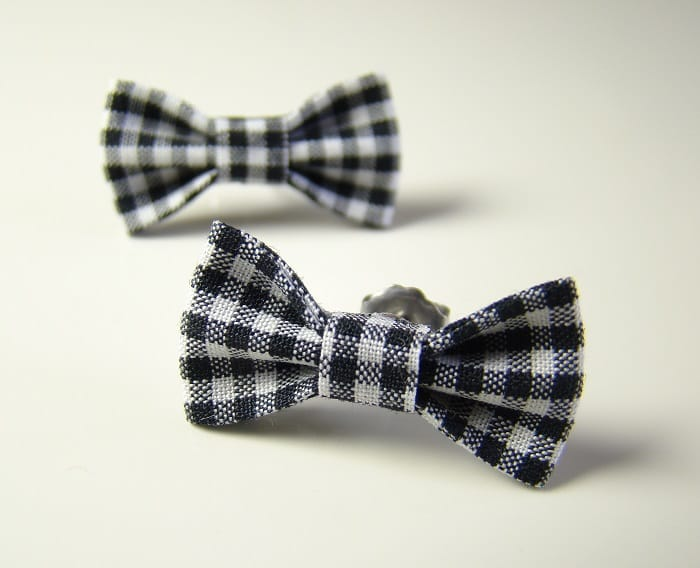
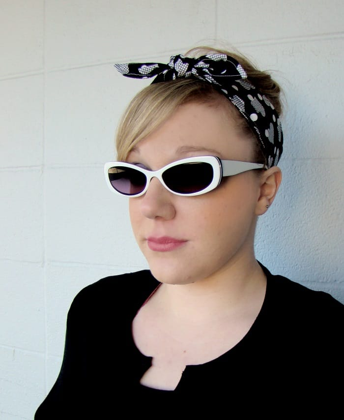
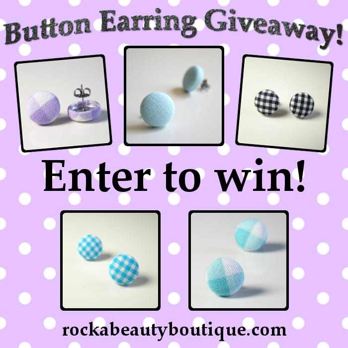

We aren’t quite done celebrating Memorial Day yet, so we are continuing with the most adorable red, white and blue (and pink, and more!) bows, headbands and accessories you ever did see! They come from

_TJ_

at

_[RockaBeauty Boutique on Etsy](https://www.etsy.com/shop/RockaBeautyBoutique "RockaBeauty Boutique")_

, who is our featured artist of the week! Learn about her below, and check out the great coupon code she has ready for Katie Crafts readers!

##

## Tell us a little about yourself…

_I’m TJ aka RockaBeauty Mama and I live in the beautiful but drizzly Pacific Northwest. I spend most of my days at home either working on my Etsy shop, RockaBeauty Boutique, or playing with and teaching my almost 5 year old daughter. When my husband is home we like to spend most of our time exploring the abundance of nature that surrounds us!_

## What do you love most about your craft?

_I have always loved creating since I was a little girl. It is like a need I was born with that I can’t get away from (not that I would want to). Sculpting fabric into something wearable is an amazing outlet for my creativity. My creations are an extension of my own style. I have always been an alternative retro gal with a love for beauty and fashion and now I create the pieces that make up my style on a daily basis. What’s not to love!_

## What item was your favorite to make so far?

_I love them all so much it is hard to choose! I always keep the first version of every item I create and I wear my designs on a daily basis. The piece I wear most frequently these days is a pink and white nautical striped retro headband… So I guess I would call that my favorite right now 🙂_

## Where do you find your creative inspiration?

_My personal style has been the main inspiration for my creations. Most of the items in my shop have a retro/punk/rockabilly feel with a hint of girly-ness on the side. I swoon over the bright and bold patterns of the past but I also love anything that is a little dark and playful._

## How did you decide to open your Etsy shop?

_I stumbled upon Etsy a couple years back after I grabbed a local vendors card at a Saturday market. When I first searched through Etsy the only thought in my head was “How did I not know of this place sooner! This is where I belong!” I spent months upon months researching and coming up with new ideas for my future shop. It then took me 2 more years to narrow those ideas down and get the courage to put my work out there! I finally launched my shop this year on March 4th 2014._

## Advice for others who want to start their own Etsy shop?

_If you are looking to start a shop on Etsy I have a few big tips…_

- _-Don’t let fear stop you from sharing your creations with others. If you make something you love chances are there is someone out there that will love what you make._\
  _-The Etsy Seller Handbook is a fantastic resource to learn the ins and outs of selling your products._\
  _-It can be a challenge to get noticed in the Etsy marketplace but if you work hard you can find success… Learn as much as you can about SEO and product photography because these are the two main tools you will use to get people to notice your shop._
- Don’t let fear stop you from sharing your creations with others. If you make something you love chances are there is someone out there that will love what you make.
- The Etsy Seller Handbook is a fantastic resource to learn the ins and outs of selling your products.
- It can be a challenge to get noticed in the Etsy marketplace but if you work hard you can find success… Learn as much as you can about SEO and product photography because these are the two main tools you will use to get people to notice your shop.

Follow all RockaBeauty Mama’s social media accounts to get the scoop on products and more!

Blog:

[rockabeautyboutique.com](http://rockabeautyboutique.com)

Facebook:

[www.facebook.com/RockaBeautyBoutique](https://www.facebook.com/RockaBeautyBoutique)

Pinterest:

[www.pinterest.com/RockaBeautyMama/](http://www.pinterest.com/RockaBeautyMama/)

Twitter:

[twitter.com/RockaBeautyMama](https://twitter.com/RockaBeautyMama)

Instagram:

[instagram.com/rockabeautyboutique](http://instagram.com/rockabeautyboutique)

TJ is currently holding a giveaway on her blog for some super cute button earrings! It only goes til tomorrow, so you better

[hurry up and enter](http://rockabeautyboutique.com/2014/05/23/button-earring-giveaway/ "RockaBeauty Boutique Button Earring Giveaway")

! She has also created a

_20% off coupon_

JUST for Katie Crafts readers. Just use coupon code

**KATIECRAFTS20**

at checkout! It expires

_June 30th 2014 at 11:59 PM EST_

.

What is your favorite RockaBeauty Boutique accessory? Tell us in the comments!
