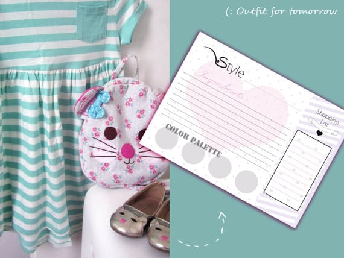
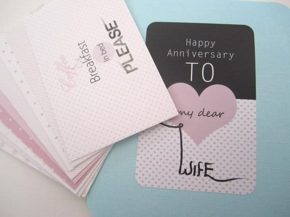
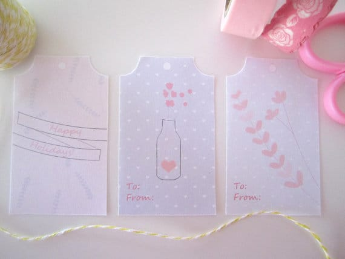
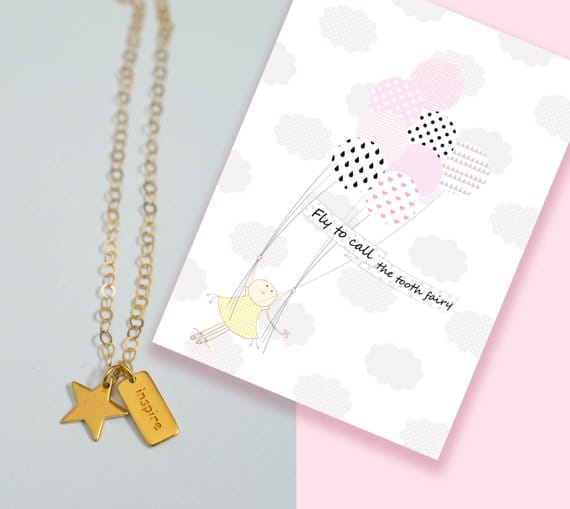
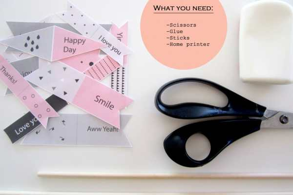
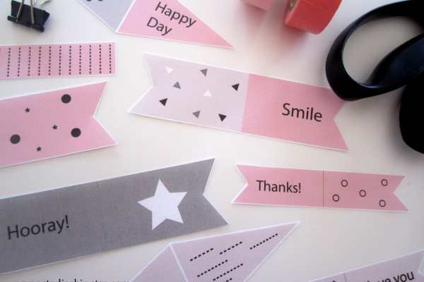
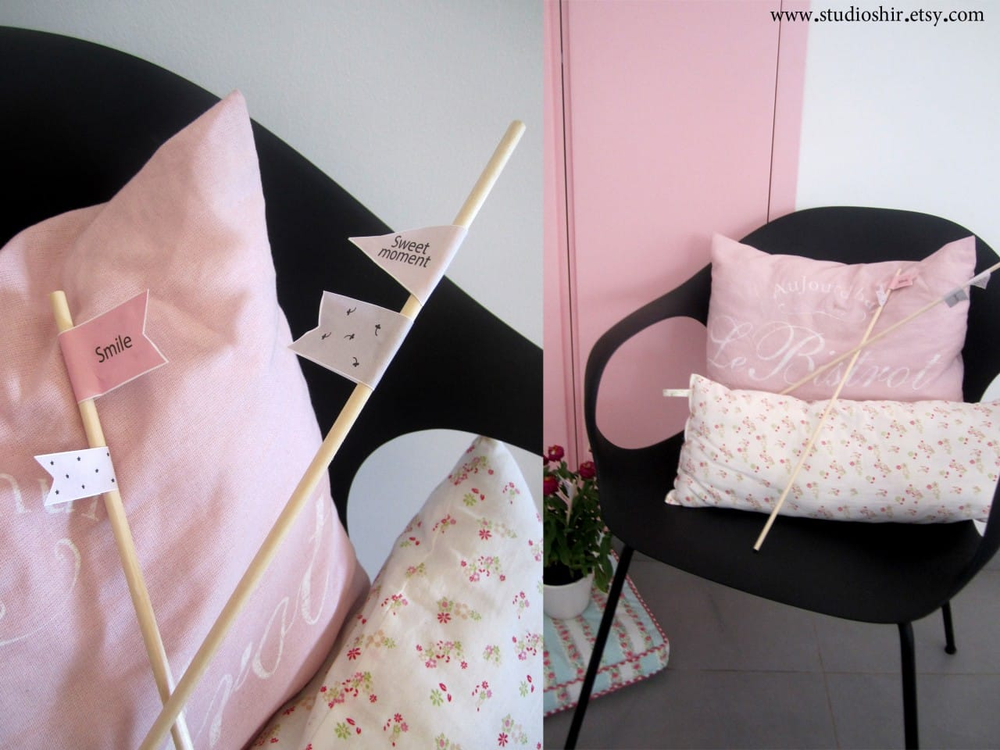

Today’s featured shop is all the way from Isreal! Her name is

**Shir**

and her Etsy shop,

[**Studio Shir**](https://www.etsy.com/il-en/shop/StudioShir?ref=si_shop "Studio Shir on Etsy")

, is filled with adorably designed notebooks, cards, digital downloads and more! Check out our interview below and download a very special gift that Shir made

_JUST_

for Katie Crafts readers: printable banners and instructions on how to make them!

##

## Tell us a little about yourself…

_My name is Shir (Song in Hebrew) and I am the owner and designer of Studio Shir, a gift shop that I opened recently. I am 30 years old, living in Israel, and a proud mom of two wonderful little kids and one old dog._

## What do you love about your craft?

_Learning new things, especially when it comes to a new technique. At first I drew with pencil on sketch paper. Today I’m mostly working on the computer, constantly learning new techniques. However, especially today, in our digital world, when there are unlimited possibilities, I like occasionally look at my old drawings. They give me a good perspective, helping me to remember where it all started, and directed me back to innocent and romantic illustrations and ideas._

## What item was your favorite to make so far?

_Awww, Katie, this is a difficult one! If I must choose, I like my romantic cards for hubby and wife. This is my best seller so far, and I think that the reason is that it is a fun and surprising item. You know that your job is to fulfill the certificates but you don’t know exactly what is it, so it’s cute surprise for the buyer too. Funny thing that I notice is that girls are not afraid to buy the vouchers to mate. They buy without question or concern. The boys however? They fear, and probably not willing to do anything._

## Where do you find your creative inspiration?

_Especially with my children, they fill my life with lots of joy, and this is a convenient basis for creating. They are really part of everything, they always peek my sketches and they are so happy to see the result when I am coming back from the printing house. I also find inspiration in my living area, surrounding with beautiful nature, green fields, greenhouses of flowers, and stunning beaches._

## How did you decide to open your Etsy shop?

_Illustration is a big passion in my life. I draw cute characters ever since I can remember. Every day I paint something, even if it’s just a little doodle. As a small child at school and as a student at university, my notebooks were always filled with happy little paintings. To friends and family it was always obvious, and they used to ask various requests: Prints for kids rooms, Birthday invitations, tags, albums, cards, and even business cards and logos! I made everything for free and with lots of love. Recently we decided to make a major change in life, and we moved from the big city Jerusalem to a small village. Along with this significant change, I decided it was time to fulfill a dream and make my first collection of illustrated items._

## Any advice for others who want to start their own Etsy shop, or who are looking to fulfill their passion for crafting?

_I personally was afraid to start, so my advice is to be brave and take the first step. You do not have to take a big risk, you can start small and slowly. I am doing everything slow, step by step. Still working on the collection, and constantly adding new items. Things do not have to be finished at once._

Now here is everything you need to get the same ADORABLE flags from the featured image at the top!!

Please click through to

[**Shir’s Etsy shop**](https://www.etsy.com/il-en/shop/StudioShir?ref=si_shop# "Studio Shir on Etsy")

and fave a few items to spread the love! Then

[_click here to download her adorable printable flags for FREE_](/wp-content/uploads/2014/07/little-flags.pdf "FREE download from Shir Studio")

! These banners are not available for purchase in Shir’s shop: she made them special JUST for you guys! Use the password

**studioshir**

when prompted to complete the download! Just be sure to follow the rules below first. 🙂

- _You may print as many copies as you like._
- _For personal use only._
- _Studio shir retains all rights._
- _You cannot use this file for any commercial or mass production purposes._
- _File reselling is not permitted._
- _After printing, use the above materials to complete your DIY!_

Thanks so much for making an exclusive design just for Katie Crafts readers, Shir!! You’re the best!

What are you going to use the printable flags for? What was your fave item in Shir’s shop?
