**\&#xA;**

We are really powering through National Crochet Month! It’s already the third Wednesday in March so clearly it’s time for another featured artist (and by total luck, another giveaway!) Yay! This week you can learn all about the darling

**Vivika**

from

[**The Wandering Deer**](https://www.etsy.com/shop/TheWanderingDeer "The Wandering Deer")

who creates the

**cutest**

little amigurumi animals you

**ever did see!**

Really though, I can’t even handle how cute these little guys are. I just want to scoop them up and shove them in my mouth! Especially when she writes little silly stories alongside the animals. I haven’t done amigurumi myself in such a long time and this makes me want to get right back into it!

## Tell us a little about yourself…

_Hello, I’m Vivika! I am in my mid 20’s and I live in sunny Greece. I am a graphic designer and I love crochet! I make cute little animals (or aliens), called amigurumi. Everyone has a different name and a different story! I’m having so much fun making them! I also love photography and sewing, so in my blog,_

_[The Wandering Deer](http://thewanderingdeer.blogspot.com/ "The Wandering Deer"), there are bits of everything._

[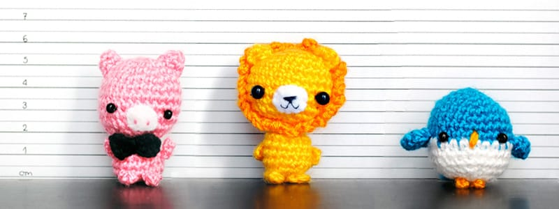](https://www.etsy.com/listing/177977152/amigurumi-lion-crocheted-doll-gift-for?ref=shop_home_active_4)

## What do you love about crocheting?

_I love that I can make any creature I have in mind! Also, let’s say I want a big pink bow for my new dress. I can make it! Bows, hearts and miniatures, what else would I need to be happy?_

[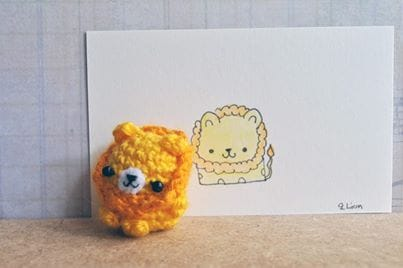](https://www.etsy.com/listing/177977152/amigurumi-lion-crocheted-doll-gift-for?ref=shop_home_active_4)

## What item (or pattern) was your favorite to make so far?

_It’s hard to choose, I love them all! But I can’t stop doing penguins. In every color. I adore them!_

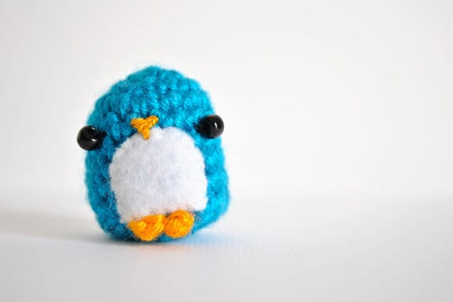

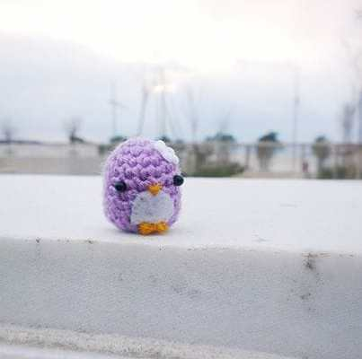

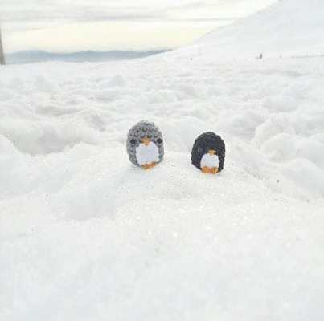

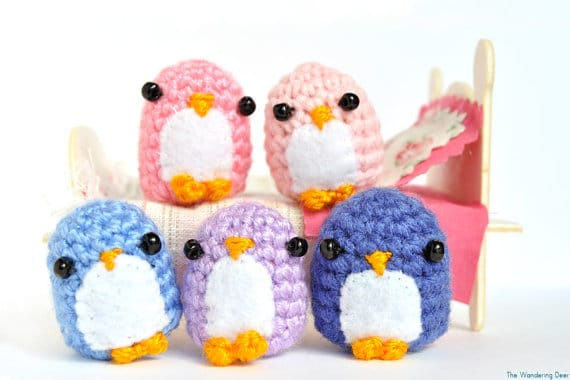

## Where do you find your creative inspiration?

_Everywhere! And I mean it. Tv, walks, blogs, books, maybe a funny shaped cloud!_

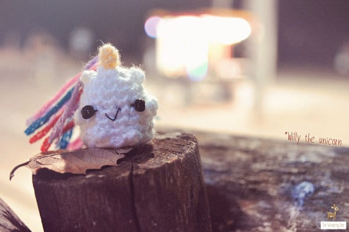

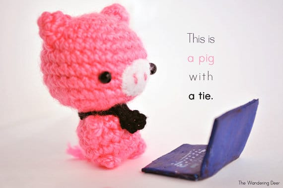

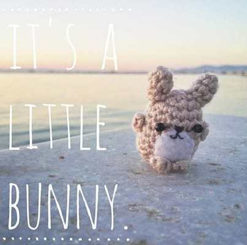

## How did you decide to open your Etsy shop?

_I learned about Etsy in 2011. I didn’t have a clue a site like this even existed. I was thrilled. I made some miniature clay sweets back then, so I told myself why not? But I was working full-time and I didn’t have free time at all. That summer I learned how to crochet and sew. And I made a ton of things. I decided it was time, and I opened my Etsy shop. I listed two things and I expected a sale. For a long time. After almost 2 years I decided to eventually fill my shop. And then I made that sale <3_

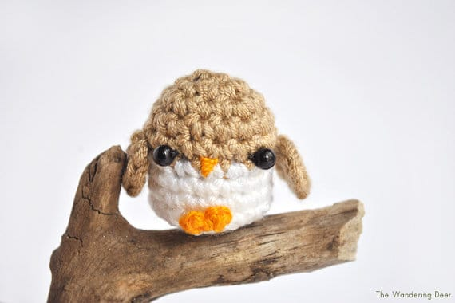

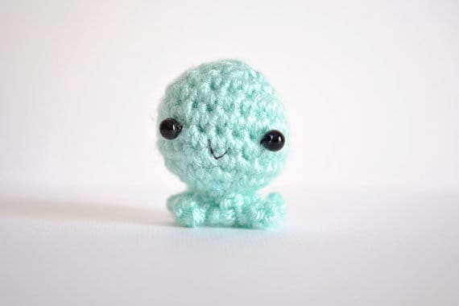

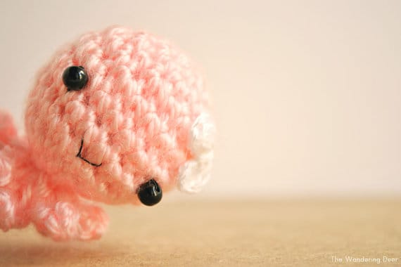

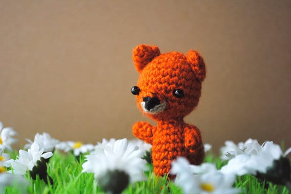

## Any advice for others who want to start their own Etsy shop, or who are looking to fulfill their passion for crafting?

_Selling on Etsy is really hard work. You have to know that. You have to learn so much, photography, SEO, social media and of course how Etsy works. But it’s worth it! I live in Greece but my cuties are all over the world, USA, Canada, Australia, Japan, China and all over Europe! So don’t give up. Do what you love and the rest are just details 🙂_

[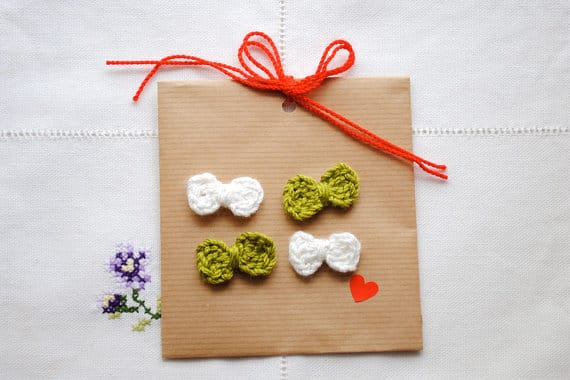](https://www.etsy.com/listing/125805265/four-cute-little-bows-made-to-order?ref=shop_home_active_19)

After you’ve checked out her

[Etsy](https://www.etsy.com/shop/TheWanderingDeer "The Wandering Deer on Etsy")

shop, pop by her

[blog](http://thewanderingdeer.blogspot.com/ "The Wandering Deer")

, like her on

[Facebook](https://www.facebook.com/TheWanderingDeer "The Wandering Deer on Facebook")

, and follow her on

[Twitter](https://twitter.com/wanderingdeer "The Wandering Deer on Twitter")

and

[Instagram](http://instagram.com/wanderingdeer# "The Wandering Deer on Instagram")

! Then thank your lucky stars because Vivika is gifting the winner of this raffle a cutie to call your own! One handmade little penguin, in the color of your choosing!

\*Giveaway open internationally. Enter to win until Monday, March 24th at 11:59 PM EST. Winner announced Tuesday! Please check the Terms & Conditions for more rules.

[a Rafflecopter giveaway](http://www.rafflecopter.com/rafl/display/64ecfa2/)

So excited to be working with Vivika for this contest! Love every item in her shop! Which is your favorite?
