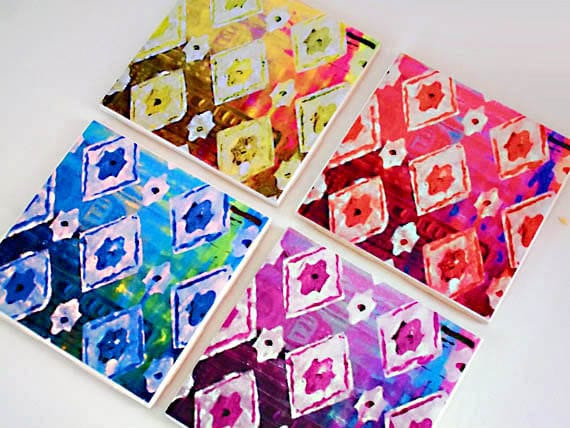
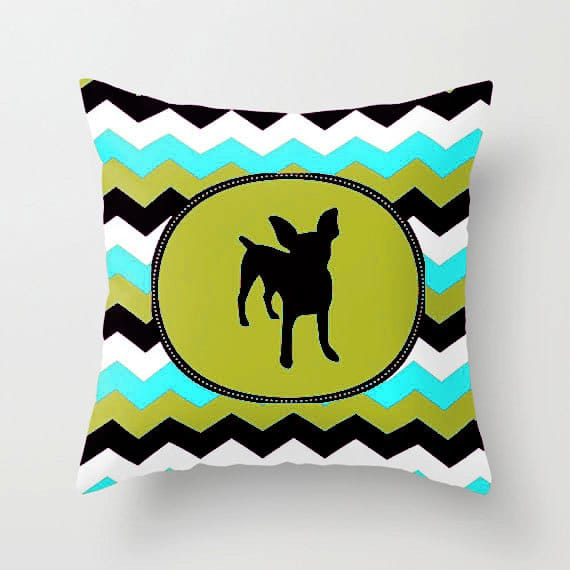
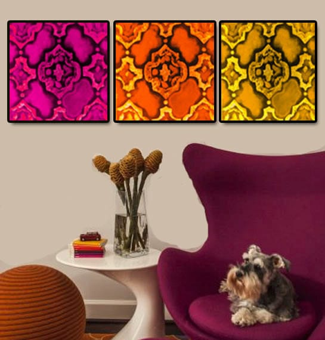
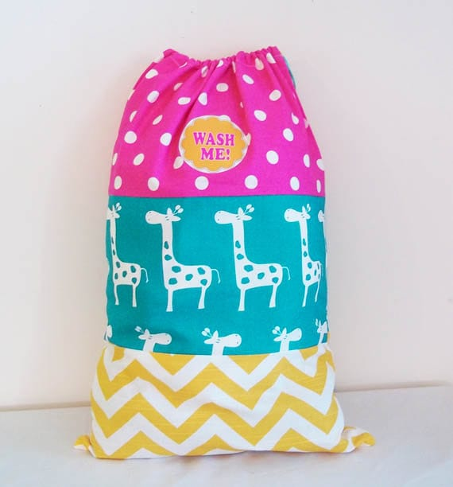

Today’s featured Etsy shop is one I found when I did my

[_Etsy Picks: Back To School Guide post_](/blog/my-etsy-picks-back-school-guide/ "My Etsy Picks: Back to School Guide")

!

[**Kendra of Urban Creative**](https://www.etsy.com/shop/UrbanCreative "Urban Creative on Etsy")

makes awesome laundry bags, but also amazing Christmas stockings, wine totes, art and more! Learn more about her below and find out how you can enter to

_win 3 Extra Large Jumbo Stockings_

, personalized just for you!

## What do you love about your craft?

_As a child I remember always thinking that I would grow up to be an inventor. Although I’ve never really invented anything I am officially a MAKER! And for now that is enough. I truly enjoy knowing that when I paint a new canvas or sew a new bag that it has my signature style stamped all over it._

## What item was your favorite to make so far?

_I painted a canvas free-hand with a beautiful Moroccan inspired design. Then I thought this could look great on fabric so I scanned the original image into photoshop and manipulated it a bit. I sent the jpg. away to be printed on fabric and now I sell pillows with my art on them! They are amazing and modern and very hip! I wasn’t even trying to make something so cool – it just happened! Check out my Morrocan Art Blocks and Pillows. The same thing happened with a beautiful Geometric Indian Blanket design I painted. That artwork too has been splashed on to fabric and I adore that series, as well._

## Where do you find your creative inspiration?

_My inspiration comes from my true love affair with color! My entire life I have been mesmerized by the many different shades and hues of the various color families. I’m amazed at how much color spices up our lives. It really means everything to me so I would say that is the base of all my creative energy._

## How did you decide to open your Etsy shop?

_In the spring of 2000 I opened a modern art gallery in San Francisco. After the dot com bust and the tragedy of 9/11 the economy came to a halt. I chose to take a break from business; take some time away to reflect on what was happening in our world. The economy strengthened and began again. Re-opening the gallery but adding exclusive housewares and gift lines along with a myriad of children’s art classes upstairs in the art studio. Once I had accomplished that and worked way harder than I wanted too I decided to slow down. I closed the shop and began to make stuff. That’s when I opened my etsy shop and listed a couple of items. I don’t think I got a sale for at least 3 months but once Christmas came I was quite busy and now I work my etsy shop almost full time._

## Any advice for others who want to start their own Etsy shop, or who are looking to fulfill their passion for crafting?

_The main point that I can extend to others thinking about delving in a creative life is to make and do exactly what you want. Don’t follow the trends but follow your heart. When you are making something with oodles of gusto and passion the crowds will notice. Once you’ve got a handful of items to list on etsy be patient. You may not sell anything for awhile but be persistent. Continue to make more items and continue to post new listings. It only costs.20 cents to start a listing so basically it costs nothing to start your shop so you have nothing to lose and everything to gain. When you’ve sold an item you will sell that item again and then once you’ve got a major seller you can then begin to figure out how to capitalize on it. For example if you hand-make a cute photo frame and you see it selling a lot then do a grouping of 5 of the same photo frames and list it as “bridesmaid gifts.” So not only are you selling your item – you are sell a lot of them to one buyer. You’ll begin to see all the ways you can sell your hand made items in groups for special occasions and party decor, etc._

You can catch Kendra on these different sites!

[Etsy](https://www.etsy.com/shop/UrbanCreative "Urban Creative on Etsy")

♥︎

**[Pinterest](http://www.pinterest.com/urbancolor/ "Urban Color on Pinterest")**♥︎**[Facebook](https://www.facebook.com/urbancolor "Urban Color on Facebook")**

Now for info on the giveaway! One lucky winner will get

_3 Extra Large Jumbo Stockings_

, customized and personalized by winner. Each stocking is about 10 inches across and about 24 inches long – very roomy for lots of goodies from Santa. Winner can pick from 48 different fabric patterns and add a cute feather boa topper or fabric cuff. Personalized with names.

Raffle is open to anyone 18 or older, worldwide! Ends 11:59PM ET on 8/20/14. Please be a real human being with a real social media account, and not a bot set up for only entering giveaways! I will sadly need to disqualify you if that is the case! Be sure to read other terms and conditions, too. Good luck!

[a Rafflecopter giveaway](http://www.rafflecopter.com/rafl/display/64ecfabc21/)

Need a stocking now? Everyone can take advantage of the

**KatiesCraft**

coupon code and receive

**30% off**

of any item in Urban Creative’s shop! This coupon code is good for one month only and good for one purchase per customer.

I can’t wait to receive my giant Christmas stocking for my front door from Urban Creative- I know it’s going to look great during the holidays! I will be sure to post a pic once I get it, too!
