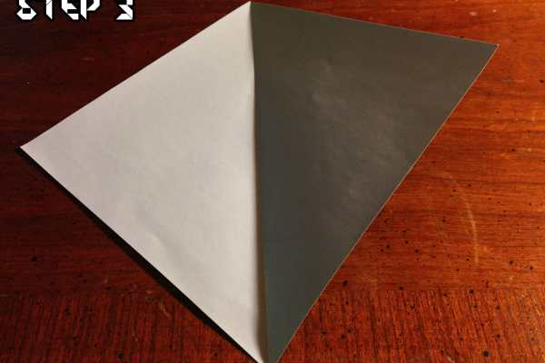
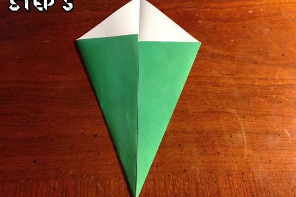
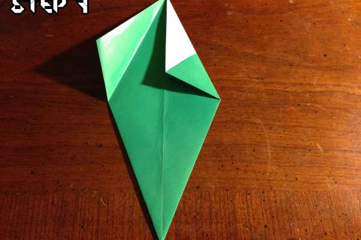
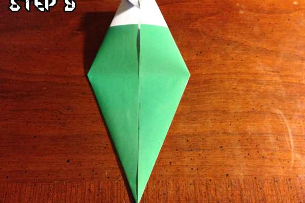
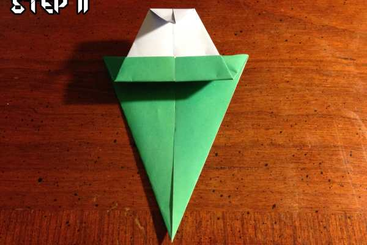
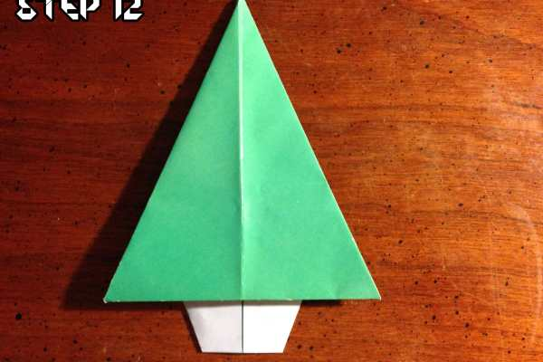

Husband here! Before I go any further, Katie wanted me to sing her christmas song for you (she told me I shouldn’t forget, or she was going to let me have it, haha)! So without further ado, here we go!

_♫ On the fifth day of Christmas, Katie Crafts gave to me- an origami christmas tree diy! ♫_

Whew, fifth day of christmas already?! I haven’t even started my Christmas shopping! Hopefully you’re not in the same boat as me and have already amassed all of the presents you’ll need for your family and friends this holiday season. If you aren’t quite there yet, fear not! You can use these easy origami Christmas trees to decorate all of your cards and presents to make them BEAUTIFUL!

### Step 1

Start with a piece of square paper. I’d suggest something green since we’re making a tree (I’m traditional, don’t judge) but gold, silver or anything else pretty will look amazing!

### Step 2

Flip the paper over so that the non patterned side is facing down then give the paper a slight turn to make it look like a diamond.

### Step 3

Fold the diamond shaped paper in half and make sure that the crease is tight, then unfold it.

### Step 4

Start with the left edge of the paper and fold it against the center crease and press it down to make sure it’s nice and crisp. This will be important later to keep the tree from falling apart.

### Step 5

Do the same thing with the right edge and fold it in to the middle, creasing it down. If you have a pencil, pen or anything else you can slide across the crease it will help it stay even better!

### Step 6

Flip the paper over so that your folds are facing down towards the table.

### Step 7

Fold the right edge towards the middle, creasing it against the middle of your paper. The original fold we did in the beginning will even provide a nice guideline to fold it against! 🙂

### Step 8

Repeat the same process, this time folding the left edge towards the center of the paper.

### Step 9

Fold the top of the paper down towards you, making sure to only use the tip of the paper. Press firmly so that it stays folded.

### Step 10

Fold the top down towards you again, this time folding the entire paper in half.

### Step 9

Almost done! leaving a little bit of space, fold the paper back up so that you end up with a double fold. This will form the trunk and add a really nice size difference between the top and bottom of the Christmas tree!

### Step 10

Flip your paper over and admire your handy work! You now have your very own Christmas tree!

Now, I know what you’re thinking: I didn’t decorate it at all! That’s because it is by far the very best part of the entire process! Let your creativity flow and show Katie and I what you come up with! You can make smaller trees, larger trees– you can even add garland, ornaments and a star on the top! Have at it and let us know in the comments what you come up with!

Happy fifth day of Christmas, everyone!
