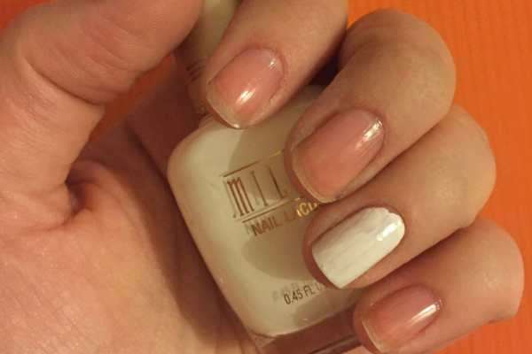
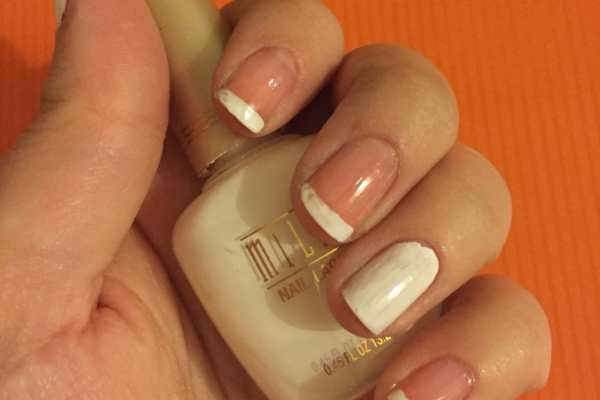
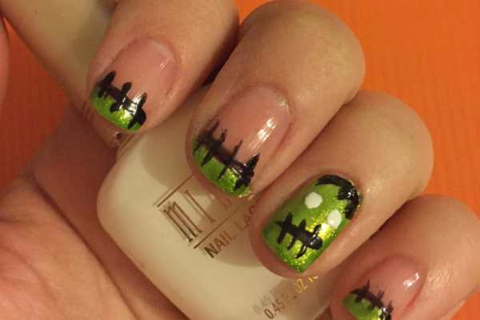
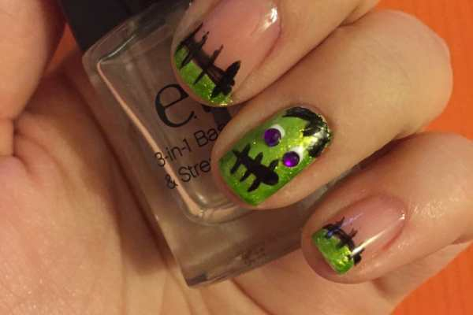

Halloween is under a week away! My last nail design for this season is my favorite so far. It’s a spooky twist on a french tip and was very easy to do. Hope you enjoy my Frankenstein nail art!

## Materials:

- Clear top/base coat

- White nail polish

- Green shimmer nail polish

- Black nail polish

- Nail art gems for eyes

- Nail art brush

## Instructions:

- Beginning with clean, dry nails, do a coat of clear and let it dry.

- Paint your accent nails (I picked my ring fingers and thumbs) with a coat of white. Let dry.

- Paint the rest of your nails with a white french tip. Let dry.

- Use the green nail polish to completely cover all white polish. The white will help the green POP!

  _Let dry completely_

  .

* Do a second coat of green if needed. Let dry.

- Use the nail art brush dipped in black nail polish to draw a line separating the bottom of the french tip and your nail on each regular nail. Draw some hair and a line for the mouth on the accent nails. Let dry.

- Go back over the lines to darken them, and make small stitches on each. Let dry.

- Use the white nail polish to make small eyes (that are slightly bigger than the gems) on each Frankenstein face. Let dry.

- Use clear polish to seal in your look. Before the clear dries, stick the rhinestone gems on the white dots to make the eyeballs.

Aren’t these little monsters cute!? I looooove them! And I really love how simple they were to do! I hope you enjoyed them too! Let me know if you get a chance to try out this tutorial!

What are your Halloween costume/beauty/nail art plans?
