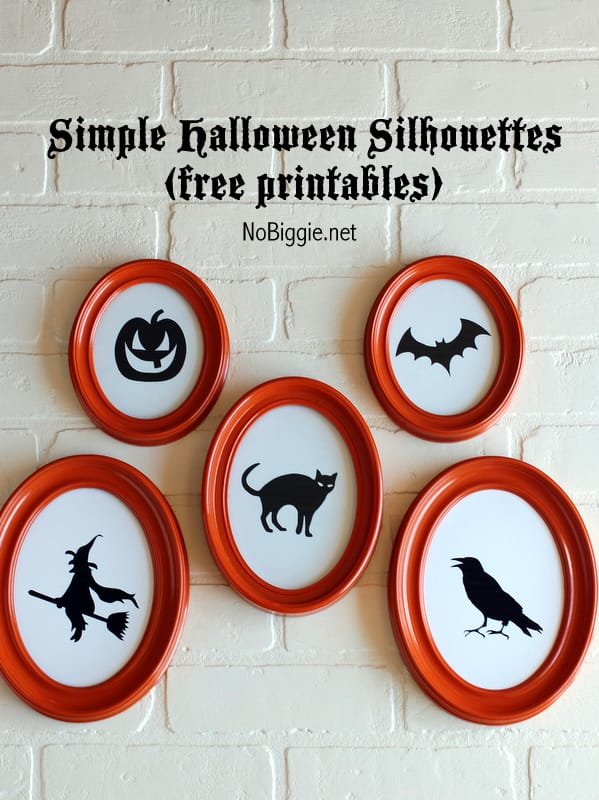
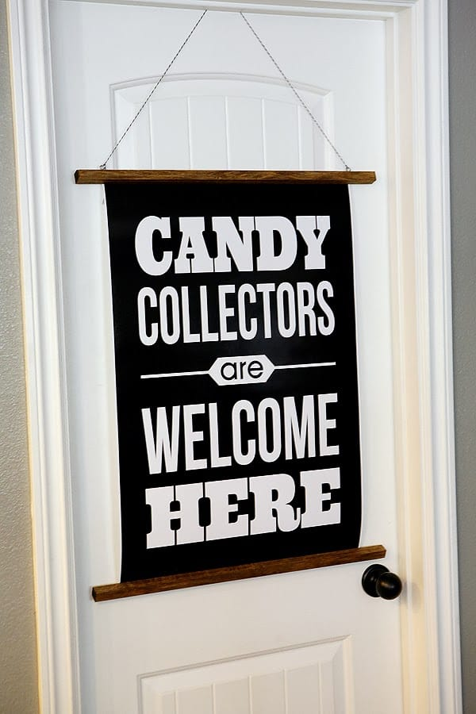
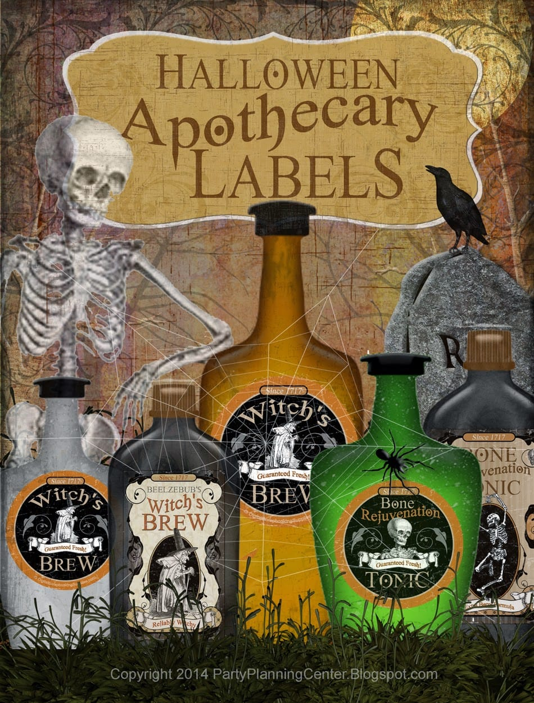
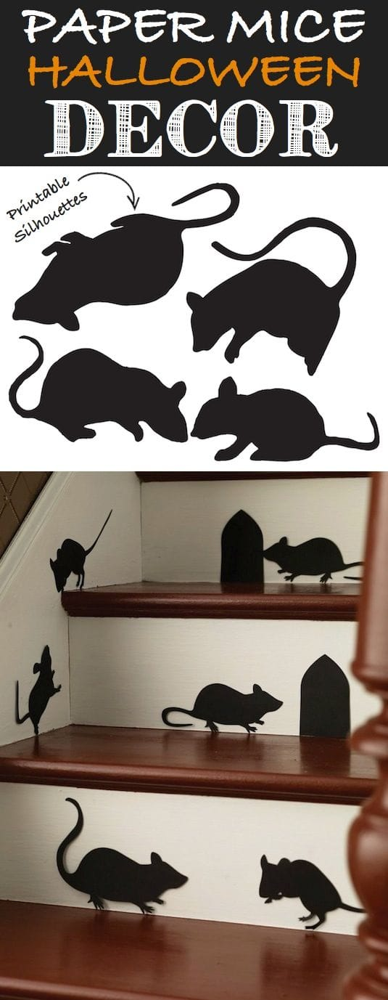
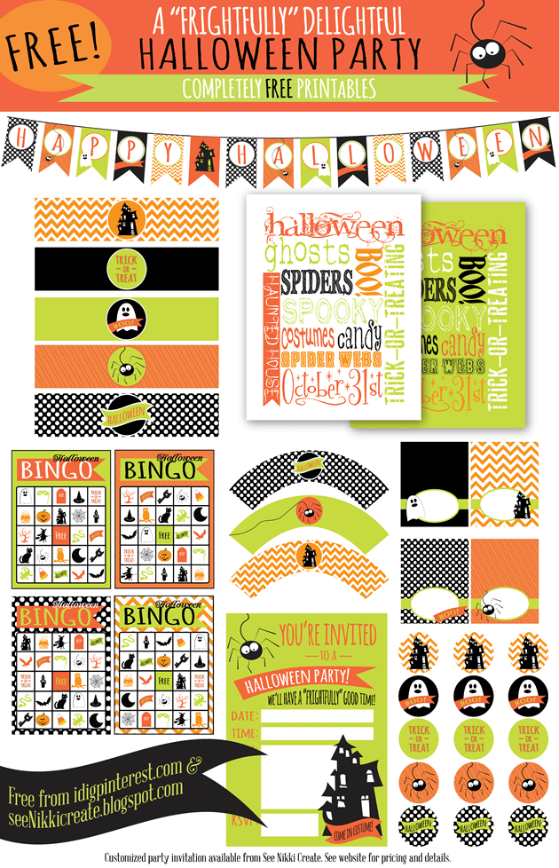

Halloween is TOMORROW! Yay! Amongst my decorations for the day, I found dozens of really great printables to add some spookiness to my decor. The best part is they are all free! You can download and print these for your own Halloween party!

Also, Happy Mischief Night! If you aren’t from New Jersey, you may have never heard of Mischief Night. It’s pretty much when all the “tricks” happen, the evening before Halloween- leaving Halloween for all the treats! I never participated because I was a good little girl, but walking around the neighborhood the next day always meant finding toilet paper in trees and egg shells glued to everything. Pretty gross, actually. I’m glad people in Philly don’t really do that since we’re homeowners now, and cleaning that up would make me crazy!

Anyway, back to the free printables! I have little glass jars that I used for some of the small label ones, mixing things together to produce what the label says it should be. For instance, if the label was “Dragonfly Wings,” I mixed large pearlescent white glitter with fine green glitter, which really looks like crushed wings! For “Zombie Brew,” which is apparently fermented zombies, I mixed water and green food coloring, added some oil, shook it up to make it bead and then added a piece of yellow moss that resembled a brain! I had a lot of fun coming up with all the things for these labels, and am looking forward to displaying them on the counter next to the crock pot\*!

> _\*Our crock pot will be filled with hot spiced cider… a recipe I will share with you soon! Yummm!_

On to the freebies! Please be sure to stop by the websites who created each of these wonderful printables and download from them!

This first one comes from

**[Craftily Ever After](http://craftily-ever-after.blogspot.com/2010/10/free-download-halloween-version-of-keep.html)**

and features a witch reminding you to Eat, Drink and Be Scary! The plates I have for my party have this same saying on them, so this would make a great sign to match my stuff!

Making cupcakes for your party this year? Print out these super cute Cupcake Toppers from

**[Life Made Simple](http://lifemadesimplebakes.com/2012/10/halloween-cupcake-toppers/)**

! Print, cut out, stick on toothpicks and you’ve got cupcakes that match your festivities!

These are the labels I used from

**[HubPages](http://hubpages.com/holidays/free-halloween-bottle-labels)**

, but there are other choices as well! Check them all out!

[Artsy Fartsy Mama](http://www.artsyfartsymama.com/2011/10/halloween-bingo-free-printable.html)

shared a really cute printable Bingo game that is Halloween themed! Perfect for any kiddies attending your party!

I love these Halloween silhouettes from

**[No Biggie](http://www.nobiggie.net/5-simple-halloween-silhouettes-free-printables/)**

! If you have some matching frames or some spray paint to make them match, you can print these out and make a little scary wall collage!

These chalkboard printables from

**[The Shabby Creek Cottage](http://www.theshabbycreekcottage.com/2014/09/free-printable-halloween-art.html)**

are so fun! Instead of print one out, I used the “Double, Double, Toil and Trouble…” one as my reference and drew it on my wall chalkboard. It looks great!

This printable from

**[Eighteen 25](http://eighteen25.com/2013/10/candy-collectors-halloween-print/)**

would make a great sign for a front door, to let Trick-or-Treaters know you mean business!

Here are some more apothecary labels that would make your bottles look great! They come from

**[Party Planning Center](http://partyplanningcenter.blogspot.com/2014/09/printable-halloween-apothecary-labels.html)**

.

I bought these mice silhouettes from Martha Stewart a few years ago, and they look SUPER cute going up my stairs! If I’d thought about it then, I probably could have just found and printed some at home instead! You can print some from

**[Listotic](http://www.listotic.com/16-awesome-homemade-halloween-decorations/16/)**

.

Lastly,

**[We Heart Parties](http://www.weheartparties.com/free-printables/post/2013/9/bright-halloween-party)**

has everything you need in one place to turn out a cute Halloween party!

Hope you liked all the free Halloween printables I found! I think they’re pretty great! Don’t forget about my ideas for

**[last minute Halloween costumes](/last-minute-halloween-costume-idea-diy/)**

,

**[DIY veils](/day-of-the-dead-easy-diy-veil/)**

, and my

**[several](/tombstone-nail-art/)[different](/nail-art-design-halloween-manicure/)[Halloween](/boo-tiful-halloween-nails/)[nail art tutorials](/frankenstein-nail-art-tutorial/)!**

Hope you have a happy and safe Halloweeeeeeen!
