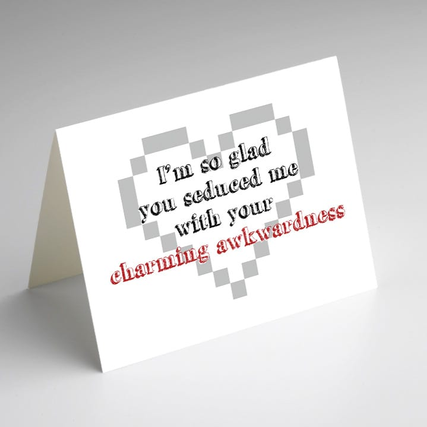
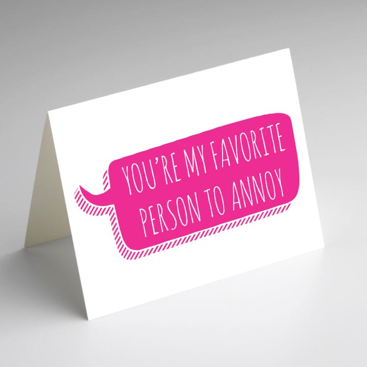
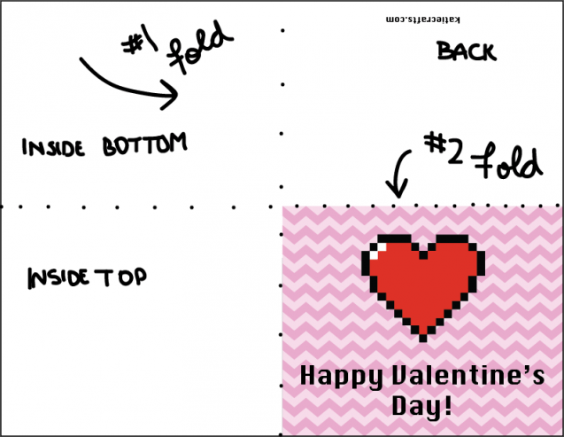

Happy

_almost_

Valentine’s Day, readers! I made five silly cards for you to give your Valentines this year, and you can print them out right now for free! They’ll soon be blank cards (without “Happy Valentine’s Day” inside) in my Etsy shop, so download them now while they cost nothing. They’re adorable, so what’s stopping you?

I had so much fun making these. I opt for the somewhat silly cards when getting things for the Husband, so I made five that I would have bought for him if I were shopping. They are all simple designs that you can print and fold at home. Not everyone has a printer that can handle double sided pages, so these folded cards are a little old school- but that’s okay! Once they’re in my shop, there will be more options. But for Freebie Friday, these will do just perfectly. I hope you like them enough to give them to your friends/family/significant other/co-workers/Valentines!

They read:

**Card #1: Click Here To Download**

_outside:_

“I love you almost as much as I love my cat”

_inside:_

“…almost.”

Card #2: Click Here To Download

**\&#xA;**

_outside:_

“Thanks for loving me even when I don’t shave my legs.”

_inside:_

“Happy Valentine’s Day.”

Card #3: Click Here To Download

**\&#xA;**

_outside:_

“You are the only person I tolerate before coffee.”

_inside:_

“Happy Valentine’s Day”

Card #4: Click Here To Download

**\&#xA;**

_outside:_

“I’m so glad you seduced me with your charming awkwardness”

_inside:_

“Happy Valentine’s Day!”

Card #5: Click Here To Download

**\&#xA;**

_outside:_

“You’re my favorite person to annoy”

_inside:_

“Happy Valentine’s Day!”

Be sure to save each pdf to your computer before printing. Then before you print each, change your printer setting to

**US Letter Borderless**

. That’s it! Need a refresher on folding? Here’s a reminder::

Which card is your favorite? Let me know in the comments!! And if you print any, tell me how your Valentine likes them! 🙂
