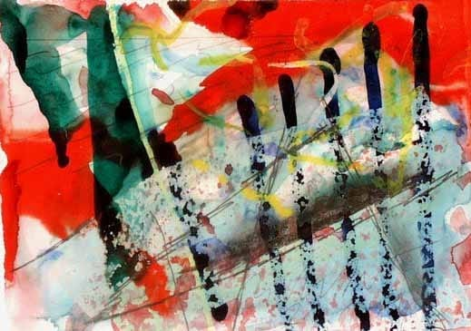
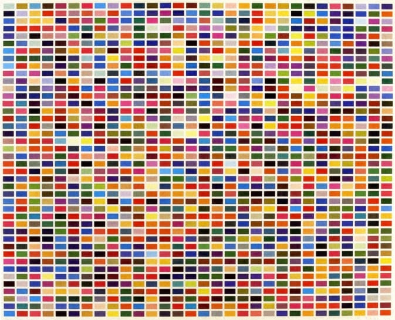
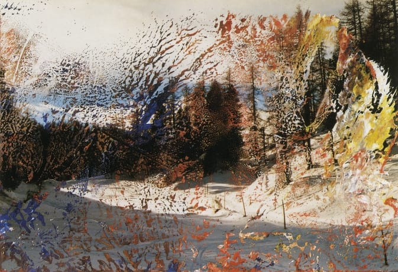
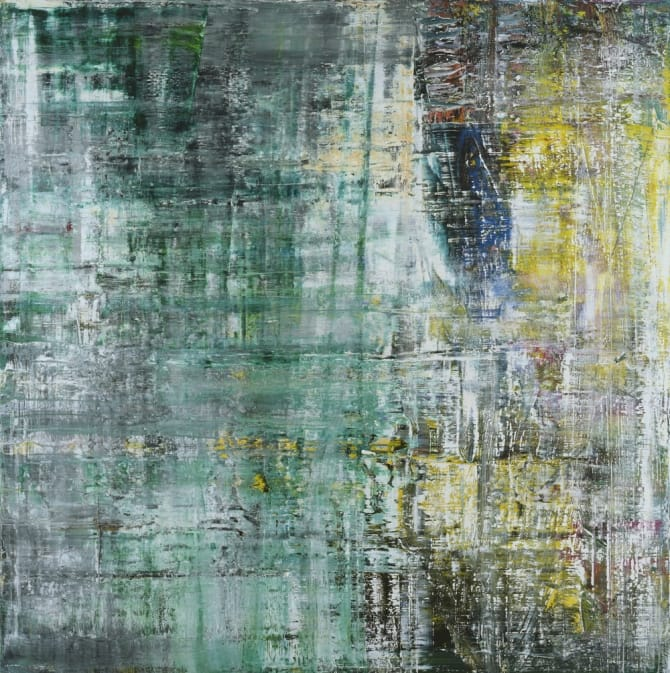
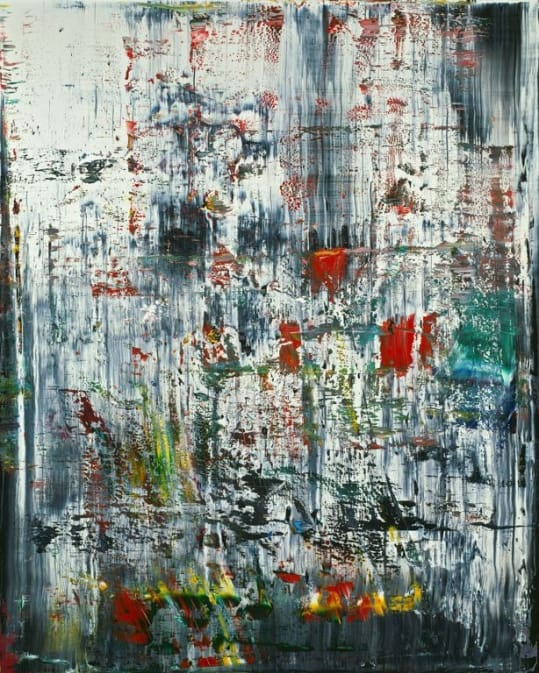
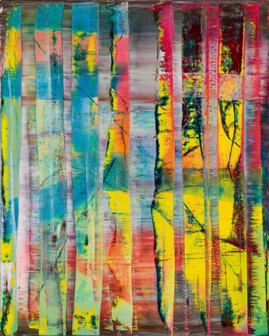
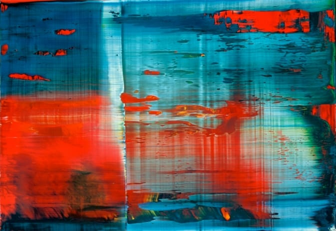

## **“Art is the highest form of hope.” \~Gerhard Richter**

\[source:

Text for catalogue of documenta 7, Kassel, 1982]

My favoritest artist of all time is

**[Gerhard Richter](http://www.gerhard-richter.com/ "Gerhard Richter")**

. When I started my college education, I knew I wanted to paint and draw but I was more drawn to landscapes, people and animals- anything realistic- and knew nothing of abstract, non-linear or contemporary artists. I could appreciate the few I knew about, but certainly wasn’t passionate about them. That is, until, Gerhard Richter.

Over the last five decades, German artist Richter has been a prominent and important artist in many medias and genres (not just abstracts!) He’s done mass amounts of amazing paintings and drawings, worked with oils, watercolors and many other mediums, and even produced several collections of overpainted photograph works (which are so great!!)

My undeveloped style of painting was still undecided until I learned about Richter and saw some of his pieces in person. I hadn’t thought of abstract workings as something that would affect me one way or another, but they just kind of struck me. Since, I’ve taken a Richter-approach to my own works, using tools other than paint brushes and lots and lots of layers to create something for the viewer to reach out and touch. That last part is pretty frowned upon in a museum setting with famous paintings, but feel free to touch the things on the wall in my living room whenever you like. 😉

I don’t want this to seem any more than a book report like it already has- I just really wanted to share what (or who, rather!) inspires me. I’ve put together a short list of my favorite pieces, both abstract and concrete (if I put them all, you’d be here all day) so that you can enjoy my favorite artist, too! Sit back and enjoy how he plays with colors and paints, and who knows- maybe you’ll come away with a new appreciation and fondness for the arts as well!

Colour Fields, 1974;

**6 Arrangements of 1260 Colours (Yellow-Red-Blue)**

Fextal, 1989; 10 cm x 15 cm; Oil on colour photograph

One of my absolute favorites!

Cage 6, 2006; 300 cm x 300 cm; Catalogue Raisonné: 897-6; Oil on canvas

Eis 2/Ice 2, 1989; 200 cm x 160 cm; Catalogue Raisonné: 706-2; Oil on canvas

Abstraktes Bild/Abstract Painting, 1992; 200 cm x 160 cm; Catalogue Raisonné: 769-1; Oil on canvas

Abstraktes Bild/Abstract Painting, 1999; 50 cm x 72 cm; Catalogue Raisonné: 858-3; Oil on Alu Dibond

At top of page:

**G.A.4 (21.1.84), 1984; 15 cm x 21 cm; Coloured ink, watercolour, graphite and crayon on paper\&#xA;**

(It’s at the top of the page because not only is it my favorite watercolor work of his, but it’s one of the pieces I was fortunate enough to see on display at the

[MoMa](http://www.moma.org "MoMa")

years ago!)

All photos are attributed to

[Gerhard-Richter.com](http://www.gerhard-richter.com "Gerhard Richter")

I hope you enjoyed my small sampling of Gerhard Richter’s many works, and especially hope you find yourself inspired for the weekend to come! I may just have to break out my easel tomorrow afternoon and start something new… Happy Friday!
