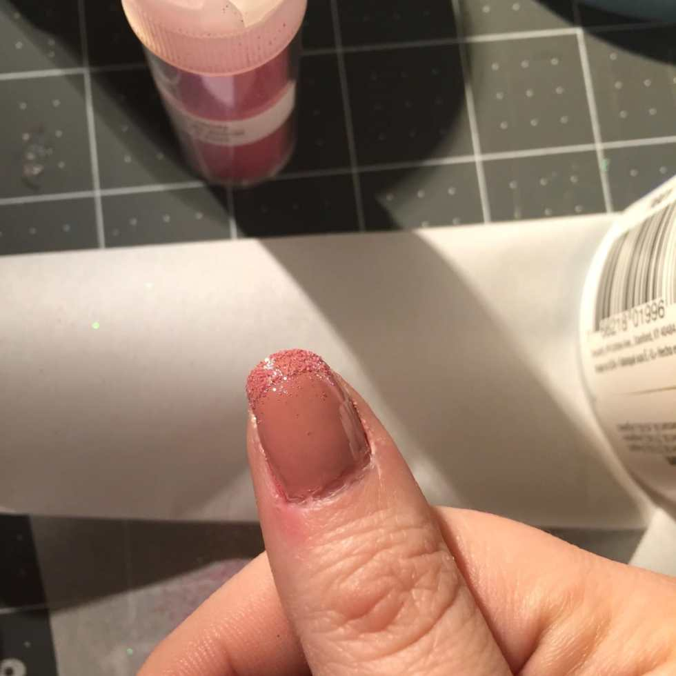
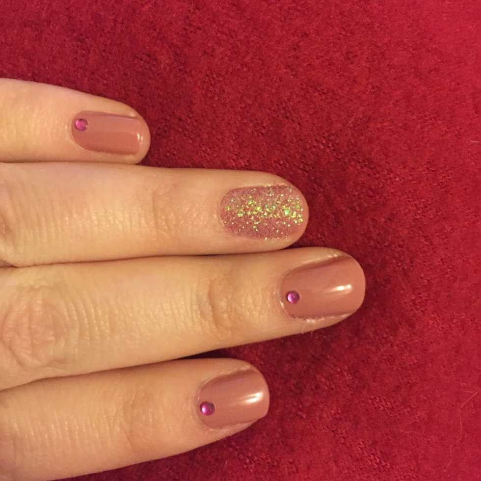
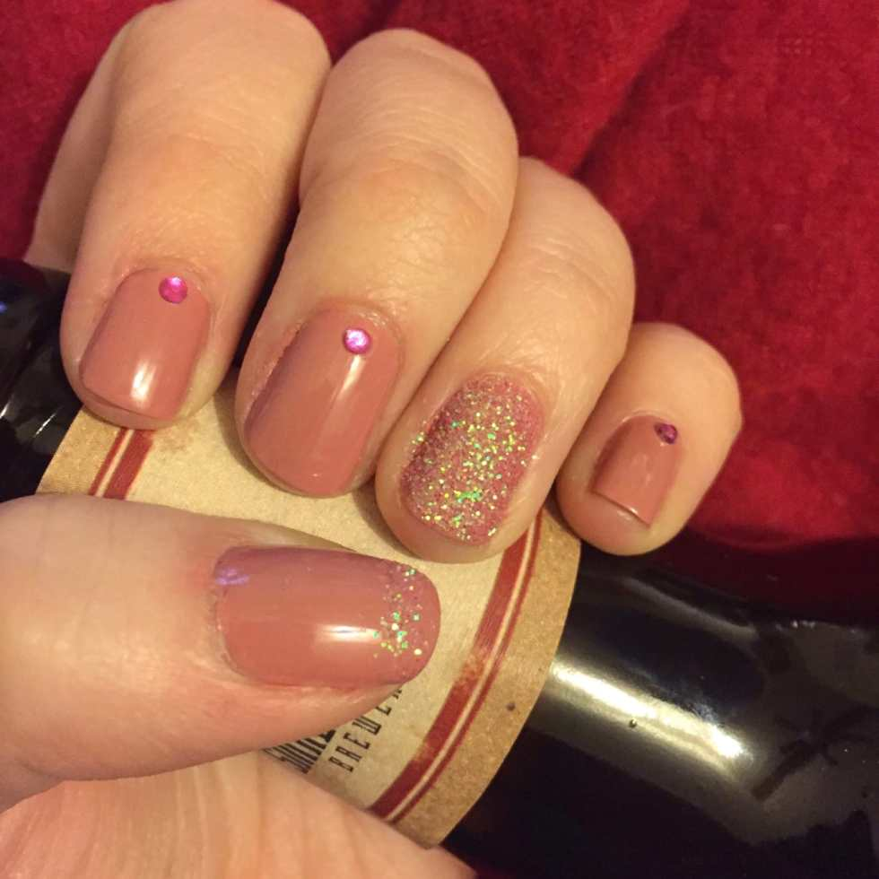

The

[last Valentine’s day nail art look](/blog/quick-easy-valentines-day-nails/)

I shared was a very simple red glitter polish. I went a step further this time and used actual glitter in the design! I was going to make little hearts and stuff, but I decided this look was classier and more versatile. Besides, I can’t say no to glittering Valentine’s Day nails!

## Materials:

- Nude/Pink nail polish

- Fine iridescent glitter in pink (I used

  [Martha Stewart’s Cotton Candy](http://amzn.to/1UOIdGZ)

  )

- Clear nail polish

- Pink nail gems

## Instructions:

- Starting with clean, dry nails, paint one coat of pink polish on every nail. Let dry.

* Do a second coat of pink on every nail

  **except**

  the accent nails (I picked my ring fingers for these). Let dry.

- While the others are drying, paint the accent nails (one at a time) and immediately sprinkle with glitter so that it sticks! Let dry.

* On the the thumbs, using either the clear or the pink polish, paint a thick french tip and immediately cover it in glitter. Let dry.

- When all nails are dry, seal in look with clear top coat, skipping the glitter portions if you like. I skipped the glitter so that it would stay extra sparkly!

- While the nails are still wet, add a nail gem to the bottom center of each non-accent nail.

- Enjoy your sweet Valentine’s manicure… and your Valentine’s Day!

Don’t forget to check out Valentine’s nail looks from the past! There are cute ones from

[2015](/blog/xoxo-valentines-nail-art/)

and

[2014](/blog/valentines-glitter-design/)

!

Which nail art design do you like better for Valentine’s Day- this look or

[my last look](/blog/quick-easy-valentines-day-nails/)

? How will you be wearing your nails that day?
