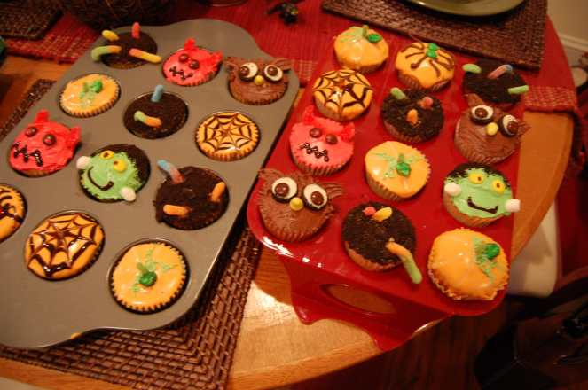

Halloween Treats: 2 Easy Recipes

Though I didn’t get to make any of these treats this year, they have both been on my table at some point or another! They are very easy (and fun) and so I thought I’d share them with you in case you want to add them to you Halloween party menu!

We called this

_**Shrunken Heads in Blood Punch**_

… or something similar. It was super cute!

## Ingredients:

- Peeled apples

- Paring knife

- Bowl of punch

- Gummy worms and ice cube tray (optional)

## Instructions:

- _Carefully_

  use a paring knife to carve out faces from your already peeled apples.

- Throw said apples in punch. (Your favorite rum punch will do, as long as it’s red!)

- Enjoy.

## Tip:

- TOO EASY? Add some floating worms just as guests arrive! Achieve this by putting gummy worms (the non-sugar coated ones) in an ice cube tray with some of the punch. Let freeze. The punch ice cubes melt pretty quickly and all the worms will sink to the bottom so be sure to do it at the last moment!

Next up, you’ll use more of those gummy worms to make

_**Worms In Dirt Cupcakes**_

!

## Ingredients:

- Oreo Cookies

- Something heavy like a meat tenderizer

- Ziploc or other heavy duty food storage bag

- Gummy worms

- Already cooled and iced cupcakes

## Instructions:

- Places Oreo Cookies in Ziploc bag.

- Grab meat tenderizer, hammer, bottle, can, or something else heavy and not easily broken.

- Take life’s aggression out on cookies, turning them in to cookie crumb dirt.

- Sprinkle cookie crumb dirt all over pre-made and iced cupcakes (chocolate icing will lend itself to your whole dirt theme!)

- Use straw, chopstick or your fingers if they are clean and poke a few holes in random places in cupcakes.

- Stick worms out of those holes, to look like they are rising out of the dirt.

- Enjoy.

## Tips:

- Get creative with your cupcakes! Use more Oreos and M\&Ms to make Owl eyes and the tip of a yellow worm to decorate a beak. Use orange and black frosting to make spiderwebs using a toothpick. Frankenstein can be made with cookie crumbs as hair and mini marshmallows as bolts in his neck. Make little devils or pumpkins by using appropriately colored icing and gum drops. Use your imagination! These are super fun to make as adults and even more so as kids!

Don’t forget to check out my

[**last minute Halloween costume idea**](/blog/last-minute-halloween-costume-idea-diy/ "Last Minute Halloween Costume Idea DIY")

, or my

[**Halloween nail art designs**](/blog/nail-art-design-halloween-manicure/ "Nail Art Design: Halloween Manicure!")

! And make sure you vote on who wore it best in my

[**Halloween Cat Dressed As A Bat Challenge**](/blog/throwback-thursday-halloween-cats-dressed-as-bats/ "Throwback Thursday: Halloween Cats Dressed As Bats")

!

What is on your Halloween Menu?
