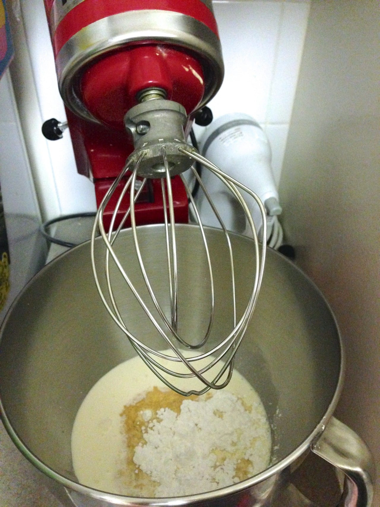
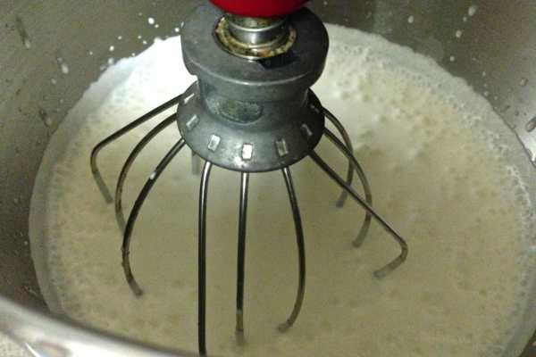
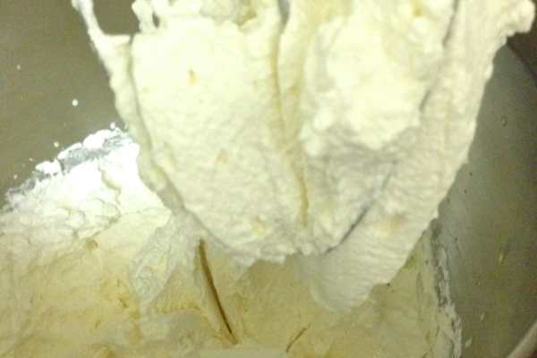
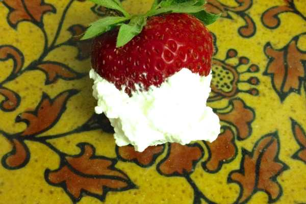
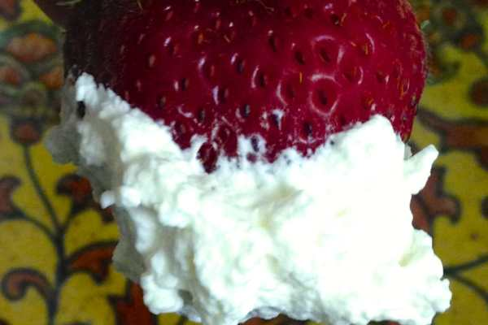
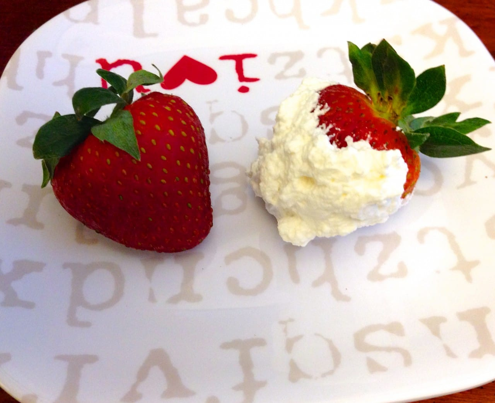
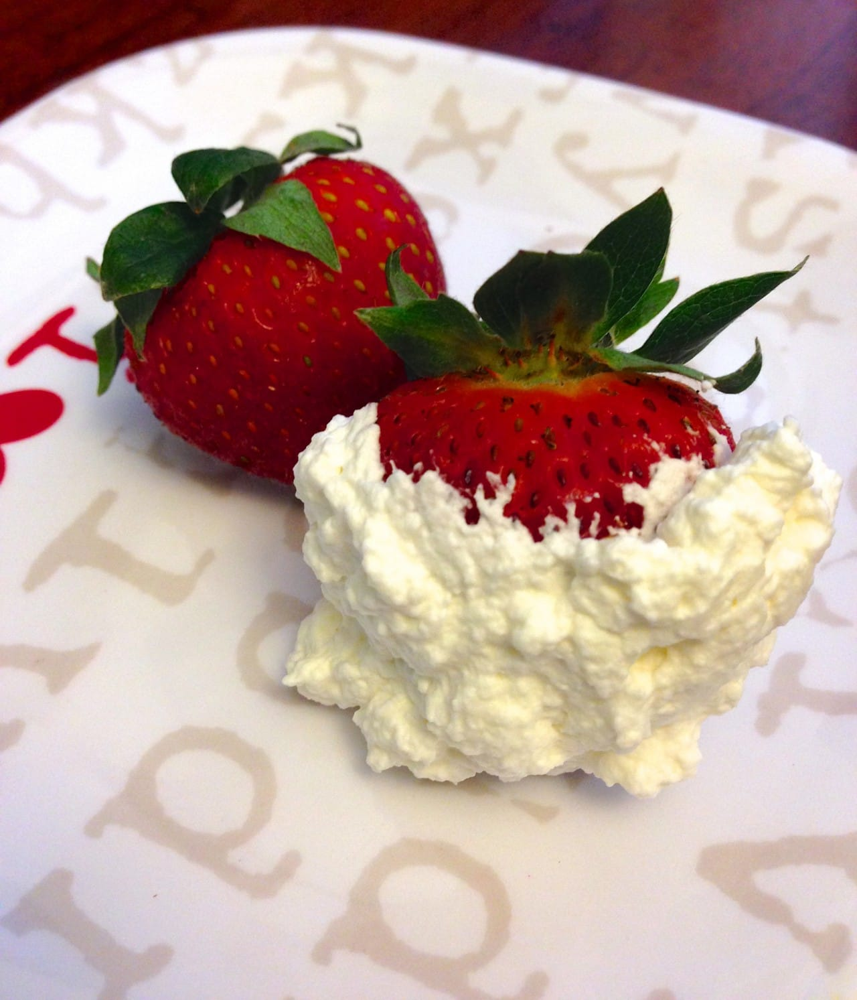

Recipe: Homemade Whipped Cream

Some days, you just want strawberries and whipped cream for breakfast. It happens! And with only three ingredients and just a few minutes, there is never a reason to eat fake whipped cream. Besides, with 4th of July coming up and red/white/blue snacks on your Pinterest board overflowing, you’ll need a good recipe. Here’s mine for something light and tasty!

I wanted this whipped cream to be mega light in flavor and barely sweet, but feel free to add more sugar and vanilla. Just do so in small doses til it’s the flavor you want it to be!

> _Disclaimer: Is my whipped cream pretty? No, it’s not. But I’ll explain why I wanted it this way in the instructions, along with how to get yours to be perfect!_

## Ingredients:

- Pint of heavy whipping cream

- 3 heaping Tablespoons of confectioner’s sugar

- 1 Tablespoon of pure vanilla extract

## Instructions:

- Add ingredients to

  **cold**

  bowl. (Stick it in the freezer if you have to!)

- Use electric mixer with a

  **cold**

  whisk to mix. Do so until peaks begin to form.

- For soft, pretty, billowy cream (the kind you may see in a whipped cream commercial!), stop

  _as soon as_

  peaks begin to form.

- For stiffer peaks, go a minute or two longer until you see it begin to separate. This is pretty much beating the cream to death (as I’ve done) but for good reason! This whipped cream (minus the amount I ate for breakfast with my strawberries!) will be the frosting on some

  [**strawberry cupcakes**](/strawberry-daiquiri-cupcake-recipe/ "Strawberry Daiquiri Cupcake Recipe")

  , and the soft pretty kind melts way too fast for this use. I wish it didn’t! But it does.

Done! See how easy that is? Now you have no excuse not to have freshly whipped cream on your next dessert!

## Tips:

- _How to store:_

  Whipped cream is best if served IMMEDIATELY. If you can’t serve it immediately, you can store it in in the refrigerator in an air tight container for a day or two. Be sure to give it a little whisk when you take it out of the fridge to re-mix any liquid that has formed.

- _Why confectioner’s sugar and not plain white sugar?_

  I used to make whipped cream with granulated sugar, and it would be delicious if eaten the second it’s finished, but if left out for just a little while it would “weep.” You know, when things begin to separate and there’s suddenly liquid dripping down your dessert. It’s not pretty. Confectioner’s sugar prevents that from happening for a bit longer.

- _3 heaping Tablespoons of sugar doesn’t seem like a “little” amount!_

  Perhaps it isn’t, if you are eating it off a spoon as is! Remember, this amount is used across an entire pint of cream! If you use any less, you won’t taste much else besides cream. This is the perfect amount to have just a hint of sweetness. You can definitely add more if you want it sweeter!

- _Substitutions and additions:_

  Nix the vanilla and do something else if you like! Peppermint extract will make a minty sweet whipped cream that would be great on top of hot chocolate. Add a couple of tablespoons of a fruit pureé (strawberry, anyone!?) to give your whipped cream something more fun (and more colorful!)

- _Won’t the brown pure vanilla extract turn the cream brown?_

  Nope! Not with the small amount of vanilla you are using and the large amount of cream you are using. If you are still worried about it, they make clear imitation vanilla!

- Toss together strawberries and blueberries and add a dollop of whipped cream on top for a quick, easy, and (for the most part) healthy Fourth of July snack!

- 
