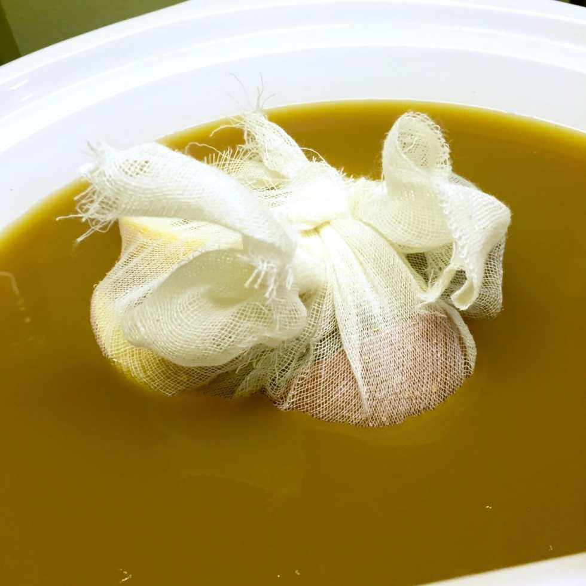
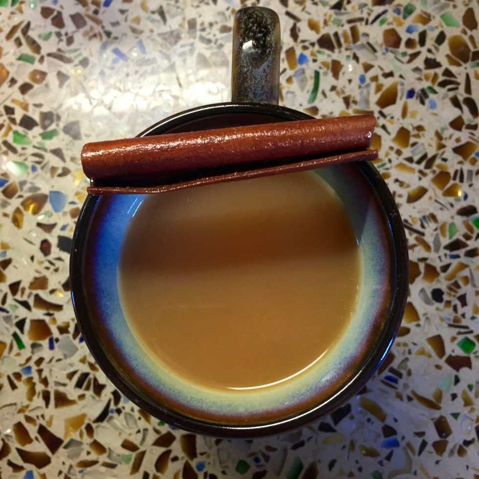

_?On the eleventh day of Christmas, Katie Crafts gave to me…?_

The tastiest (and easiest) hot spiced cider recipe in the universe! You can make the best apple cider for your guests this holiday with just a handful of ingredients and a crock pot. Rum optional. 😉

Nothing warms your bones during the cold winter months as much as a hot mug filled with something yummy. Sometimes you’ll want it to be hot chocolate, other times you crave something a little different. Perhaps cider? Perhaps spiked? Yes please!

I went ahead and added the rum to my batch, making it quite alcoholic (and delicious!) If you aren’t a spiked cider fan, feel free to omit it. I’ll add what I used to the ingredients list either way!

## Ingredients:

- 1 gallon of apple cider

- 1/2 an orange

- 1 small apple

- 1 whole nutmeg

- 3 or 4 cinnamon sticks

- Approx. 25 whole cloves

- 1 cup brown sugar (not pictured)

- 1 1/2 to 2 cups Kraken Black Spiced Rum

- Cheesecloth

## Instructions:

- Cut your orange in half if you haven’t already, and do the same to your apple!

* Stick the cloves in the apple and orange pieces as pictured.

- Cut a large square of cheesecloth and place the orange, apple, cinnamon sticks and nutmeg inside. Tie it closed into a little bouquet.

* Add entire gallon of apple cider to crock pot.

* Add brown sugar to crock pot and stir until it dissolves.

* Add bouquet to crock pot. It will float- that’s fine!

- Turn your slow cooker on Low for 3-4 hours. Because there is no raw food here, the time isn’t as important. You are just trying to heat it through thoroughly and let the spices do their thing. If you want it spicier, let it cook longer. If you’re in a rush, throw it on High for 2 hours instead. It’s up to you!

- When it’s done and you’re ready to serve it, add the rum (if you are so inclined!)

- Enjoy!

If you make this cider for your holiday party, let me know how it turns out! AND DON’T FORGET ABOUT THE GIVEAWAYS! They all end tomorrow! They are:

- [e.l.f. makeup haul](/elf-haul-giveaway/)
- [pearl earrings](/pearl-earrings-giveaway-with-natalia-khon/)
- [crocheted baby hat](/crocheted-baby-hat-giveaway/)
- [cupcake brooch](/cupcake-brooch-giveaway-with-me-mama-creations/)
- [baking supplies](/holiday-baking-giveaway-pb-cookie-recipe/)
