Project: How to Make a No Sew Baby Tutu

My best friend from home,

**K**

, is having her second baby

**TODAY**

– this time a little girl! She found lots of things on Etsy that she wants to get baby-to-be, but most of them are very expensive. I told her I’d take care of a few of them myself, including the tutu she wanted for the newborn photos! This project was so much fun and maybe one of the easiest I’ve made, using just a simple slip knot technique. I wish I had a reason to make a ton more!

You may remember when I shared how to make little

[_tulle pom pom flowers_](/blog/5-minute-tulle-pom-pom-flowers/ "5 Minute Tulle Pom Pom Flowers")

a few weeks ago, and then how to make

[_baby headbands_](/blog/how-to-make-baby-headbands/ "How To Make Baby Headbands")

after that. All that work was to match this tutu for one super cute baby shower gift! It’s all starting to make sense now, right? 😉

## Materials:

- Light pink tulle, 6″ x 25 yd roll\*

- Pink tulle, 6″ x 25 yd roll\*

- No-roll elastic, 1/2″

- Pink satin ribbon

- Scissors OR rotary cutter and mat

- Hanger with hooks OR roll of paper towels OR piece of cardboard- something to stretch elastic band over during project

- Measuring tape (not pictured)

- Hot glue gun OR sewing machine (not pictured)

\*I used

[_Expo tulle_](http://amzn.to/14wPINX "Expo Tulle on Amazon")

in “shiny” because I want it to catch the light a little more in photos! You can use the glitter kind or regular kind if you don’t want the shiny one (but it’s subtle shimmery tone is so cute!) The newborn skirt used a little more than half of each roll. If you aren’t sure how much you’ll need, always get extra, just in case.

> _Note: Using a hot glue gun will make this tutu_
>
> _**100% completely no sew**! However, I sewed the elastic together simply because it is stronger and has a better chance of staying in one piece longer. Obviously, sewing this spot together negates the whole “no sew” idea, so it’s up to you! The rest of the tutu is made without sewing, so even if you do sew together the elastic, it is super minimal and can be done by hand in just a few minutes!\&#xA;_

## Instructions:

- First step is to make the waistband. For a newborn, you will want a 12-14″ band. I researched many charts to see what the best fit for a newborn is, and it ranged between 10 to 16 inches, with most between 12 to 14 inches. I’ll go right down the middle and make mine 13 inches. This means I have to cut 14 inches of elastic, so that there is a one inch overlap.

* You can either glue the overlap together, or sew it with your machine for extra durability. You can even hand stitch this together if you want!

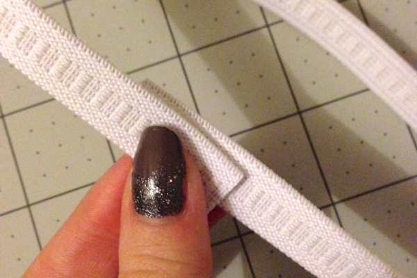

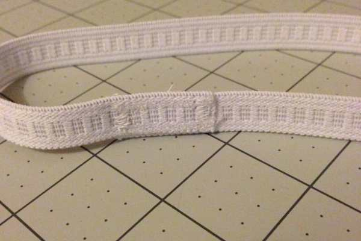

- Now that your waistband is made, stretch it out on the hooks of the hanger, or a roll of paper towels, or a square of cardboard or even your thigh! As long as the elastic is stretched a little bit, just not TOO much.

  _I started out using a hanger but realized since it’s a newborn tutu, the smallest tutu I could make, it would be too large for the elastic. SO I switched to cardboard. You’ll see what works best for you!_

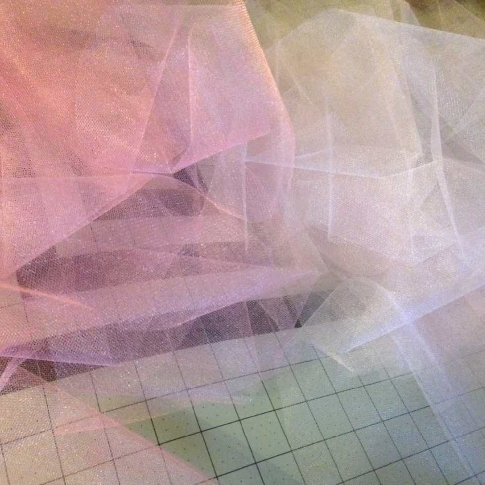

- Next, you will need to cut your tulle in to neat 14 inch strips. I ended up using 36 strips of each color. Combining the two pinks that are just a couple shades apart gives a great dimension to the skirt, but you can use all one color, or completely varying colors if you like.

- Cutting all the strips at once makes the next part go much quicker, so cut ahead of time for ready to go piles. If you run out of strips, you can of course pause and make more. There was a

  _ton_

  of static electricity on my cutting mat so my piles were more like giant messy lumps. I tried to make them neat piles for the photo, but that didn’t work out very well.

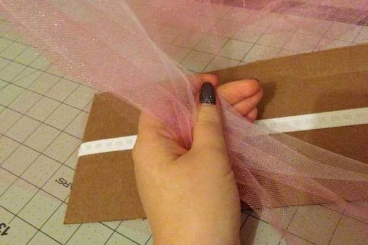

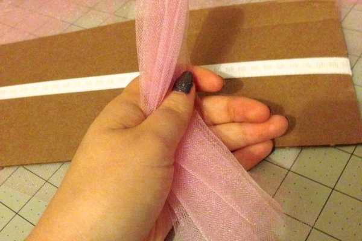

- Take one piece of each color of tulle and lay them on top of each other. Give them a little pull and then fold them in half.

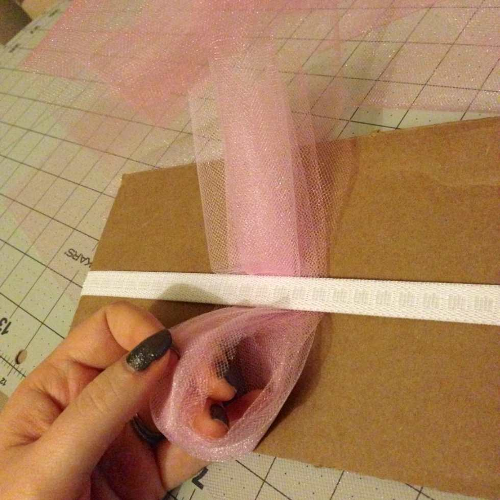

- Place the loop under the elastic like in the photo above. Then slip knot it on to the elastic like the photos below.

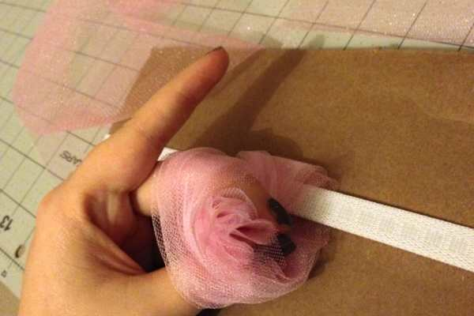

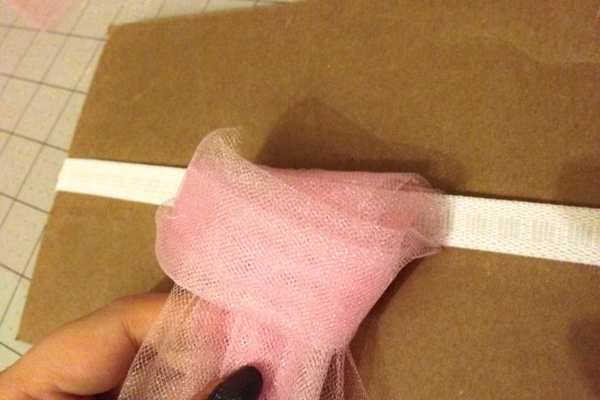

- Pull it tightly to make the knot the way you want it to look, but don’t pull TOO much or you’ll stretch the elastic. I’m guilty of doing this myself. Hopefully the tutu still fits the baby!

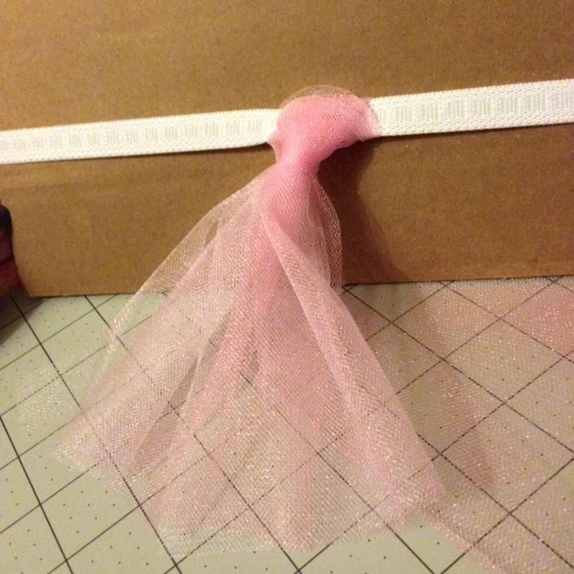

- Do this all the way around until you almost reach the end, then take the elastic off of whatever you have it stretched over.

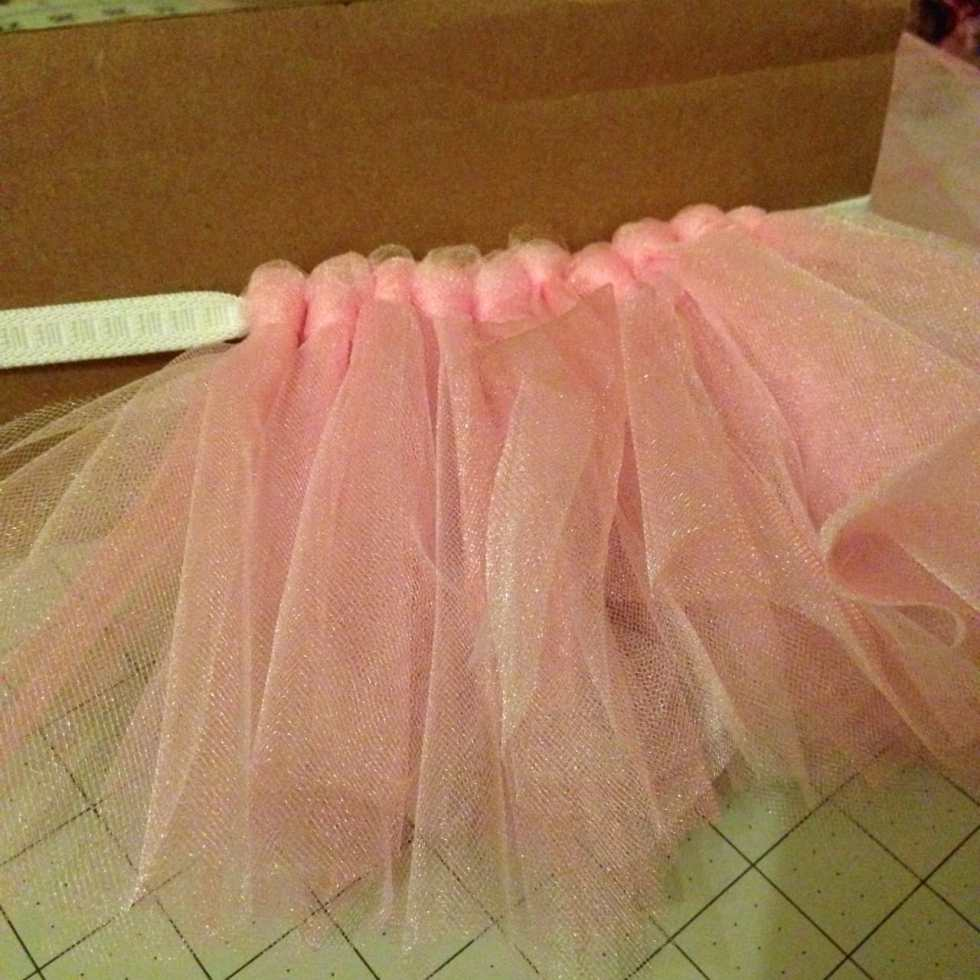

- Play around with the pieces, moving them around to see if you need more tulle. I ended up not needing any more once I got to that point. The existing ones just needed some moving around to fill the elastic.

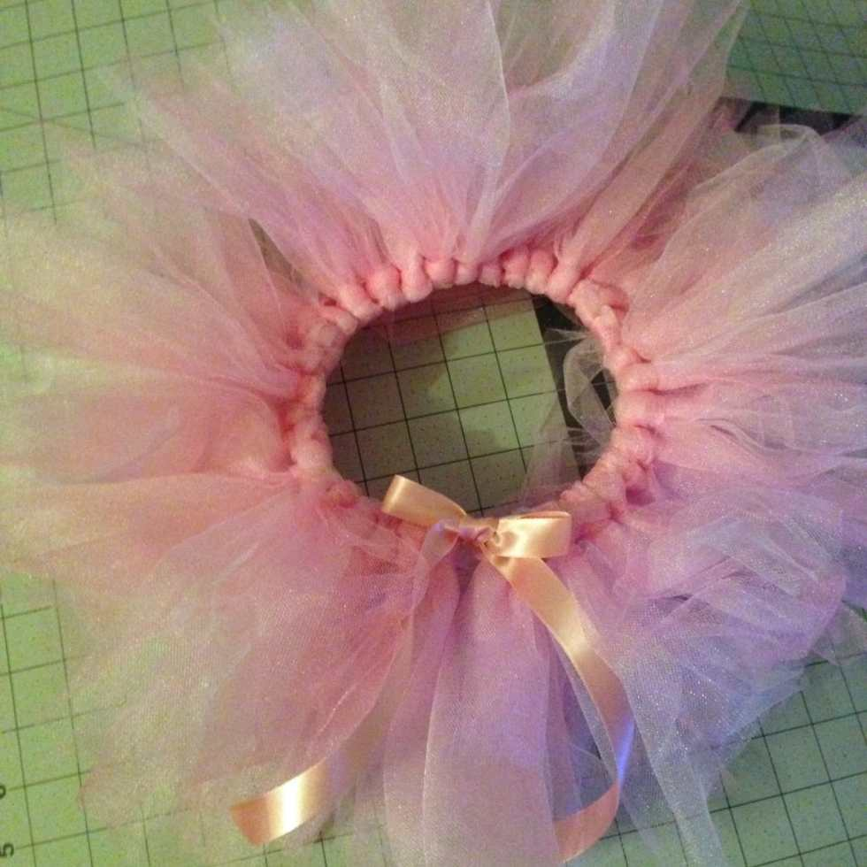

- Cut a piece of ribbon whatever length you desire and slipknot it on to the elastic between two tulle knots. Make a bow and snip ends of ribbon to equal length.

- Use your fingers to separate all the tulle layers and fluff it out to make a fuller tutu.

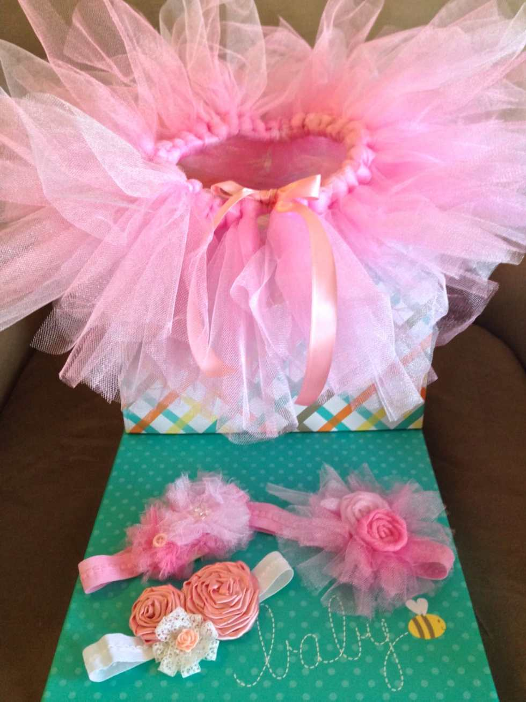

- Step back and

  _ooh_

  and

  _ahh_

  at your adorable work!

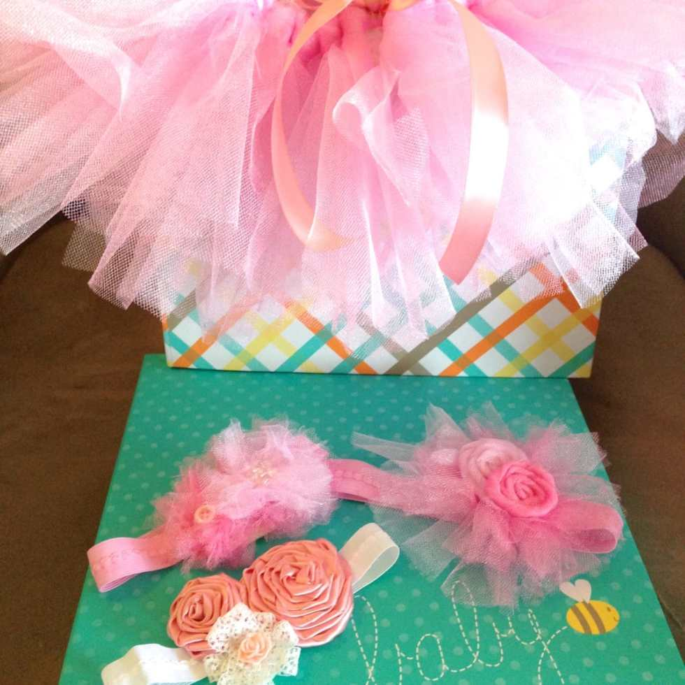

## Tips:

- Tulle is messy. You may not think so, but every snip or adjustment you make will shed little tulle dust all over. Make sure if you aren’t working on a mat, that you at least work on a surface that is easy to wipe down.

- The 14 inch strips of tulle, when folded in half and knotted, give a skirt length of about 6 inches. You can make the strips shorter or longer depending on how long you want your tutu.

- Easily make this for a toddler or little girl instead by adding length to the tulle strips and the elastic band. Since they work up in about an hour or so, your little one can have a different colored one for every day of the week!

- Alternate knots with different colors to make a rainbow tutu.

- Add three strips to each knot instead of two for an even fuller skirt.

- The glitter tulle is a lot rougher/itchier than regular or shiny tulle. Take a trip to your local craft store and feel the fabric for yourself before buying it. You may decide it’s not worth it since it will be against a baby’s skin!

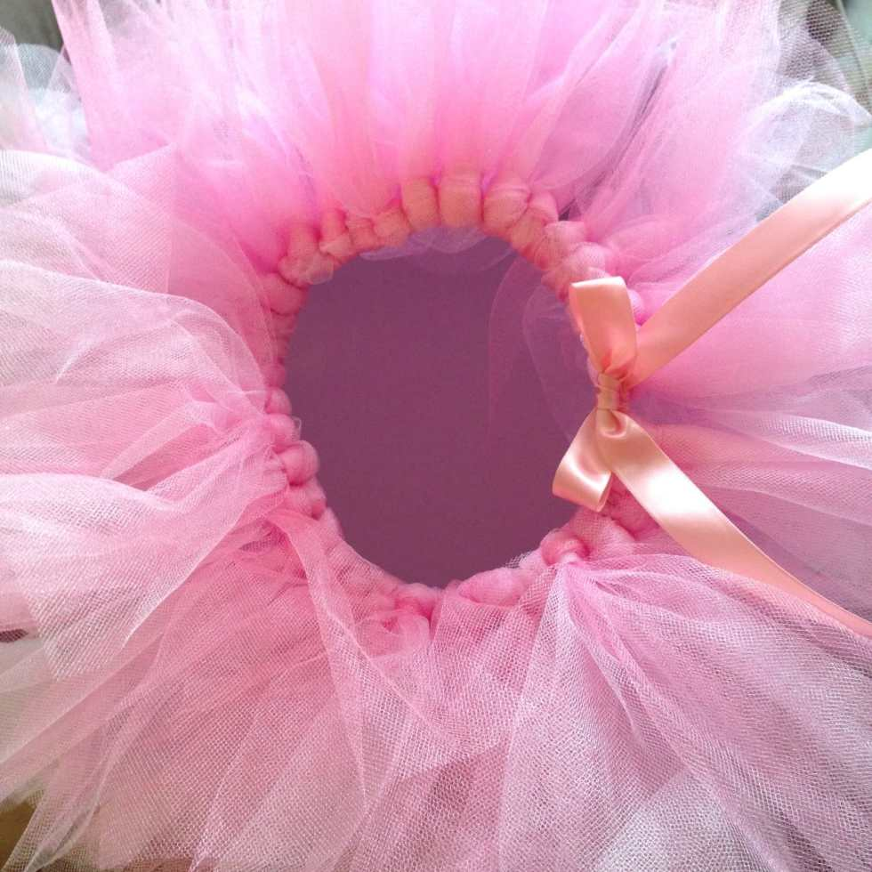

Welcome to the world, little

**E**

! I can’t wait to meet you!
