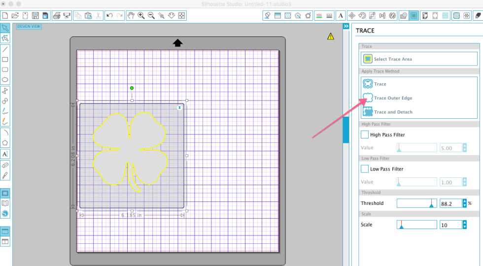
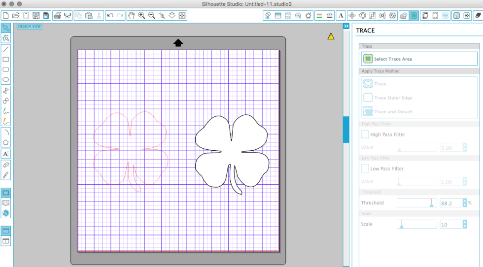
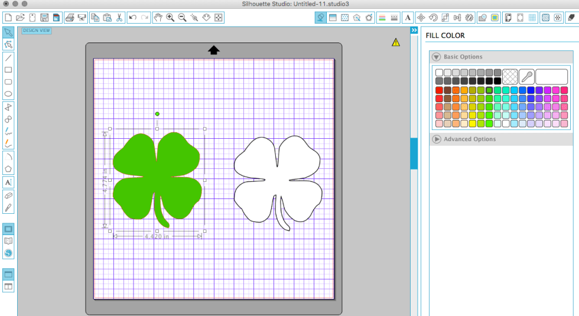
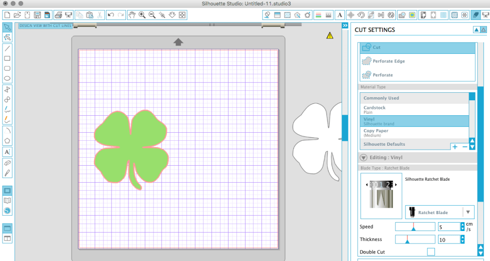
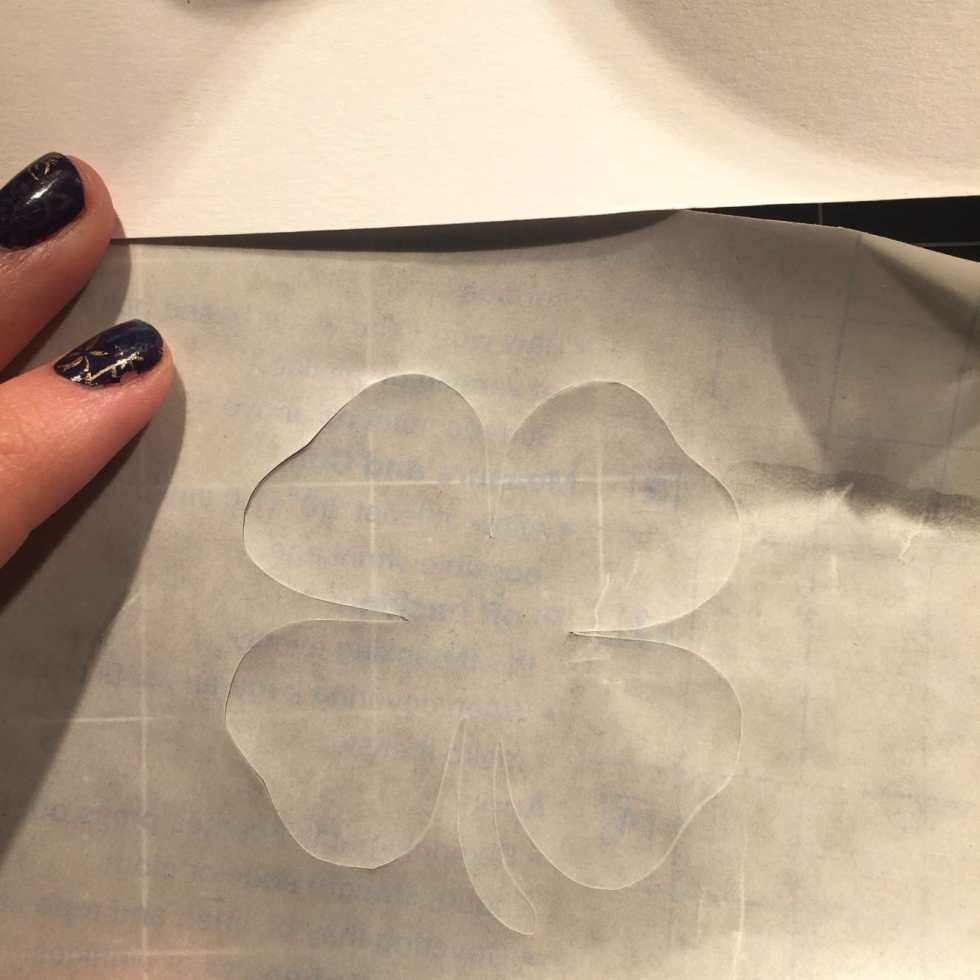

Stencils are a great way to add a personal detail to all kinds of things: walls, headboards, clothes, mugs, and more! If the craft store doesn’t have the kind of stencil you are looking for, why not make your own? Today you will learn not one, but TWO ways to make an adhesive stencil! First, I’ll show you how to do it by hand. Then, I’ll share how to make one using an electronic cutting machine. Tomorrow I will give you a project to try your new stencil out on!!

I have a magical machine called a

**[Silhouette Cameo](http://amzn.to/1nMrdG4)**

that cuts all my paper crafts, vinyl, etc. for me! So of course, I use it to craft the perfect stencils. If you have a Silhouette and you want to learn how to make your own stencil, read Tutorial #2 below! It includes photos of how to trace any image you find online to turn into a stencil or decal. If you don’t have a Cameo, you can make a stencil by hand with the easy steps in Tutorial #1. Check both DIYs out below!

# How to Make an Adhesive Stencil: By Hand

## Materials:

- Contact paper or shelf liner paper, the self-adhesive kind! (I get mine at the Dollar Tree!)

- Scissors

- Paper

- Pencil

## Instructions:

There are a couple different options for making a stencil by hand.

- Google the Image\*

  1. You can find a picture of what you want your shape or initial to be online and print it out. Search for designs with a clear cut outline that will be easy to cut out.

  2. Cut the design out, for example, a shamrock.

  3. Place the shamrock on top of the contact paper. Trace it with your pencil and carefully cut that out leaving behind the outside of the object in tact to be an adhesive stencil.

- Draw the Image

  1. You can draw the image yourself! Remember, you will be using the negative space later, so stay away from designs that are detailed inside the shape. You are looking for something that will have a simple outline.

  2. Cut the design out, for example, a shamrock.

  3. Place the shamrock on top of the contact paper. Trace it with your pencil and carefully cut that out leaving behind the outside of the object in tact to be an adhesive stencil.

_\*Tracing an image from Google is for personal use ONLY! Do not take someone else’s copyrighted work and sell it or try to pass it off as your own!_

# How to Make an Adhesive Stencil: Using Silhouette Cameo

## Materials:

- Contact paper or shelf liner paper, the self-adhesive kind

- Scissors

- Computer with Silhouette Studio Software loaded

- [Silhouette Cameo](http://amzn.to/1nMrdG4)

  (or other electronic cutting machine)

- Cutting mat

## Instructions:

- If you don’t have an image you already plan on using, search Google for something! If you are doing an initial mug, you can use whatever font you like in Silhouette and just make it larger. If you want a silhouette of something specific, you can trace the image from Google using these steps:

  - Look for an image that is black and white with a strong outline (i.e. lines that connect and won’t be hard to cut). “Coloring” pages are good examples to use. Larger images are best. PNGs and JPGs are the file types you are looking for.

  - Save image to your computer and then open it in Silhouette Studio (File>Open). If you are using a Mac, you can just drag it from your desktop and drop it right on the mat inside the studio.

* Once the image is in the studio, click the tracing button (green square with a butterfly on it). Then click “Select Trace Area” and use your mouse to put a big highlighted box around the entire image.

- If the yellow highlighted portion of the outline doesn’t look full enough, you may need to play with the High Pass Filter and Threshold. Just slowly move the numbers up on one/both until the outline is totally filled in and solid.

* With the image highlighted, click “Trace Outer Edge”.

- Now drag the image away from it’s original spot. You’ll see a red outline is left. That is your new cut file! When cutting the stencil/vinyl, it will cut all along the red, creating a perfect shamrock.

- I opened the “Fill Color” screen and filled the clover with green, just to see what it looks like. You do not need to do this step, as it’s going to cut around the red outline no matter what. I just always like to visualize the image first!

- The original image (the black and white shamrock) has no cut lines, and therefore won’t cut when you feed the contact paper/vinyl through your Cameo. You can move it to the side off your ‘mat’ and open your “Cut Settings” (looks like a little pen).

- Select “Cut” and “Material Type > Vinyl”

- It will tell you once you click vinyl what your blade should be set to. Vinyl is typically a Ratchet Blade setting of 1. You will need to use turn your blade to 1 before placing it in it’s holder and locking it in place.

- Place your contact paper or vinyl face up on your cutting mat. Be sure it’s on the same spot as the image you are cutting in the studio.

- If everything looks good, load your mat in your Silhouette Cameo and send the file to be cut!

- Use your scissors to cut excess around the shamrock/your image and weed the shamrock out. You are using the outside of it as a stencil, so you don’t need the shamrock itself. Leave the rest in tact on the paper backing until you are ready to use the stencil.

_That’s it!_

Now you have a great stencil to use for whatever your heart desires!

**_Tune in tomorrow_**

to see how I use this little shamrock on St. Patrick’s Day!
