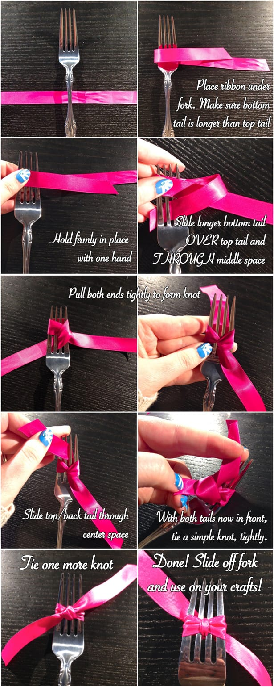
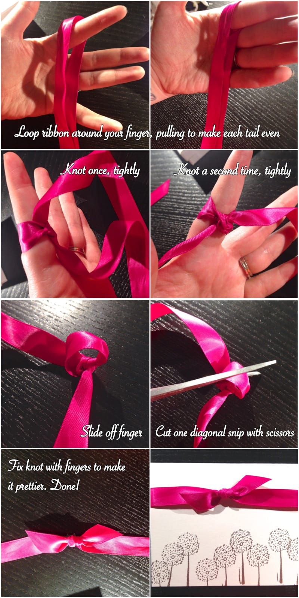

Project: How To Make The Perfect Bow (in 3 different ways!)

I love finishing touches on gifts! Sometimes, that silky ribbon really makes the whole present pop. In this post, I’ll teach you three totally unique ways on how to make the perfect bow- whether it be the dressing for a jewelry box or a decoration for your paper crafts!

Sometimes I’d re-tie a ribbon half a dozen times on a gift before I’d get it just the way I wanted it. That’s because I never tied it the same way twice, and when I’d finally perfect the bow, I wouldn’t remember what I did to get it that way! I finally taught myself a few tricks to make the perfect bow every time, no matter what I need it for!

## Gift Box Bow

In this first tutorial, you’ll learn how to make a simple bow that will look great on any gift. Use a small ribbon for a jewelry box or a large wide one for a big gift box! This tutorial will work on either! I used a satin ribbon that I had laying around.

## Fork Bow

In the second tutorial, I’ll show you how to make a teeny tiny bow for use in any crafts. They are really small and adorable, and would be cute glued to hair clips for your baby’s hair, or even earring studs for bow earrings! You make them using a fork- so the size fork you use will make a different sized bow. In this instance, I used a standard dinner fork. Be sure it has four prongs, as that means it will have three spaces. It needs an odd number of spaces for this to work properly!

## Flat Knot Bow

In the third and last tutorial, you’ll learn how to make a really pretty flatter bow, that is totally perfect for paper crafts! I always want to add bows to homemade cards or scrapbook pages, but the big ones above just don’t fit in envelopes or in the plastic pages of an album. These little bows are perfect for them, though!

I hope you enjoyed these three bow tutorials! Which one is your favorite to use? Tell me if you try one!
