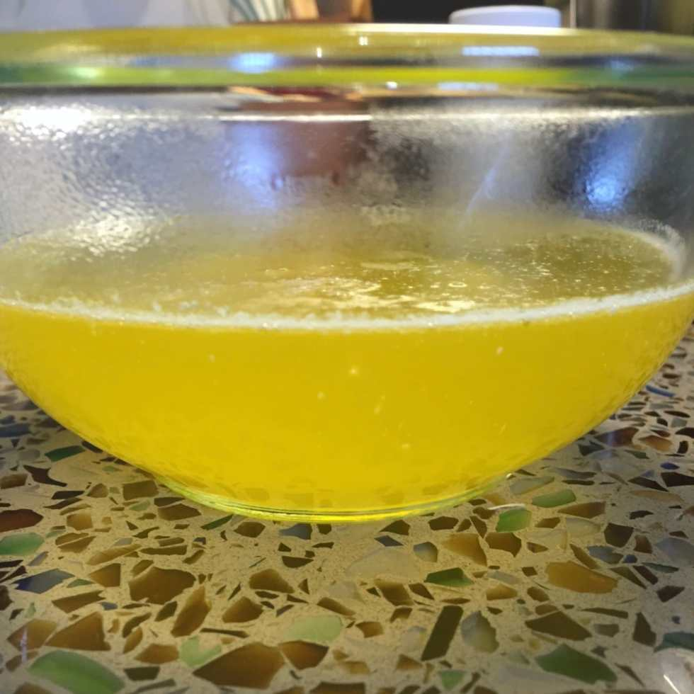
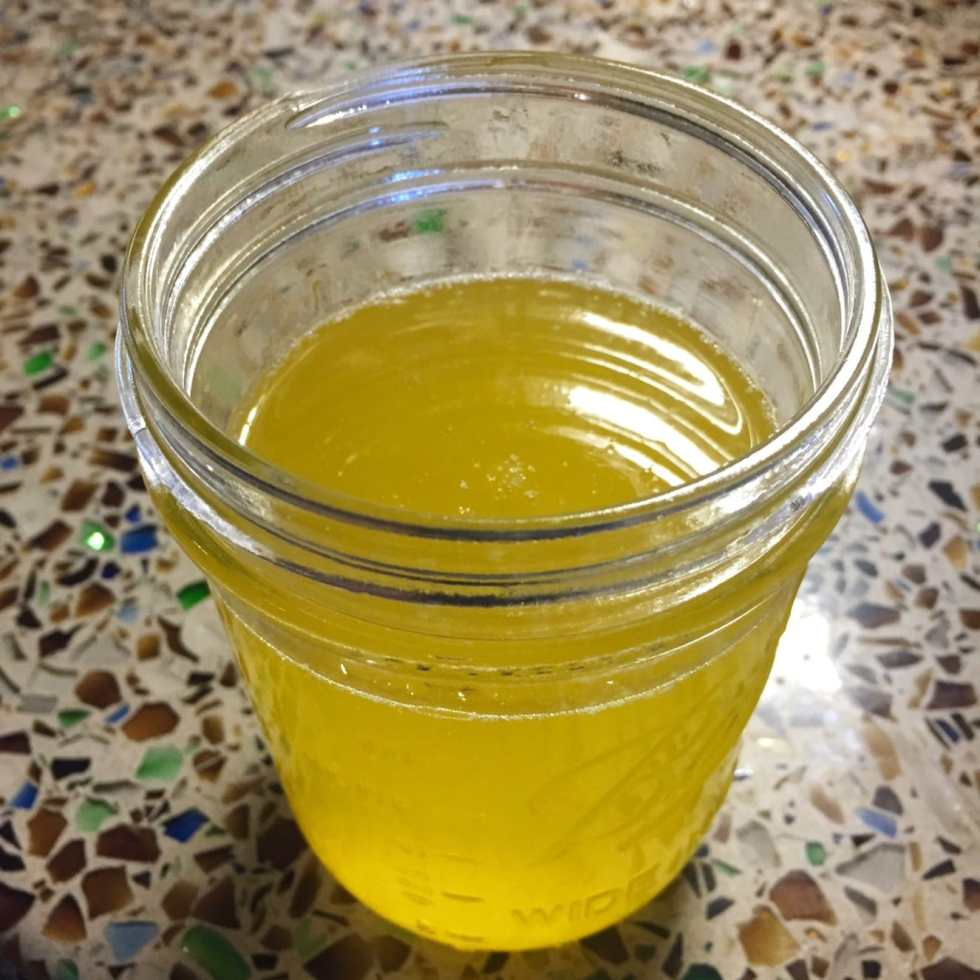

One of the rules of

[Whole30](/whole-30-approved-egg-muffins/)

is

_no dairy_

. That means I can’t use butter in cooking or to flavor any of my meals- unless I clarify it! You can find clarified butter, also known as ghee, in a few shopping markets, but I prefer to make it myself. It’s very easy and in my personal experience, it comes out better than the store bought kind. With just one ingredient and 10 minutes of your time, you can learn how to make your own ghee too!

Regular butter has a very low smoke point, so it begins to burn in your pan quite quickly. The part that is actually burning is the milk solids in the butter. If you remove the milk solids, you are left with clarified butter which has a much higher smoke point. It also makes it close to dairy free, for those who are lactose intolerant or can’t eat dairy. It’s commonly used in restaurants for seafood (now you know why your melted butter bowl with your lobster looks a little different!) and in many cuisines. It’s also one of the main ingredients in bulletproof coffee!

Learn how to make some DIY ghee below and make your Whole30 or Paleo lifestyle that much more delicious!

## Ingredients & Materials:

- One pound of good quality, unsalted butter

- Small square of cheesecloth

- Medium saucepan

- Spoon

- Container for ghee

- Funnel, if needed

## Instructions:

- Throw your butter into the saucepan on medium heat. If it’s one large block, you may cut it up first to speed along the melting process.

- Let the butter melt and begin to boil. Turn the heat down a little and let it boil for about 8 minutes. This will cause the water in the butter to evaporate and the milk fat to separate, turning into a solid/foam on the top of the pan.

* Once the butter has separated, turn off the heat and use a spoon to gently scrape out the fat. Don’t worry if you can’t get it all, that’s what the next step is for.

- Choose the container you’ll be storing your clarified butter in. Place the cheesecloth over it (or a funnel over it, and a cheesecloth over the funnel if you need to). I keep the cheesecloth on with a rubber band if I’ve cut the cloth to small. Additionally, you can double up on the cheesecloth to ensure you are getting as much of the remaining solids as possible.

* Slowly pour the melted butter through the cheesecloth and into your container. Dispose of the milk solids and cheesecloth.

- Ghee may be stored at room temp, but since I make it myself and may not get every last bit of dairy out of it, I keep mine in the refrigerator.

- Enjoy!

Have you ever made your own clarified butter before? What are your favorite recipes to use it with?
