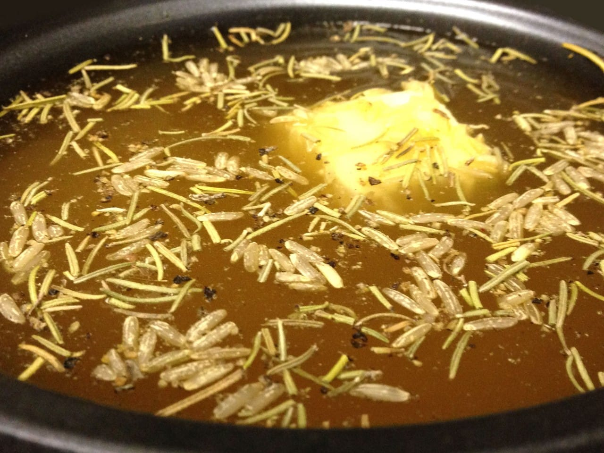

WHOA! Do you guys smell that? It totally smells like Chicken Cordon Bleu in a Crockpot to me! While Katie was away partying with the ladies this weekend, I decided to hunker down in the kitchen with our two cats, Lucky and Mabel, to recreate one of the first meals I ever made for her!

…What? You don’t know who I am? I guess I should probably introduce myself before I go ahead and divulge my kitchen secrets! I’m Sean to most everyone, but Katie likes to call me “The Husband”. I love programming (for work and for fun), playing video games (or killing monsters, as Katie calls it), Dungeons and Dragons (don’t judge me) and making a mess in the kitchen (also known as cooking). Since the things I make generally taste pretty darn good, I thought I’d share with you guys! This is the first official post of The Husband’s Recipe Box: Crockpot Chicken Cordon Bleu!

## Ingredients for the Chicken Cordon Bleu

- 1-2 large breasts of chicken\*

- 4-6 pieces of ham

- 4-6 pieces of swiss cheese

- 1 10oz can of cream of potato soup

- 1/4 cup of milk

- 1/4 cup of chicken broth

- Salt, pepper, allspice, paprika, rosemary, onion powder & garlic powder

_\*You’ll need about 2 wooden toothpicks per roll. If you use colored toothpicks, the dye will run off on your chicken, so stick to plain ones!_

## Ingredients for the Rice

- 1 cup brown jasmine rice

- 2 tbsp butter

- 2 cups chicken broth

- Salt, pepper, rosemary

## Preparation

Take each chicken breast and cut it in half horizontally. You want to make sure that you end up with slices of chicken thin enough that you’ll be able to roll them up later. If the chicken breast is REALLY thick, you might be able to get three slices instead of two.

Once the chicken is sliced, take out the day’s frustrations by smashing them flat; the flatter, the better. Just make sure you don’t destroy them (or the counter)! When they’re thin enough, take a fork or knife and poke a few holes in them so that the flavor can get in there, you’ll thank me later! Then, give them a light coating of salt, pepper, allspice (very little, it’s strong!), paprika, rosemary, onion and garlic powder. Feel free to leave out a spice or two if they aren’t your thing — it will still turn out delicious, I promise!

Take the slices of ham and swiss and layer them on top of the chicken, ham first. Depending on the size of the breasts, about two pieces of each should fit per slice. If you have ham and swiss left over, that’s ok. You can feed the ham to your cats (or dog) and save the swiss to toss in the crockpot for extra cheesy goodness.

Roll up the slices carefully starting from either end (ham and cheese in the middle!) and stick a toothpick through it so that it holds its shape. Try and make them around the same thickness and make sure that you sit the roll up on it’s end to help it stay closed.

Pop them in the crockpot any way they’ll fit (around the edges with one in the middle worked for me). Once they’re all snuggled in, mix the cream of potato soup with the milk and pour it over the top. Sprinkle a few bits of rosemary on top for effect and turn the crockpot on low for about 4-6 hours. The exact time will vary based on the thickness of the rolls you’ve made. Now we wait!

## It’s almost done! Better start the rice!

About 30-45 minutes before your crockpot is ready, you should start cooking the rice. I know it’ll be tough to go on (it smells SO good) but please try; it’ll be worth it!

Hopefully you have a rice cooker like Katie and I do — it makes this step incredibly easy. Toss the rice in the cooker and pour the chicken broth over it. Pop the little nugget of butter in there and sprinkle a couple rosemary sprigs on there to tie the flavors together (salt and pepper to taste). Turn that sucker on and try to keep yourself busy for the next 30 minutes.

## Ding ding, dinner time!

As soon as the chicken and rice are both done, turn everything off and give it a few minutes to cool down! We wouldn’t want you burning your tongues, it’ll ruin everything we’ve been working towards! Scoop some rice on your plate and nestle a little chicken cordon bleu right on in there (don’t forget to remove the toothpicks!!!) Enjoy!

If you try this recipe out and love it or change the ingredients up a smidge and it turns out fantastic, let me know in the comments!
