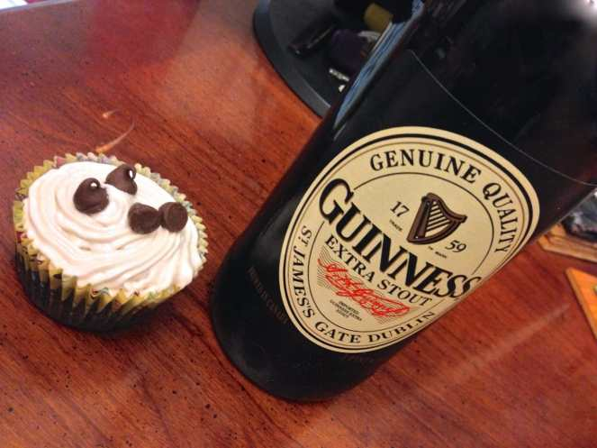
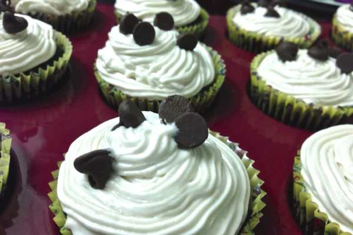
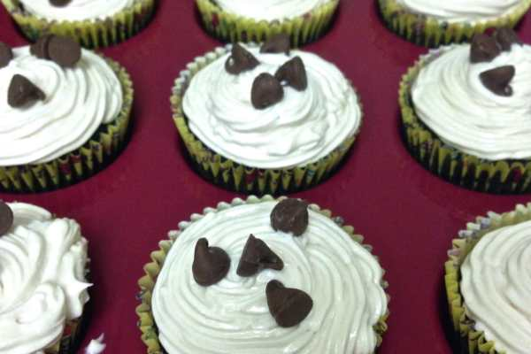
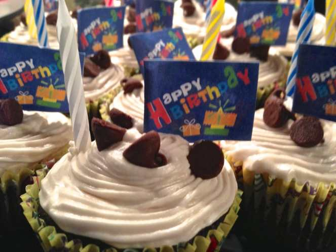

Happy Friday! Yesterday was our friend’s birthday! We helped to throw a surprise party for him! These are the cupcakes I made for it! They have Guinness and Bailey’s in them and are delicious! Give them a try! 🙂

Before you start anything, make room in your fridge! When your cupcakes are all frosted and finished later, that is where they will need to stay until you’re ready to eat them. The frosting (the delicious, delicious, alcohol filled frosting) is on the thinner side, so it needs to stay cold to set up.

Also, the cake itself is very dense- more like a pound cake than a light fluffy cake- so don’t be alarmed when you take them out of the oven and they resemble bricks! They are supposed to. And they are crazy good. Okay, on to the baking!

## Ingredients For Cake:

- 1 cup Guinness beer

- 1 stick of unsalted butter

- 3/4 cup unsweetened cocoa

- 2 cups dark brown sugar

- 1 cup sour cream

- 2 eggs

- 1 Tbsp vanilla extract

- 2 cups flour

- 2 1/2 tsp baking soda

## Directions:

- Preheat the oven to 350° F and line muffin tin.

* Break the butter up into small chunks. Combine with the Guinness in a large saucepan. Once the butter is melted, remove from heat.

- Whisk in cocoa and sugar.

* In a separate bowl, whisk together eggs, sour cream and vanilla. Add this to the beer mixture.

- Sift together the flour and baking soda. Fold into the liquid batter, squishing any chunks of flour that are left.

* Pour into the muffin cups about ¾ the way full. Bake 20 minutes or until a toothpick inserted comes out clean.

- Let cool 1,000,000% completely before frosting (or said frosting will immediately melt off!)

## Ingredients For Frosting:

- 1 stick of unsalted butter, room temperature

- 2 1/2 – 3 cups confectioners’ sugar

- 2 -3 shots of Bailey’s Irish Cream

  _(I made my own Bailey’s from scratch to use in this recipe- but that’s a whole different recipe post! You can use regular Bailey’s, and if you don’t want to buy a big bottle just for this recipe, the tiny airplane shots are perfect- just grab a couple of those!)_

- Chocolate chips for decoration (optional)

## Directions:

- Place the stick of butter in a large mixing bowl and beat at a medium speed for about 3 minutes.

* Add the Bailey’s and keep mixing.

- Gradually (about ½ a cup at a time) beat in the sugar. Put the beater on a slower speed so you don’t spray sugar everywhere! Only add extra sugar if it isn’t thick enough for you yet- it’s quite sweet as it is!

* Pick an adorable frosting tip if you like, and frost the cupcakes! Add chocolate chips for extra adorable-deliciousness. Store in fridge til you’re ready to serve! Pair with coffee ice cream for a delicious treat to honor

  _National Ice Cream Day_

  (which is this

  _Sunday, July 20th_

  !)

If you try this recipe out for yourself, let me know how it turned out! If you think I should post my homemade Bailey’s recipe sooner rather than later, give me a holler! 🙂 Have a great weekend!
