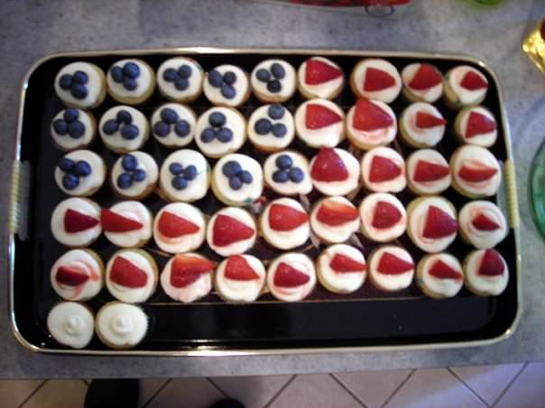

Recipe: Jam Filled Cupcakes with Lemon Cream Cheese Frosting

Today is a double whammy! It’s not only Memorial Day, but it’s my Dad’s birthday too! In honor of such, I’m disclosing my favoritestestest go-to cupcake recipe- you are so lucky! Get ready to bake (and drool!)

This recipe is my

_**favorite**_

for a few reasons. First of all, it is really easy while looking deceptively fancy! Instead of your typical Plain Jane cupcakes, these have that citrus bite in the frosting and a surprise jam filling in the middle. Every time I make them, people comment on my cupcaking skills and how it must have taken me so long to do. In all honesty, these are my fastest cupcakes to make!

Secondly, the cupcakes themselves are a great canvas. This is true of pretty much all cupcakes, but the possibilities are endless when you think of the different fruit and jam combos that you can use, making them completely different cupcake flavors!

Lastly, they are crazy delicious, which is why they are my go-to favoritest recipe! My dad also adores them, so it was a no-brainer to use this recipe as today’s post! I fashioned the berries and mini cupcakes to look like the flag to make it extra patriotic! These cupcakes were made using my from-scratch batter recipe, but I’ve also cheated and made them using boxed white cake. It came out great then too- so use that if you’re in a rush!

## Ingredients:

Cake:

- 3 cups flour sifted

- 2 ½ teaspoons baking powder

- 1/2 teaspoon salt

- 2/3 cup unsalted butter, softened

- 1 ¾ cups granulated sugar

- 2 eggs

- 1 ½ teaspoons pure vanilla extract

- 1 ¼ cups milk

- Red and Blue sprinkles (to make it red/white/blue! Use different colors for your theme!)

- Jar of jam of your choosing (I used strawberry!)

Frosting:

- One stick of unsalted butter, softened

- One 8 oz package of cream cheese, softened

- One box (approximately 4 to 5 cups) of confectioner’s sugar

- One tablespoon vanilla extract

- One tablespoon lemon zest

- 2 tablespoons lemon juice

- Fresh fruit of your choosing (I used strawberries and blueberries!)

## Instructions:

> _I made mini cupcakes for this recipe, but have also done full-sized versions. Follow instructions the same, and just add the extra jam as you see fit!_

Cake:

- Preheat oven to 350º, and line your mini cupcake tin with cupcake papers.

* Sift flour, baking powder and salt (

  _NOT_

  the sugar!) in a bowl and set aside.

- In a large bowl, cream together sugar and butter with an electric mixer until light and fluffy.

* Beat in eggs and vanilla til mixed.

- Add your flour mixture SLOWLY, alternating with milk (half a cup of flour, quarter cup of milk, etc.), beating well after each addition, until all is mixed smoothly. Fold in sprinkles using a spoon.

* Fill mini cupcake liners

  **halfway only.**

- Put about a half of a teaspoon of your jam/jelly/preserves on top of the batter you’ve already scooped into your cupcake liners. There is no science to measuring this- just eyeball it! If you put TOO MUCH, it will sink to the bottom of your batter and stay there rather than bake in the middle of the cupcake. It makes it a bit messier- but is still really tasty.

* Bake for about 11-12 minutes, and using a toothpick, check to see their consistency. If they are no longer runny inside, and just starting to turn a smidge golden, they’re done!

- Let cupcakes cool

  **completely**

  while you make the frosting! (If they aren’t cool, the frosting will melt on contact!)

Frosting:

- For your frosting, beat together butter and cream cheese with an electric mixer. Add vanilla, lemon zest, and lemon juice. Mix. Beat in confectioner’s sugar one cup at a time until you reach the consistency you prefer.

* Using a pastry bag and a fun frosting tip, frost each mini cupcake! Top with your fruit of choice! Keep in refrigerator (or at the very least, a cool space) until ready to serve.

Enjoy these little guys many times a year, using different seasonal fruits! Try not to pop one million in your mouth at once. It’s pretty hard not to, though! Katie Crafts is not liable for the 10 pounds you may gain from doing so.

## Tips:

- If you don’t have any baker’s frosting tips, you can use a zippered sandwich bag. Fill it with your frosting, zip it shut, and cut a small piece off the bottom corner to create your own pastry bag!

- If citrus isn’t your thing, skip the lemon juice and zest and make regular cream cheese frosting. It’s great, too!

- Match the theme of these cupcakes to whatever your occasion is! Use fruits that are your son’s school colors for a fun graduation party dessert; color coordinate the theme of your friend’s bridal shower brunch with these light fruity cakes. Use your imagination!
