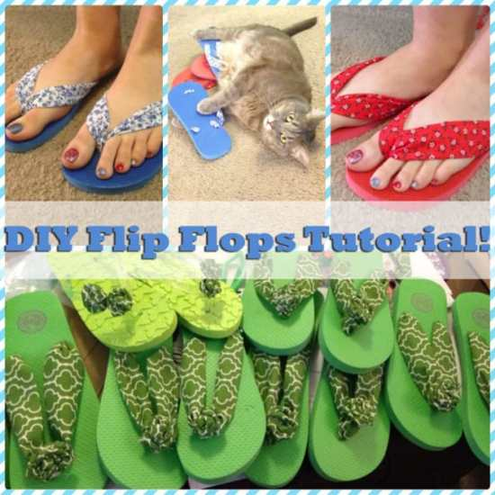
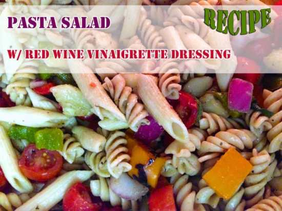
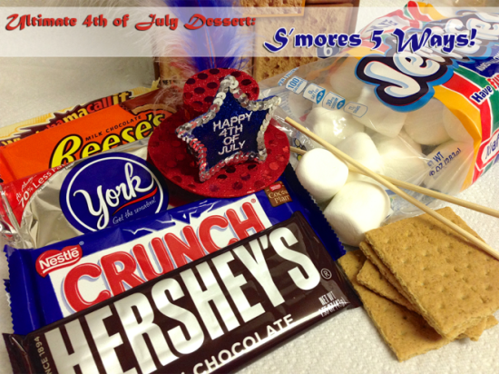
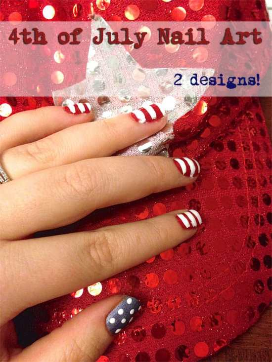
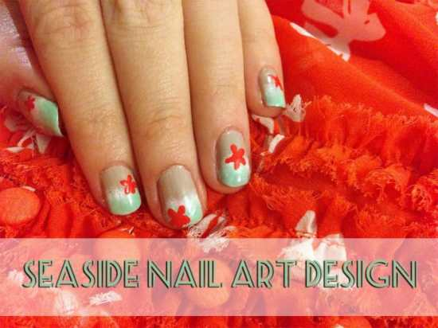
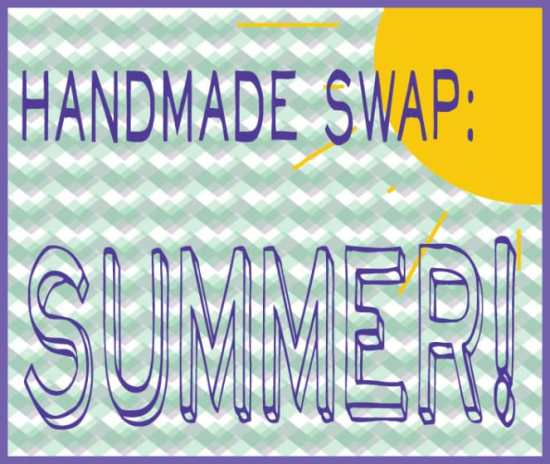

It’s already August! I was waiting FOREVER for the Summer to arrive and now it’s almost gone. The only consolation is that Fall is my favorite season! Since July is over, I’ve gathered up my favorite projects from the month and tied them up with a bow so you can find them all in one place! Take a look at what I made last month!

These are the things I made (and ate!) over the last month! Some are crafts, some are recipes, and some are nail art- a little something for everyone. 🙂

## Crafts

[**Wedding Mason Jars: 3 DIYs**](/blog/wedding-mason-jars-3-diys/ "Wedding Mason Jars: 3 DIYs!")

: These little mason jars make the perfect favors and decorations for your Summer wedding! Make floating candle holders, candy jars or salt shakers to match your theme!

[**DIY Flip Flops**](/blog/diy-flip-flops-tutorial/ "DIY Flip Flops Tutorial!")

: You still have enough of the summer left to try out this project! They are SO EASY to make, and don’t even require sewing if you don’t want to sew! Why wouldn’t you want a matching pair of flippies for your outfit?

## Recipes

[**Pasta Salad and Red Wine Vinaigrette Dressing Recipes**](/blog/pasta-salad-with-red-wine-vinaigrette-dressing-recipe/ "Pasta Salad w/ Red Wine Vinaigrette Dressing Recipe")

: On pasta salad, regular salad, or as a marinade, you will totally love my red wine vinaigrette dressing! It’s made with red wine- what’s not to like?

[**Irish Car Bomb Cupcakes**](/blog/irish-car-bomb-cupcake-recipe/ "Irish Car Bomb Cupcake Recipe")

: These cupcakes take a bit of elbow grease to make, but boy are they worth it! Bailey’s in the icing, Guinness and chocolate in the cake batter… Mmm!

[S’mores 5 Ways](/blog/smores-5-ways/ "S’mores 5 Ways!")

: This was a fun post to do “research” for! When my sister was visiting, she, my Husband and I picked out five different candy bars to make s’mores with and rated them! Find out which our favorite was!

## Nail Art

[**4th of July Nails**](/blog/4th-of-july-nail-art/ "4th of July Nail Art!")

: I am definitely not the best at making straight lines- especially with a striper that is too thick, but these were still pretty cute! I’ll need to practice more before making stripes again, though!

[**Seaside Nails**](/blog/seaside-nail-art/ "Seaside Nail Art")

: This is one of my favorite designs! I came up with it last summer and was waiting for the right season to post about it again this year! They were super cute and I got lots of comments on them. They also lasted a really long time!

My last post of the recap doesn’t exactly fit in to an above category, but is a reminder instead!

[**The Handmade Swap theme for this round is SUMMER**](/blog/handmade-swap-summer/ "Handmade Swap: Summer!")

, and you have until

_FRIDAY, August 8th_

to sign up! If you love care packages, pen pals and receiving surprises, check out the post to learn how you can participate!

Which was your favorite July project or recipe? What do you want me to post about during August?
