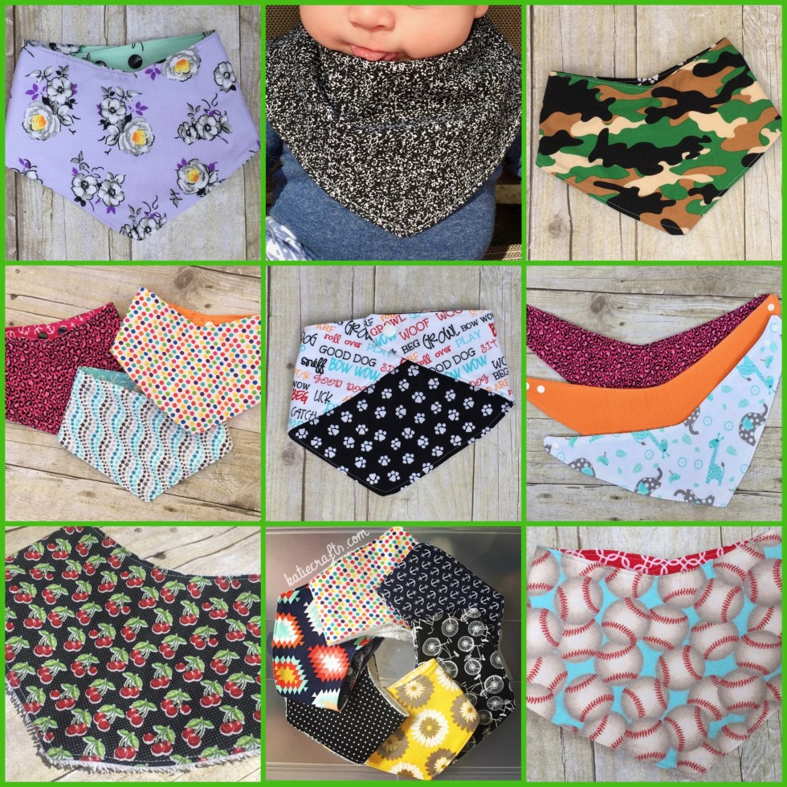
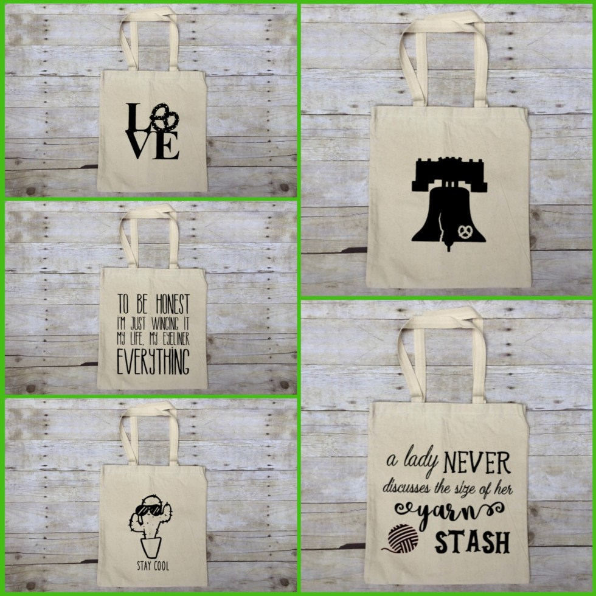
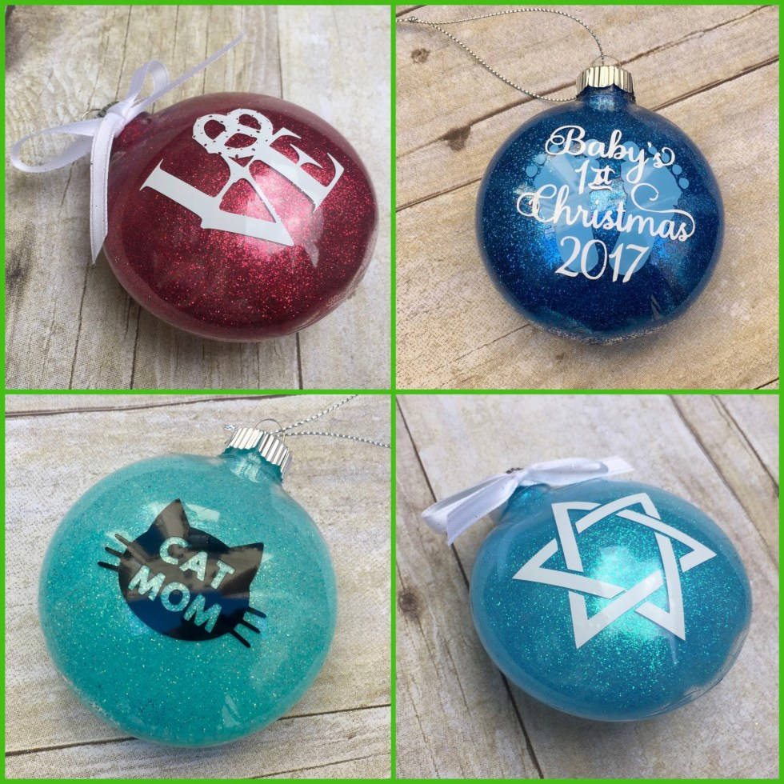
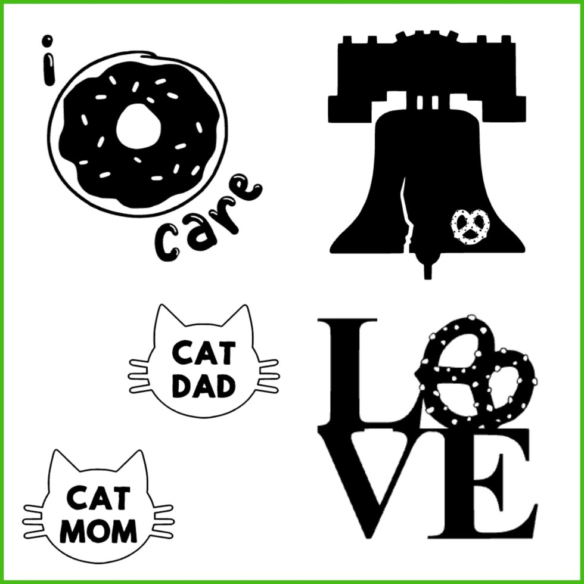

Guess who’s back, back again? I know, it’s been a

**long**

while. A recap of the last year is below.

_But first,_

I’m excited to announce I’ll be selling my wares with

[Art Star](http://www.artstarcraftbazaar.com/about-spruce-street-harbor-park/)

at

[Spruce Street Harbor Park](http://www.delawareriverwaterfront.com/places/spruce-street-harbor-park)

in Philadelphia this

**Saturday, August 5th**

! But wait, there’s more!

First, you’ve probably noticed the design changes. New year, new Katie Crafts! We changed up the logo and website to better reflect our needs going forward. I ditched Etsy and my husband (hi honeys!)

[got a storefront up and running which you can access here.](https://www.etsy.com/shop/katiecrafts)

We are also officially, finally, a business. 🙂

Second, I’m sure you’re wondering where I’ve been since last Summer. Well, let’s see. I got pregnant(😍

**!**

), was weirdly VERY nauseous every time I looked at the computer screen, and simply could not sit down to write a blog. Ah, “morning sickness”

_(read: every-minute-of-the-day sickness)_

. Besides constant nausea when looking at a screen (computer, phone, tv), I was also beyond exhausted ALL the time and extremely busy getting ready for baby-to-be! You can easily see how blogging had a permanent home on the back burner.

Fast forward 8 and a half months, and my little bubbie arrived! He’s been an amazing joy and all I wanted to do was chew his newborn cheeks for the first few months, which meant churning out posts was still not on my to-do list. Now that he’s almost six months old (

_what!_

) and turning into a little person, I’ve had a bit more time on my hands. That meant I could finally start creating things again. Yay!

A new love in my life meant new interests for craft projects, and so my bandana bibs were born. I initially made them just for the baby as a cute but practical means to catch the never ending drool he produces, but I really liked making them so I continued. Some of the bibbies are a layer of cotton fabric with terry cloth backing and a layer of interfacing between them. Others are reversible, with two different layers of cotton fabric and interfacing and diaper cloth between them.

[All are absorbent, adorable and available for sale!](https://www.etsy.com/shop/katiecrafts)

They fit infants, toddlers and your favorite pup as well!

I’m also still making tote bags, though I’ve added new designs to the mix and changed my supply from lightweight bags to better quality heavyweight bags.

[You can find all my market tote bag options here.](https://www.etsy.com/shop/katiecrafts)

I made ornaments for friends and family last Christmas and will be opening up my sales to the public this year via my online store.

[More of those will be added as the holiday months grow nearer.](https://www.etsy.com/shop/katiecrafts)

Each can be personalized as well, making them really great gifts!

Lastly, some of the designs I’ve created for totes and ornaments will now also be available as decals! Each decal is made of commercial grade outdoor vinyl and covered with clear transfer tape so you can adhere it easily to whatever window/laptop/mug you please. They’ll be up in the shop soon.

Now that you’re all caught up on my last year, I can tell you how excited I am to have a table at

[Spruce Street Harbor Park](http://www.delawareriverwaterfront.com/places/spruce-street-harbor-park)

this weekend! I’ve been going there since the

[pop up park opened a few years ago](/blog/spruce-street-harbor-park/)

, and always admire the vendors who sell on the weekends. Now I get to be one of them! This Saturday, August 5th, I’ll be at SSHP selling bibs, totes and decals from Noon to 5PM with Art Star.

**EVERYTHING WILL BE ON SALE**

(plus no shipping) so if you’re in the Philadelphia area, come on by, grab a beer and some eats from the many food vendors, and pop over to my table! If you are extremely heartbroken that you can’t make it this weekend, don’t fret. I will also be selling with the

_Punk Rock Flea Market at SSHP_

on

**Sunday, September 3rd**

– the day before Labor Day! If all goes well those days, I’ll be sure to sign up for more local shows as the holidays approach. Either way, you’re always welcome to shop my online store whenever you like. Want a specific fabric combo for a bandana bib, or have a design you really want to see on a tote bag or ornament?

[Email me](mailto:hello@katiecrafts.com)

about creating something custom just for you.

I hope to update my blog more often, even if it’s just with pics of new products or photos of my still adorable kitties, but you can always find me on

[Instagram](https://www.instagram.com/imkatiecrafts/)

or

[Facebook](https://www.facebook.com/imkatiecrafts/)

.

Hope your last year was as wonderful as mine, and hope to see your lovely faces at SSHP this Saturday!
