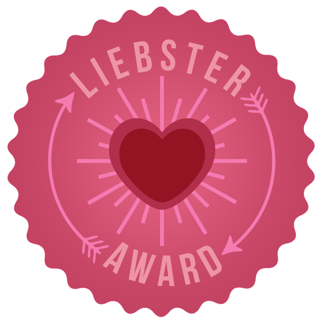
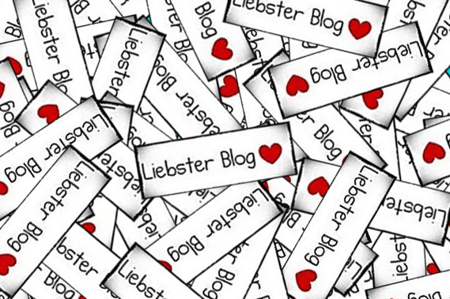

Hip hip hooray! Katie Crafts has been nominated for a

**Liebster Award**

! “What the heck is that?” you ask? Well, I’ll tell you. First, let’s define Liebster: it’s German origins tag it as meaning

**“beloved, sweetheart, darling.”**

That being said, it’s an award that is given to bloggers by bloggers, to recognize us little guys who are just starting out and/or haven’t made it big yet- those of us who are just

**darling**

and deserve for others to know that! My nomination came from the lovely Alison (thank you!) over at

[**Texas Farmer’s Daughter**](http://texasfarmersdaughter.com/the-liebster-award/ "Texas Farmer's Daughter")

. I’m in love with her blog (and her

[**Etsy**](https://www.etsy.com/shop/TexasFarmersDaughter "Texas Farmer's Daughter on Etsy")

shop!) so be sure to check both of them out!

I love the way this Award works. It’s all about meeting new bloggers, networking, making friends and discovering new blogs that you may not have known existed before! You can accept the Award and continue to pay-it-forward by nominating blogs you believe deserve a nod, or you can decline and wonder why that rain cloud is suddenly following you around 24/7. Okay, maybe I’m kidding about the last part.. or am I? I don’t want to find out, so I’m happily accepting! If you are too, read the rules below!

## **The Rules**

1\. Say “Thanks!” to your Liebster Award presenter on your blog, linking back to their blog.

2\. Answer the 11 questions from your nominator, list 11 random facts about yourself and then think up 11 new questions for the blogs that you’re nominating.

3\. Present the prestigious Liebster Blog Award to 11 blogs that have 200 followers or less whom you think are darling and underrated! Let them know they are the chosen ones by commenting on their blog or Facebook page.

4\. Copy and paste the Award right onto your blog so everyone knows how amazing you are, because you totally are!

On to the questions! Alison asked me these eleven things:

1\. What’s your favorite TV show right now?

_Hmmm… I have a lot, and many of them are just really terrible guilty pleasure shows. After all these years, I still love Grey’s. I also tap in to my teenage self and obsess over Pretty Little Liars every week. Really, none of them fill the hole in my heart that Gossip Girl left behind!_

2\. What inspires you to blog?

_Everything! Which is precisely why I began the blog. I’ve found inspiration in so many things since I was little, and was always drawing, or painting, or crafting. I rarely see a project/product/style/item that I love and don’t say “I think I can make that!” Katie Crafts is my place to showcase just that._

3\. If you could have any animal as your pet, what would your ultimate pet be?

_I want all the pets! I want a cute little hedgehog, and I want a fuzzy little piglet, and I want a miniature pony, and I want all the English bulldog puppies in the world along with all the baby tiger/lion/big cat cubs.. . but for now, my beloved kitty children will just have to do!_

4\. What’s your biggest guilty pleasure?

_Besides my really bad TV? I suppose turning my music up way-too-loudly-for-apartment-building-standards and dancing around (…with my cats…) while I craft and work._

_\&#xA;_

5\. What’s the last book you read?

_“Meet Me at the Cupcake Café” by Jenny Colgan! I talk about it in my first_

_[Sunday Funday Issue](/blog/sunday-funday-issue-1/ "Sunday Funday: Issue 1")! So adorable. I just picked up another book by her in the same vein, “The Loveliest Chocolate Shop in Paris.” I hope to snuggle up on the couch in my PJs and start it soon!_

6\. What’s your biggest pet peeve?

_When I hold the door open for someone and they don’t smile, or say thank you, or even glance my way. I’m not put on this Earth to follow you around and hold doors open for you! I did it because I’m being nice- so be nice back and shoot me a smile! Jeez!_

7\. What three words describe your blog?

_Well, the name of it is ‘Katie Crafts.’ These two words encompass it all. The blog is totally me, and all about crafting! For a third word, I guess I’d choose fun- because I hope people are having fun reading what I have to say and trying out the tutorials!_

8\. Desk: messy or organized?

_Right now, so messy. But that’s because the desk is brandy new and I don’t have any shelving up above it yet, so everything is strewn across it. Hopefully it will be organized soon._

9\. Who do you admire?

_She may not be here any longer, but the answer to this will always be my Mom. She was a painter, and a generally crafty and creative lady, who taught me to follow my dreams. I know she’d be an avid reader of this blog if she were here today._

10\. What’s your favorite thing to do on your day off?

_This is usually dependent on the weather! When it’s warm and sunny, I like to take a book to the park. Grab some coffee and macarons, and sit on a blanket, reading. On cold or rainy days, I also like curling up with a book, but when it’s raining outside that usually puts me right to sleep! You can usually find me spending those days crafting, watching my bad TV, or trying out a new recipe._

11\. What is something you’ve learned in the last week?

_How to make a pretty knotted headband! I won’t feature it til I’ve perfected it, but I’ve already made several for myself and totally love them!_

## 11 Random things about me.. .

1. For the last 4 years, I’ve worked from my couch. I only \*just\* got a desk to work from last week. I’m not used to it yet, and am writing this right now from, you guessed it…

2. Cadbury Mini Eggs (in the purple bag that only come out at Easter time) are my favoritest chocolate treat. I get way too excited the first time I spot them in the store each year.

3. I graduated with a BA in painting and drawing almost 9 years ago, but have yet to get a job at all related to my degree.

4. I signed my first lease in Philly 6 years ago and met my husband here 4.5 years ago. Before that, I was a Jersey girl.

5. I may live in (and love!) Philly, but Manhattan will always have my heart.

6. Followed closely by both Florence AND Rome.

7. I have terrible anxiety over too many things to count. Driving is one of them.

8. Every time I get a cut or scrape, I immediately assume I’m infected, and tell my Husband so each and every time.

9. While having my tonsils removed 5 years ago, my jaw was dislocated. It still clicks and crackles loudly to this day.

10. My favorite form of gambling is simply sitting on the penny slots for hours with a $10 bill and a free drink.

11. I love coffee. Coffee does not love me.

## I nominate (& encourage you to check out) these fine blogs!. ..

I recently started following each of these blogs, and have to say- I love ’em! You’re all great, guys!

1. [Katrina Alana](http://web.archive.org/web/20191117122258/http://www.katrinaalana.com/blog/ "Katrina Alana")
2. [Kitty Baby Love](http://kittybabylove.com/ "Kitty Baby Love")
3. [BelleBlush](http://belleblush.com/ "Belleblush")
4. [Tiny Mountains Designs](http://tinymountainsblog.tumblr.com/ "Tiny Mountains Designs Blog")
5. [Can or Can Not?](http://www.canorcanot.com/ "Can or Can Not?")
6. [Love n Lavish](http://lovenlavish.blogspot.ca/ "Love N Lavish")
7. [Ilona’s Passion](http://ilonaspassion.com/ "Ilona's Passion")
8. [A Kup of Katie](http://akupofkatie.blogspot.com/ "A Kup Of Katie")
9. [A Little Slice Of…](http://alittlesliceof.blogspot.com/ "A Little Slice Of...")
10. [Always Wear Your Invisible Crown](http://alwayswearyour-invisiblecrown.blogspot.nl/ "Always Wear Your Invisible Crown")
11. [The Domestic Betch](http://thedomesticbetch.com/ "The Domestic Betch")

## Nominees, please answer these questions in your own blogs!

1. What’s your middle name, if you have one?

2. How long have you been working on your craft/hobby?

3. If you could only eat one food forever and ever, what would it be?

4. What’s on your DVR right now?

5. When you were little, what did you want to be when you grew up?

6. What is your superpower?

7. What project are you currently working on, or want to get started with?

8. Never have you ever…

9. Where do you wish you could live?

10. You just won the lottery. What do you do next?

11. Share the lyric that is currently stuck in your head!

Yes, I know, I didn’t need to add ALL of the different Award buttons that I added, but they were all so cute. I couldn’t pick just one to use. 😉 Happy reading, and congrats to all the new nominees! xo!

