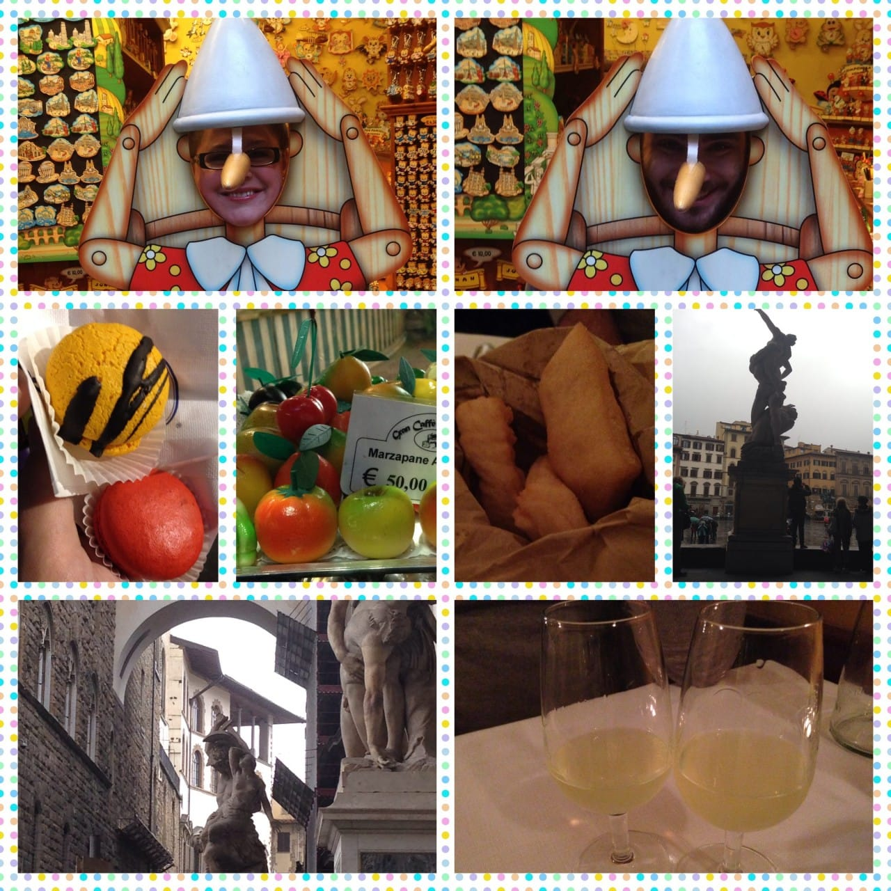
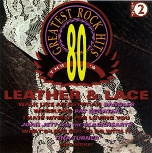
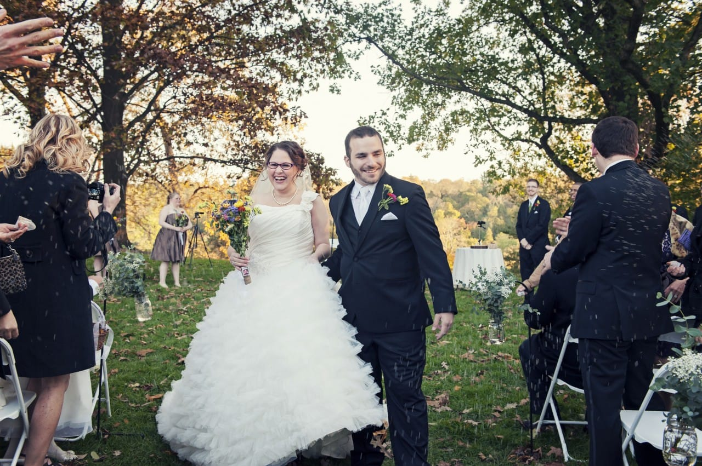
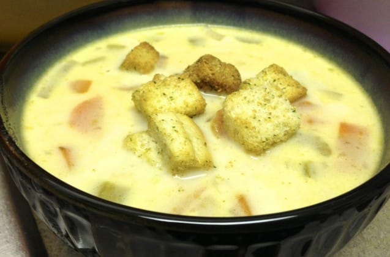
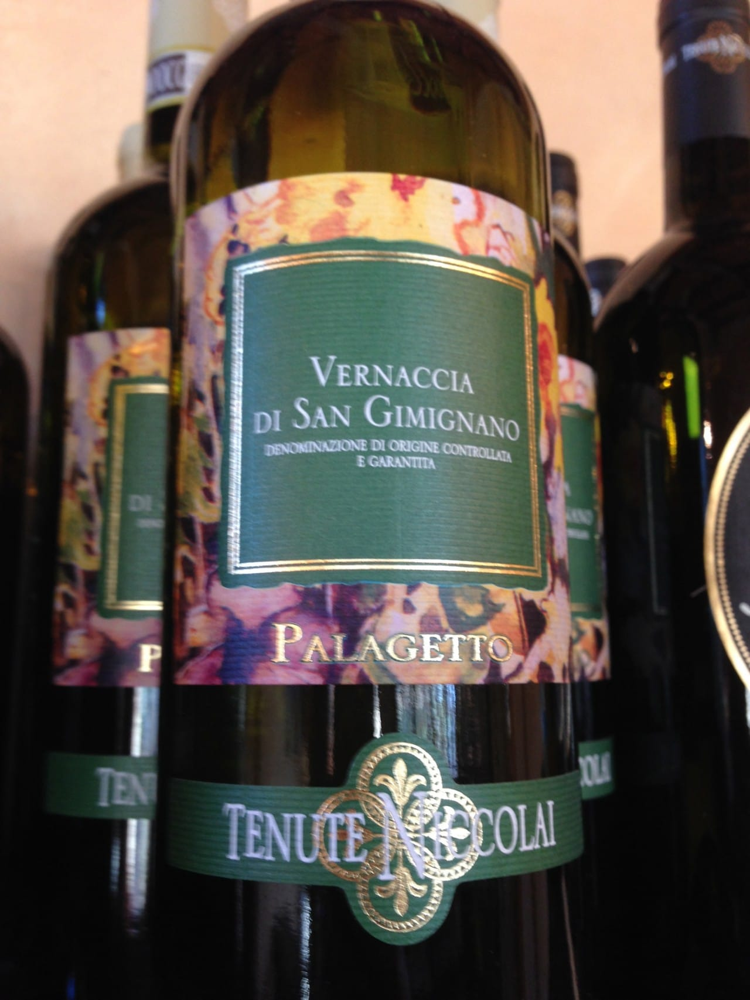
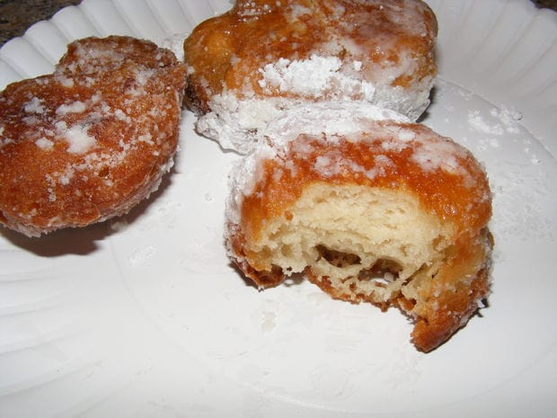

I was recently tagged in a fun get-to-know-you blogger game from May over at

[La Vie En May](http://www.lavieenmay.com/ "La Vie En May")

! It’s called “Life In Letters” and (as you probably have already guessed) includes a fun fact about me using each letter of the alphabet! It was cute and fun to do, and hopefully you all enjoy reading all about me, A through Z as much as I liked writing it!

A- Artist. I went to school for art. Sadly, I rarely use it now. Except for the craftiness I do for this blog, that is!

B- Baking. I love baking! Specifically around the holidays, but also for fun. It makes me feel like a little old housewife from the ’50s, in my apron and slippers, baking cookies and the like. I love it.

C- Chocolate. Chocolate covered everything is my favorite. My current favorite favorite chocolate covered thing are these dark chocolate covered açai berries!

D- Devious Maids. One of my favorite guilty pleasure TV shows. I’m watching it right now. It’s so awful and wonderful!

E- Elephants. BABY elephants. They are my favorite zoo animal!

F- Florence. My absolute favorite place I have ever visited. Ahhh, Italy <3

G- Ginger Ale. My favorite carbonated drink. I could drink it every day (though I don’t, because that would be terrible for me.)

H- Hobby Lobby. My favoritest store! I don’t even need to elaborate- if you read this blog, you already understand.

I- Ice Cream. I’m eating it for dinner tonight. I can do that. I’m an adult. 😉

J- Jellyfish. I love jellyfish- I think they are so beautiful floating through the water. I want a jellyfish tattoo soon but I keep changing the design of it. I also have 3 other totally different designs I’m figuring out too, so who knows when the jelly one will happen!

K- Kennedy. My new last name!

L- Leather & Lace. A ‘greatest rock hits of the 80s’ compilation CD. The first CD I ever owned (this, and ‘The Bodyguard’ soundtrack!)

M- Mint Green. My current favorite color! It’s almost always some shade of green, depending on the season. Right now, it’s mint green! I can’t stop buying things that are mint!

N- Nail Polish. I have a small addiction. Well, not too small. Well over 50 bottles are on the shelf on the wall. But there is room for more, so I’ll keep getting it!

O- October. My wedding month! The Fall is my favorite time of year, and now October will likely be my favorite month of the year. 🙂

P- Painting. Painting (and drawing) were my concentration for that art degree!

Q- Quizzes. I’m a complete sucker for online quizzes. It really doesn’t matter what they are about, either. If they pop up in my Facebook feed, you can bet I’m going to take it. Today I found out that I should live in New York, that my gem is a Sapphire and that my decade is the ’50s. All very important information, obviously!!

R- Regenye. My maiden name!

S- Soup. Soup is my favorite thing to eat! I love making it, I love trying different soups in restaurants, and if it was cold all the time I would eat soup every single day. There is only one meal I love more than soup, and that is….

T- Thanksgiving Dinner. My favorite meal of the whole year. Especially now that I cook it all myself. I love the satisfaction of a beautiful perfect meal that feeds the family on a big holiday that I was responsible for. That, and it’s so delicious!

U- Uniform. I went to Catholic school for 13 years. First, K thru 8th. Then High School. All 13 years I wore a uniform. 9 years of maroon skirts with white plaid, then 4 years of grey skirts with maroon plaid. When I had to figure out my daily outfits in college without the ease of throwing on the same uniform every day, I was at a loss. I ended up wearing pajama pants to class a lot my first year!

V- Victoria. One of my favorite songs by one of my favorite bands, “Jukebox the Ghost.”

[_Listen Here!_](https://www.youtube.com/watch?v=bnIJYJkFuBM "Victoria by Jukebox The Ghost")

W- Wine. White wine, specifically. I used to only drink red, but over the last couple of years I’ve slowly started changing my tastes to white and rose. Mmmm!

This was the best wine ever!! The vineyard we stayed at on our honeymoon made it. SO. GOOD.

X- X-Box. This really has nothing to do with me, but my cat! Our X-box sits atop the cable box on the ground underneath our TV stand. Because the on/off button for it is a lit-up logo and is extremely sensitive to touch, she presses her nose on it all the time and turns it off on us. The brat!

Y- Yellow. The color of the walls we just painted my childhood bedroom over the weekend! Dad had a few cans of “Golden Opportunity” in the basement and wanted us to throw out everything in my childhood bedroom, paint the walls, and fix it up so that it was nice. The yellow paint is still stuck to my nail polish.

Z- Zeppoles. Every single year of Catholic school in Jersey ended with an end-of-year carnivals (also called fun-stival, because we were adorable.) All carnivals had a tent that sold funnel cake and zeppoles. Think smaller version of

[beignets](/blog/nola-in-a-nutshell/ "NOLA in a Nutshell")

. Hot, crispy on outside/soft on inside, covered in powdered sugar deliciousness and tossed in a greasy paper bag. I miss them.

Sooo about half my letters were food related, I’m noticing now! I guess I shouldn’t have done this while I was hungry! Ah well, hope you enjoyed it just the same! Rather than tag people in this post (as you normally would do), I will simply invite any of you readers who think this may be fun to join on in! Be sure to tag this post in yours, so I know you did it too! I’d love to read it!
