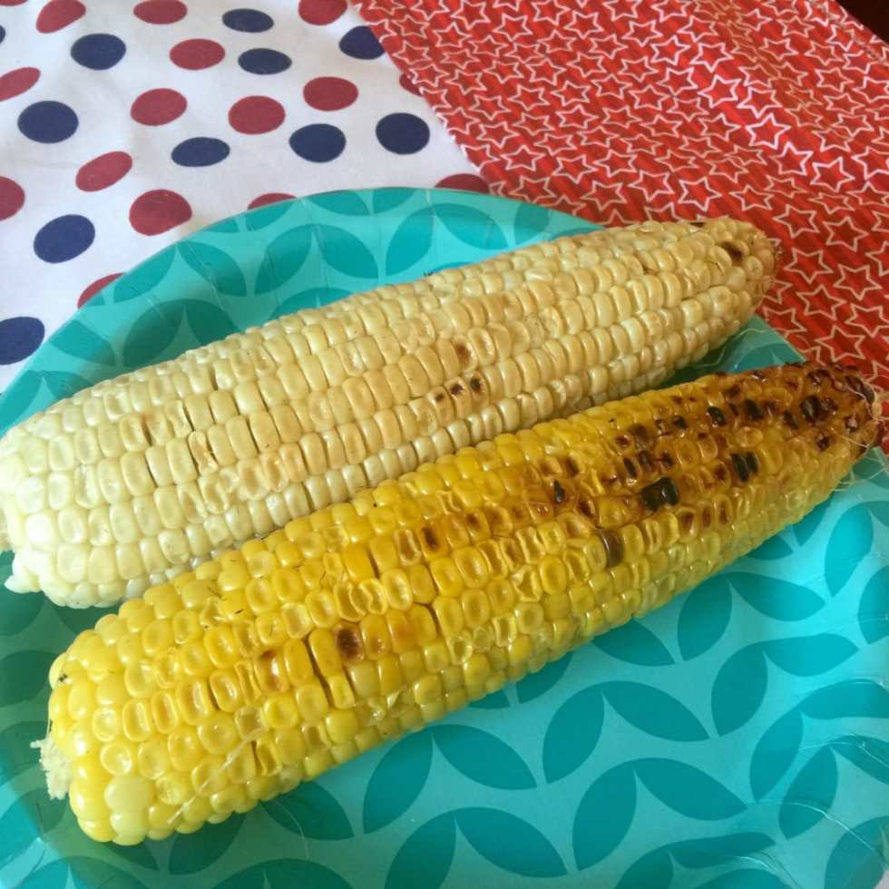
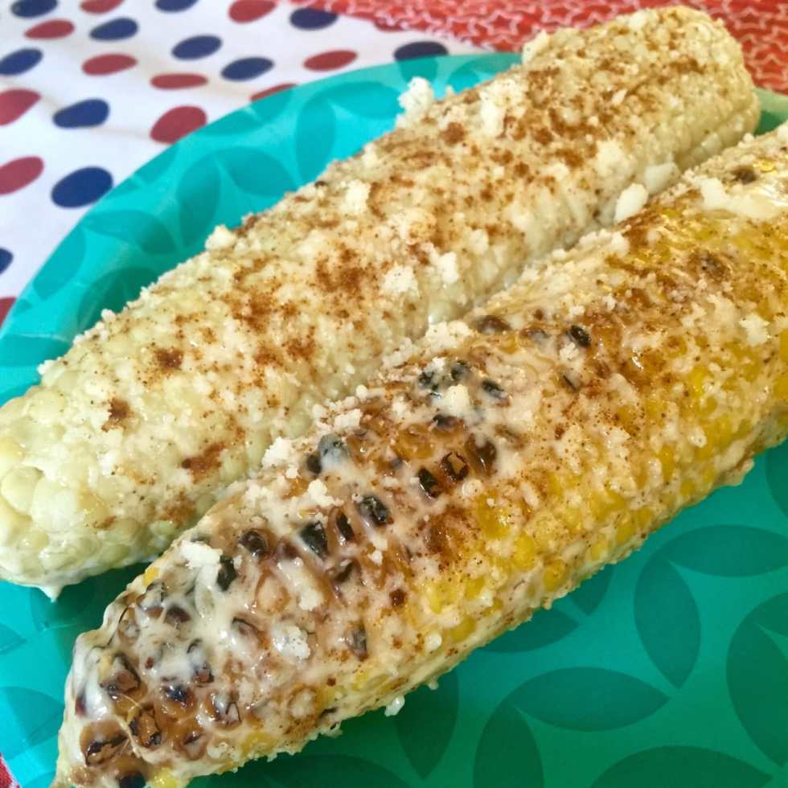

Recipe: Mexican-Style Corn on the Cob

A few weeks ago was the Italian Festival here in Philly. Street festivals of any kind usually mean grilled corn on the cob, Mexican style. It’s one of my favorite things to eat, so I decided to give making it at home a whirl, and it came out GREAT! You’ll definitely want to add this to your 4th of July menu!

Mexican corn on the cob, or “Elote”, typically uses Cotija cheese. However, since we have a tub of grated Locatelli (my favorite Pecorino Romano cheese) on hand, we used that instead. It came out SO GOOD, even better than Cotija in my opinion. Probably because it’s a little tangier.

This recipe is so easy, I wish I’d thought to try it out sooner! We’ve already made it three times in the last month and will likely make throughout the Summer!

## Ingredients:

- 4 Corn on the cob, grilled

- Mayonnaise, 1/4 cup

- Butter, 1/4 cup softened

- Cotija or Parmesan or Pecorino Romano cheese, grated

- Cayenne Pepper

## Instructions:

- Cook corn IN HUSKS on the grill on medium-high heat for 15 minutes. Rotate, and cook another 15 minutes.

- In a plastic gallon bag, add mayo, butter and a sprinkle of cayenne. Close bag and squish all contents together with your fingers!

* Shuck the corn, removing husk and silk

- Put one or two entire cobs into the baggie. Squish the mayo/butter mixture around to get every edge of the corn.

- Remove corn and place on a plate.

- Shake some cheese all over the cob and sprinkle more cayenne if you’d like it extra spicy.

- Enjoy your amazing corn on the cob, Mexican-style!

Have you ever tried corn this way before? What is your favorite street festival food?
