Recipe: Mom’s Ham Glaze

Every Easter for as long as I can remember, we’ve had a baked ham. We also have ham at Christmas, and on my birthday. I really, really love baked ham. I love it because my mom made this glaze of pineapples and brown sugar that was just soooooo delicious! I would look forward to dinner and leftovers more than the holiday itself sometimes. Today, I share with you my mom’s simple and delicious ham glaze recipe for the next time you make a ham for your family!

I glaze my ham about 20 minutes before the ham is going to come out of the oven, so that it has a good 20 minutes to cook in. I ONLY use HALF my ham glaze on the actual ham. The other half I keep in my pot for later. I’ll explain below!

## Ingredients:

- One 20-ounce can of crushed pineapples\*

- 3 Tablespoons brown sugar

- 1 teaspoon mustard

- Cornstarch

These ingredients yield enough ham glaze to cover and use as topping for a large ham. You can cut the proportions down for a smaller sized ham if you don’t want a lot of glaze left over. In our house, the glaze is always the first thing to disappear, so we never run in to this problem!

## Instructions:

\*The store didn’t have crushed pineapples when we went, so we had to buy chunks and smash it ourselves. I’ll include what I did just in case you find yourself stuck in the same predicament! If your can of pineapples is already crushed, completely skip over this next part (and gallery), as it does not apply to you!

> - -First, I drained the chunk pineapples of the extra juice. When you mash them up, more juice will be created so you won’t need the extra juice that is already in the can. If your pineapples are already crushed, it’s mixed together and doesn’t need draining.
>
> - First, I drained the chunk pineapples of the extra juice. When you mash them up, more juice will be created so you won’t need the extra juice that is already in the can. If your pineapples are already crushed, it’s mixed together and doesn’t need draining.
>
> - -Then I put the pineapple chunks into a bowl and used a potato masher to smash them up. It was fun! Very messy, though.
>
> - Then I put the pineapple chunks into a bowl and used a potato masher to smash them up. It was fun! Very messy, though.
>
> 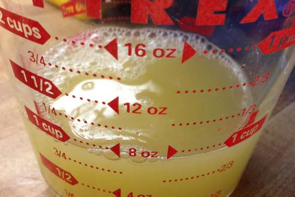
>
> 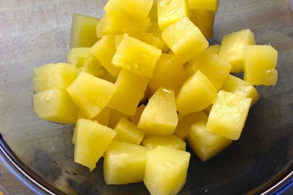
>
> 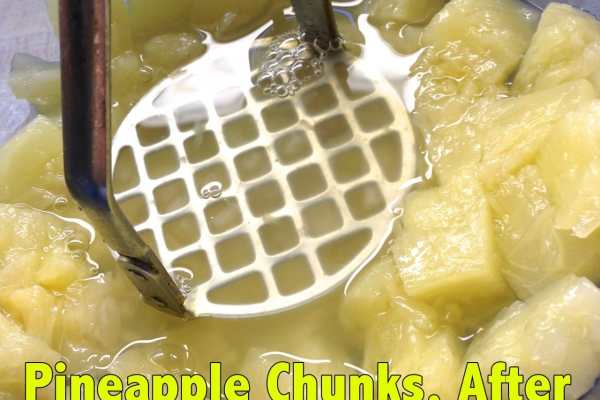

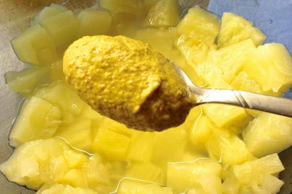

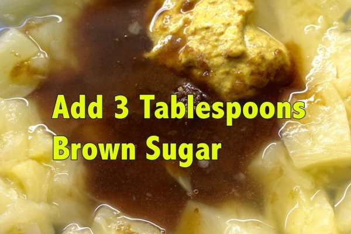

- Add three tablespoons of brown sugar and one teaspoon of mustard to your pineapple chunks and mix. Use any mustard you like! Dijon was my mom’s favorite. I like honey mustard. My dad likes this mustard from the deli, so that’s what we used this time. Each different mustard gives the glaze a different flavor, but it’s always good!

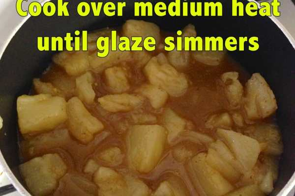

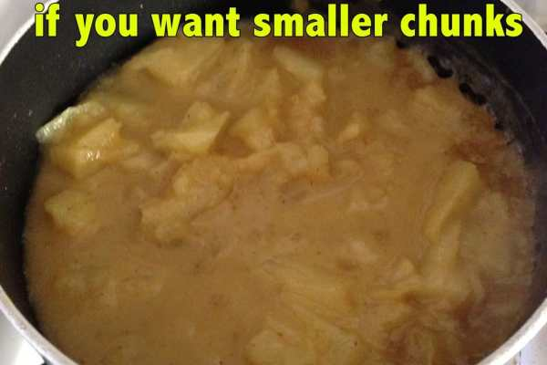

- After the three ingredients are mixed, put them in a small pot and bring to a simmer.

- Smash the chunks more as it’s simmering if you like!

- After the glaze is simmering and hot, follow the instructions on your cornstarch container to make a little cornstarch mixture at a time. ALWAYS add just a teaspoon worth of cornstarch to your food at a time- you can always add more, but it’s hard to thin it back out if you’ve added too much!

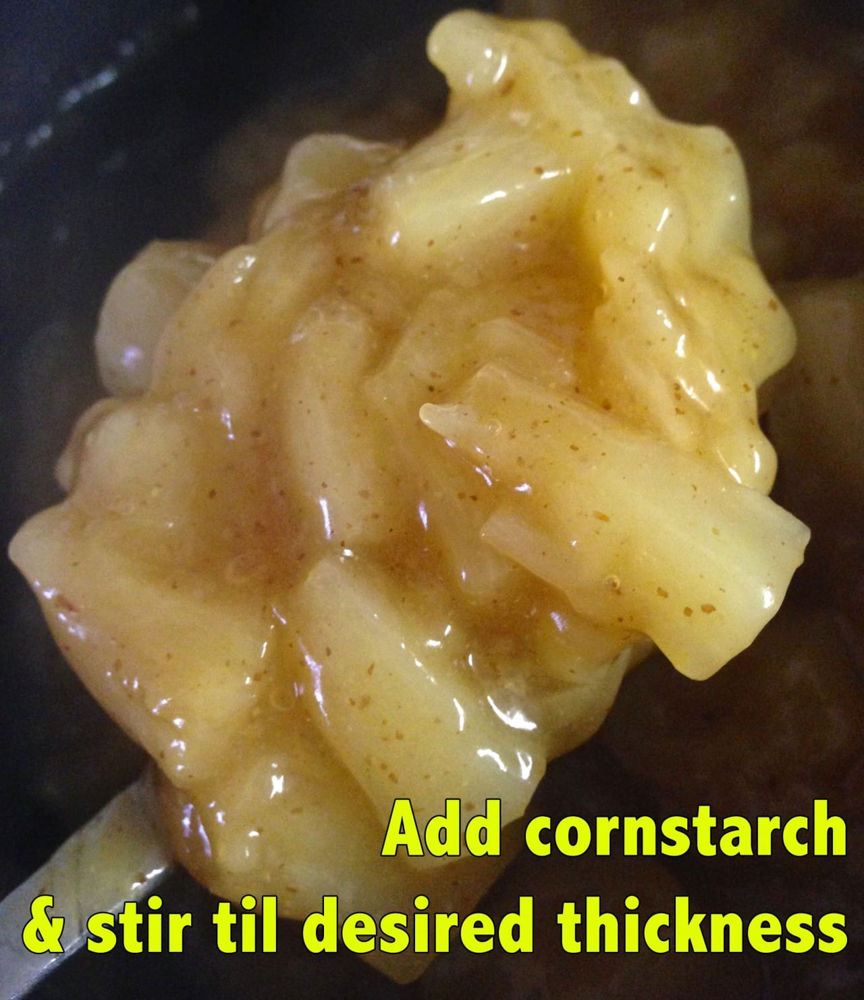

- When you’re happy with the thickness of your glaze, turn off the stove top because you’re DONE! Now it’s time to glaze the ham. Only use HALF of your pot, making sure to spread the glaze over each side. Let cook for 20 minutes.

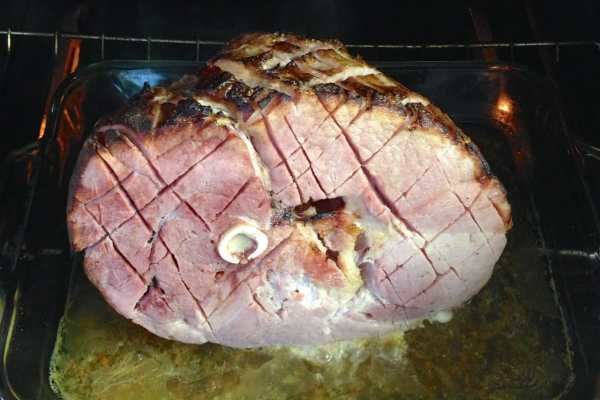

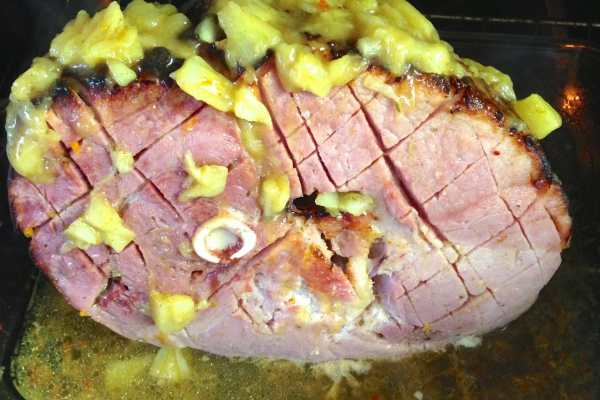

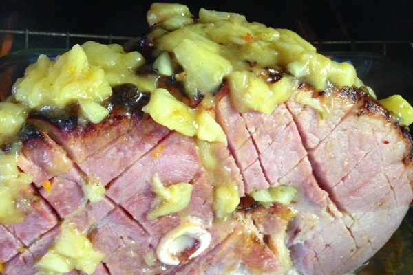

- After the 20 minutes is up and your ham is finished and out of the oven, spoon out some of the juice from the bottom of the pan and return it to the ham glaze that is still in the pot. Turn the stove back on and re-heat the glaze, giving it a good mix. Transfer to whatever dish you are serving it in, and it’s ready to eat!

- Smother it on your ham, potatoes, macaroni salad, or anything else on your plate. Salivate while thinking of it only an hour later when you write up a blog post about it. Enjoy!

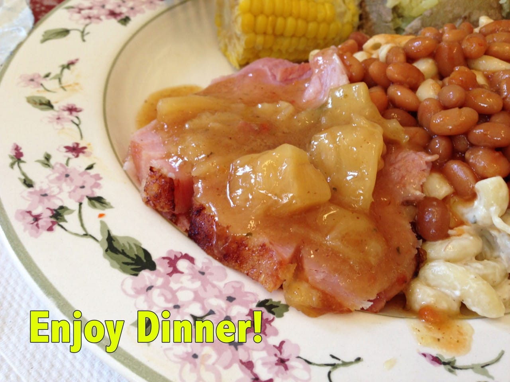

## Tips:

- Sometimes my Mom would add a teaspoon of lemon juice to the glaze for a little tangy bite. It was also delicious!

- Store in airtight container in fridge for up to a week.

- Don’t forget: cornstarch is white! If you think the color of your glaze/gravy/etc. is the perfect appetizing hue already, adding cornstarch is going to lighten it! Don’t be alarmed when it happens!
