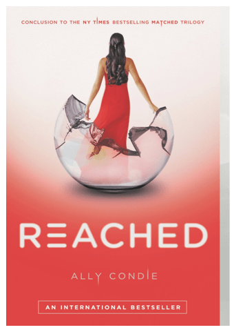

> _Note from Katie:: Since the site was wonky all Saturday, we didn’t get a chance to edit and schedule this for Sunday! Instead, it’s a MONDAY Funday, via Jess! Enjoy!_

Well, it’s Sunday Funday once again, and Katie has decided to hand the post over to me! For those of you who don’t know me, I am Katie’s sister, and have only had three posts on the blog so far. Lately, I have been feeling very nostalgic for my childhood so I ended up choosing things for this post that are kid friendly.

## Makes Me Laugh:[Disney Is Better With Turkeys](http://blogs.disney.com/oh-my-disney/2013/11/23/disney-movies-are-better-with-turkeys/ "Disney Is Better With Turkeys")

I was browsing through my friend’s Facebook page and she posted something that led me to this. At first, I was looking up something having to do with Power Rangers but I ended up getting onto

[Disney.com](http://disney.com)

. They have a section called ‘Oh My Disney’ in which they do blogs as told by Disney characters. There are several funny ones on there that will make you laugh out loud and have tears at the same time. I saw this one in particular and I knew I had to share it. It features a turkey in place of other characters in different movies!

“It’s the circle of life and turkey moves us all!”

## What I’m Reading: “Reached” by Ally Condle

You may remember my sister and I have mentioned reading the books

[“Matched”](/sunday-funday-issue-16/ "Sunday Funday: Issue 16")

and

[“Crossed”](/sunday-funday-issue-19/ "Sunday Funday: Issue 19")

by Ally Condle. They are part of a three book series, with this book (

[“Reached”](http://amzn.to/1mrKrZD "Reached by Ally Condle")

) being the final book. Just like the first two books, I got sucked right into the story line and really felt the characters jump off the page. I will not give anything away but I do highly recommend you read this book.

“Reached” by Ally Condle

## Place I Love: IHOP

Yes I said it! I absolutely love the International House of Pancakes! I especially love their Loaded Baked Potato Soup, which I always get when they have it. I also really love their crepes with blueberry compote. Their fries are really good too! You know, now I am just really hungry, so it’s a good thing I have my next section’s thing \[something delicious!] right next to me.

MONDAY Funday: Issue 22 on Katie Crafts;

IHOP! Says it all!

## Something Delicious:[Raylicious Better Then Delicious](http://myraylicious.com/ "Raylicious Better Then Delicious")Popcorn

There is a Bravo supermarket not far from where I live. My father likes to shop there whenever he needs to stock up on a few things. When we run out of milk, bread, and ketchup- the usual stuff. Well, he also likes to pick up some snacks on occasion. A bags of chips, maybe some snack cakes, or he will surprise me with this. They have a few flavors that I have tried so far. There is a candy flavored one, a sweet and salty one and a caramel flavored one- all kettle cooked. They are all really good, surprisingly! Hopefully you guys may be able to find them in a store near you!

Candy Frosted Popcorn!

Sweet & Salty Kettle Corn the one I just had.

Caramel one!

## Project That Inspires: Bubbles!

As a kid, one of my favorite thing to do was blow bubbles. I still enjoy blowing bubbles today, whether it’s the soapy kind or bubblegum kind! There is just something about watching a bubble form. I was thinking of buying some for my little cousin’s upcoming birthday party as a present, and then thought, “Wait! For once I can do a home craft!” Making homemade bubbles is super easy to do and it doesn’t really cost you too much. I looked online and found this simple way to make bubbles on

[eHow.com](http://www.ehow.com/how_4476827_homemade-bubbles-kids.html "ehow")

and I think I am gonna try it. Here’s what you need to make them:

- Something big to put the bubbles in, like a bucket

- 1 cup dish soap (like Dawn)

- 1/4 cup corn syrup (which apparently makes the solution stronger so that the bubble’s don’t pop)

- 4 cups of water

Pour the 4 cups of water into your container. The next step is to slowly add the corn syrup and dish soap at the same time to the water. Then, allow the mixture to sit for 30 minutes so it can mix well together. Lastly, just pour it into something for easier dipping and enjoy.

Bubbles!!!!

I hope you guys all enjoyed this post that is a bit more kid friendly then normal. And I hope you all had a good weekend!
