Last Saturday, the Husband and I went to the

[Morris Arboretum](http://morrisarboretum.com/ "Morris Arboretum")

here in Philadelphia to celebrate our 6 month anniversary! It’s where we got married back in October, so we thought it would be a perfect place to go. It was also a completely gorgeous day, so it was definitely a great choice! When we got there, they happened to be celebrating Arbor Day with a “Home Tweet Home” Exhibit of designer birdhouses amongst the grounds! We grabbed a map and spent the next few hours on a birdhouse scavenger hunt!

There were 29 birdhouses in all, hidden all over the Arboretum. We had a blast seeking them all out and taking pics for the blog, and we photographed a ton of other landscapes along the way! Here are a few galleries of what we came across on our day out!

First, here are all the birdhouses, in sequential order! Underneath are the designers and titles of each.

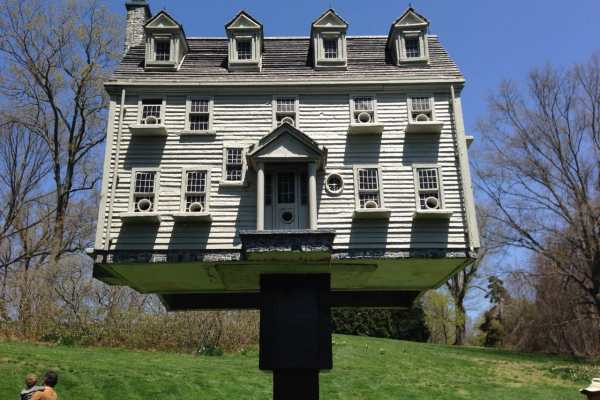

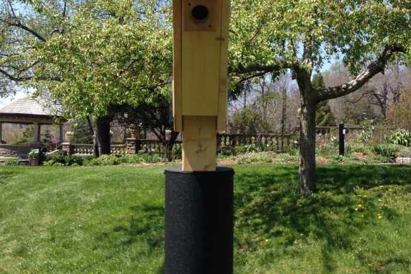

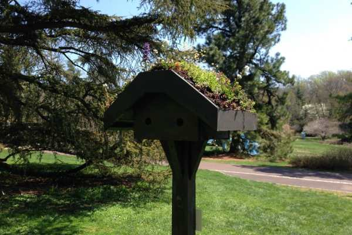

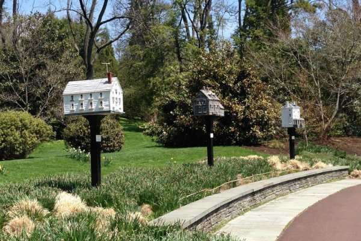

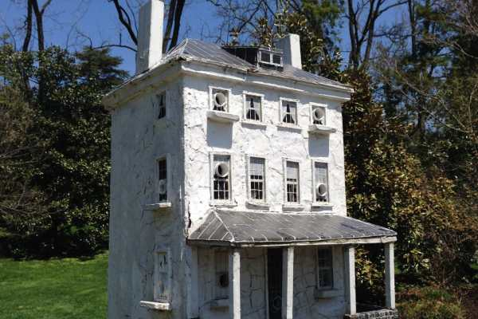

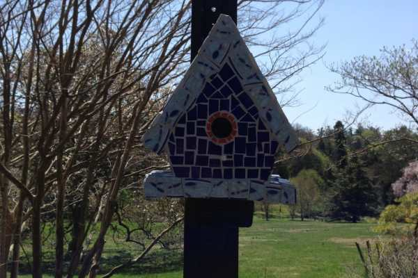

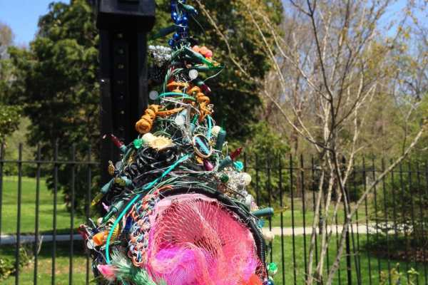

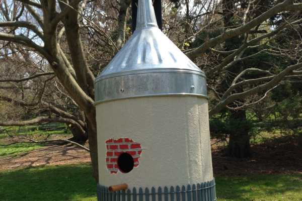

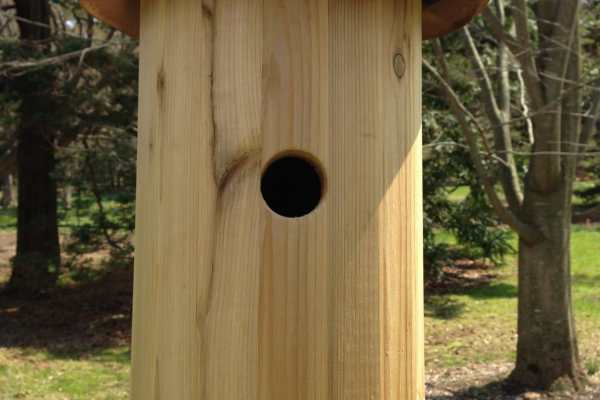

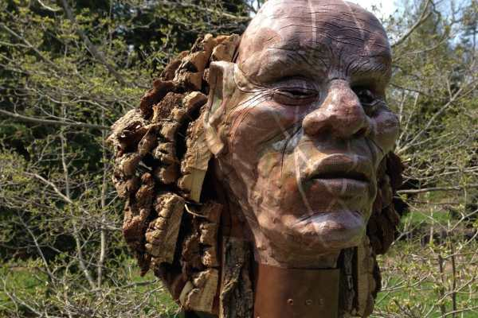

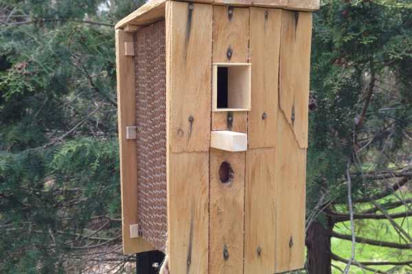

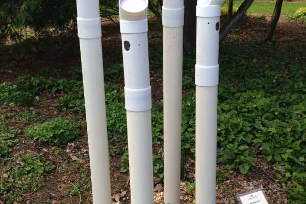

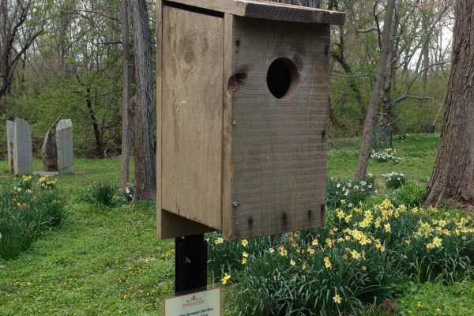

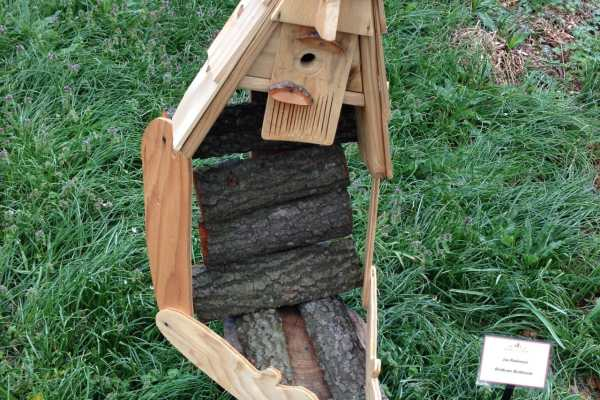

1. Thomas Burke – John Chads’ House

2. Murrie Gayman – The Beethoven Birdhouse

3. Joanna Omlor Cahill – The Rusted Aviary

4. Devin McNutt – A Nest For Kinnaris

5. Alison Auth – Nena

6. Thomas Burke – Canitoe Corners; Martha Stewart’s home in Bedford, NY

7. Jacob Bass – Bluebird Box

8. Howard Brosius – Green Roof Quadraplex

9. Thomas Burke – Inspired by Andrew Wyeth’s ‘Goodbye, My Love’

10. Thomas Burke – Inspired by Andrew Wyeth’s ‘Christina’s World’

11. Thomas Burke – Inspired by Andrew Wyeth’s ‘Evening at Kuerners’

12. Rachel Kaufman – House of Blues

13. Estelle Carraz-Bernabei – Nature’s Miracle

14. Jennifer Hawkes – Woodsy Hollow

15. Amy Orr – The Urban Weaver Nest

16. Thomas Burke – The Clubhouse at Augusta National; Home of the Masters Golf Tournament

17. Ralph Aument – The Silo

18. Frank Buono – Sweet Retreat

19. Crooked Works – Toss!

20. David Robinson – Big Log Chalet

21. Philadelphia Salvage Company – Casa Recuperada

22. John Hurd Jones – Shaman of the Woods

23. Austin + Mergold LLC – The Finch Stable; from Domus Avicus Philadelphicus

24. Shady Apple Goats – Lost and Found

25. Penelope Lisk – Reach for the Birds

26. Natural Lands Trust – Barred Owl Box

27. Natural Lands Trust – Eastern Screech Own Box

28. Natural Lands Trust – Bluebird Box

29. Joe Robinson – Birdbrain Birdhouse (two photos of this from each angle!)

Fun facts! When we hit number 7 (Bluebird Box), a robin flew out of it just as Sean was finishing a photo of it! It scared him half to death. He was scared the rest to death when we got to number 27 (Eastern Screech Owl Box) and an owl that was apparently occupying the box screeched super loudly. I giggled the whole time.

Now here is a gallery of some of our other photos! It was a lovely day so I wanted to share them! Enjoy!

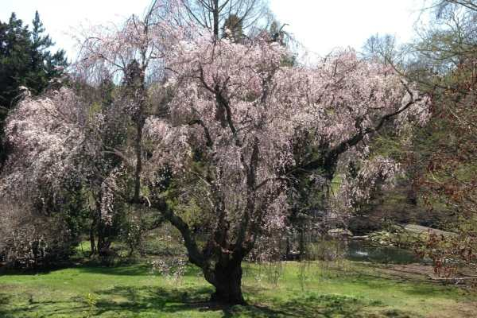

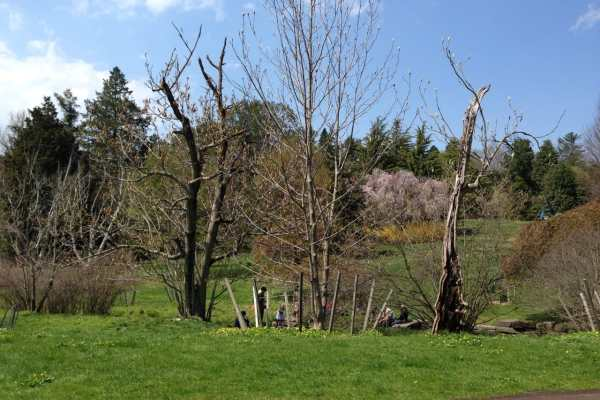

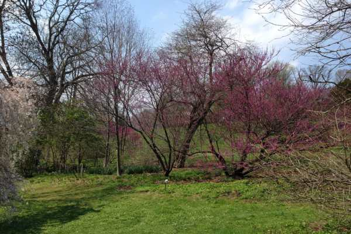

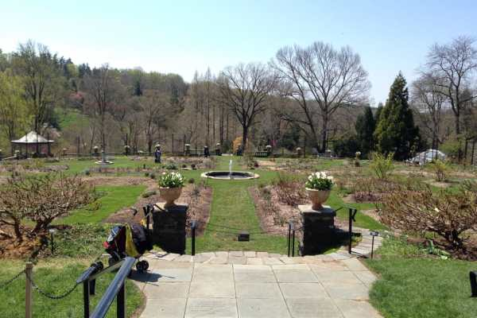

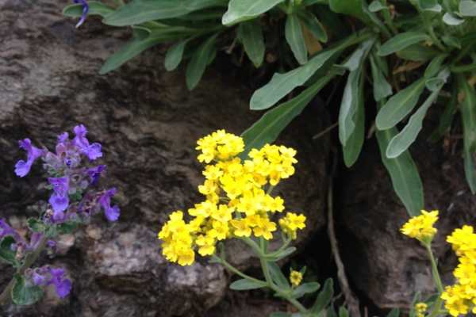

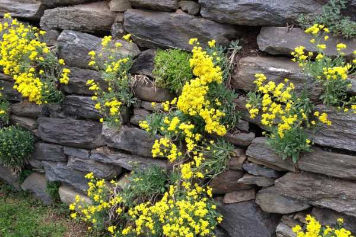

Hi, little butterfly!

Sitting on our bench!

So lonely without us.

Throwback! How awesome is this photo of us on our bench on our wedding day!? Our

[photographer](http://www.erikaletitia.com/ "Erika Letitia Photography")

was the bestttttt!

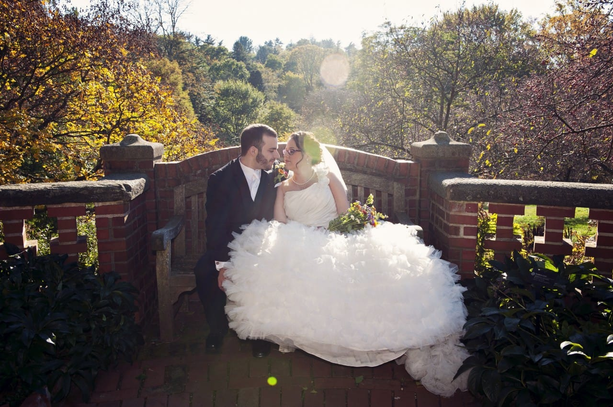

Ok one more throwback shot! Here are the trees we got married next to now, and then the day we got married there!

Ahhh, memories! Right now I’m heading out for my one of my absolute favorite festivals of the year here in Philly: Rittenhouse Row Spring Festival! I’ll report back with photos if I can manage any! Happy Saturday!
