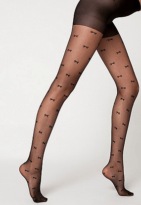
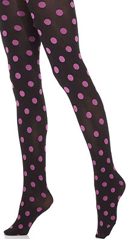

I know the warm weather is creeping up on us, but I’m still completely obsessed with tights! In fact, I have a few pairs that I received from Santa that I have been saving for the warmer weather, to pair with a fun skirt or dress. The same goes for fun leggings paired with ankle boots. Lately, I’m finding myself planning full outfits based on which tights or leggings I want to wear. Here are some amazing pairs of tights and leggings I found and really love!

[Urban Outfitters](http://www.urbanoutfitters.com/urban/index.jsp "Urban Outfitters")

is super close to my apartment (dangerously close, actually.) The amount of fun and colorful leggings there is just crazy. They have tons of tights, too! The Betsey Johnson ones above are my fave.

Another store (right next to Urban, actually) where I stock up on tights at is

[H\&M](http://www.hm.com/us/ "H\&M")

. I have several pairs of sweater tights that I wore all winter long, and now I’m ready to grab new patterned sheer tights for the summer. Since I love all things chevron, I obviously need the pair above!

I don’t typically shop at

[American Apparel](http://store.americanapparel.net/ "American Apparel")

, but I will venture in sometimes for their giant wall of tights. The ones with the little bows are totally worth it. So cute!

These Hue polka dot tights are on sale at

[Macy’s](http://www.macys.com/ "Macy's")

right now, so I may have to head over there this weekend and see if there are any pairs left in stock!

Another pair of leggings that I really love and are totally unique come from a shop on

[Etsy](https://www.etsy.com "Etsy")

called

[Lavender and Ash Leggings](https://www.etsy.com/shop/lavenderandashdesign?ref=l2-shop-info-name "Lavender and Ash Leggings on Etsy")

. They’re like ugly sweaters, with little skulls. I just ordered a pair and seriously can’t wait to get them!

Lastly, for a pop of color with an already busy dress, nothing beats the million different colored pairs of Merona opaque tights at

[Target](http://www.target.com "Target")

. I own at least 4 different colors. Maybe even 5.

If you have amazing tights or leggings that I have to try out, tell me in the comments! I’m always looking for new pairs!
