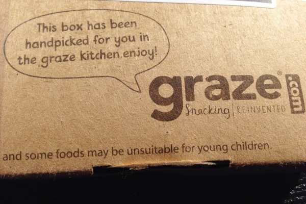
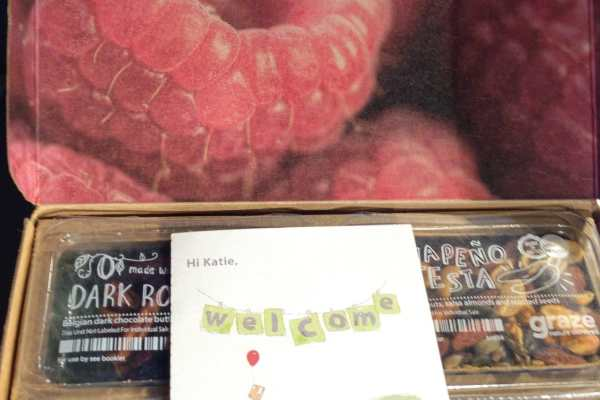
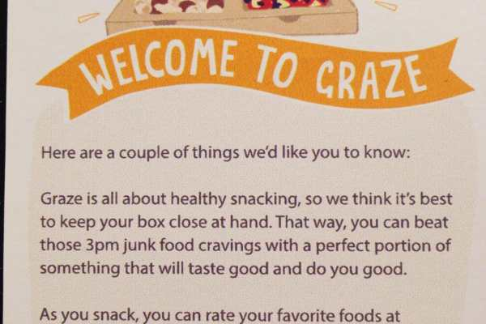
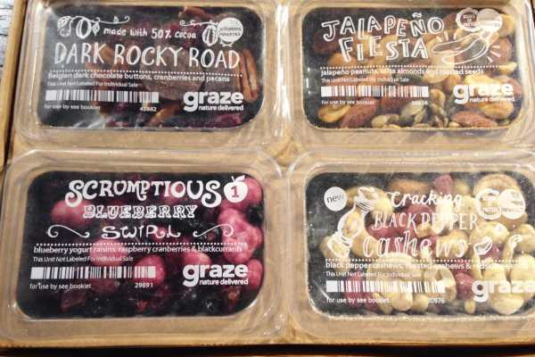
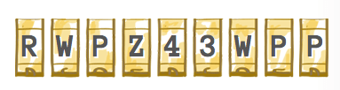

Nom nom nom! I recently signed up for a fun and delicious subscription service over at

[Graze](https://www.graze.com/us/p/RWPZ43WPU "Graze")

, where I receive a box every week with four healthy snacks based on things I want to try, like or love! Graze is marketed as ‘snacking reinvented,’ and that’s exactly what it is.

I love the idea of healthy snacking but often have a hard time doing it. If I find a snack that’s considered healthy, I tend to convince myself that eating a larger portion of it is okay since it’s good for me. I can’t cheat with Graze, since they give me only one portion of each snack at a time. Perfect! I’m currently subscribed to the “nibble box,” which sends four healthy snacks ranging from yogurt covered berries with chocolate bits to roasted and seasoned nuts and seeds, from a lot of 90 different options. To go a step further, you can order the “calorie counter box” and ensure your choices are 50-150 calories each.

Here’s what my first box looked like, and what was inside!

After receiving your box and eating up your goodies, you can log in to your account and rate them. If you hated them, trash ’em and you won’t be seeing the likes of them in your Graze box again! If you LOVED them, you’ll definitely be getting them again. Easy, right?

You also get a chance to learn about the things in your box. Included with your snacks is some nutritional information, but logging in to your account will give you even more. At a glance, you’ll notice some icons above your current snacks, letting you know what healthy category they fall in to on Graze’s site. Nifty!

Thinking about joining? You can sign up with my

[**friendcode**](https://www.graze.com/us/p/RWPZ43WPU "Graze")

and get your first (and if you decide to stick with it even longer, your fifth too!) box(es) for free! Yup, free. You lucky ducks!

Here’s my friendcode! Use it wisely!

Check out Graze on

[Facebook](https://www.facebook.com/grazeusa "Graze USA Facebook")

and learn more about them now! If you’re already a subscriber, let me know what snack I \*have\* to try next!

## Tips:

- My Favorite- Dark Rocky Road. It was to-die-for! I can’t wait to nibble it again!

* Husband’s Favorite- Jalapeno Fiesta. He would “eat it again for sure.” 😉

