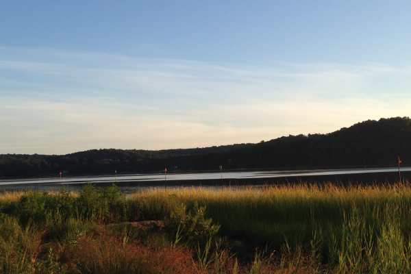
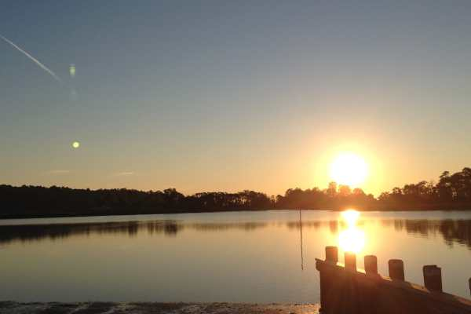
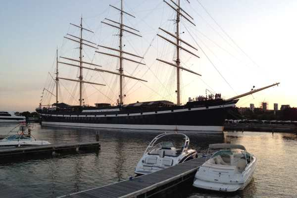
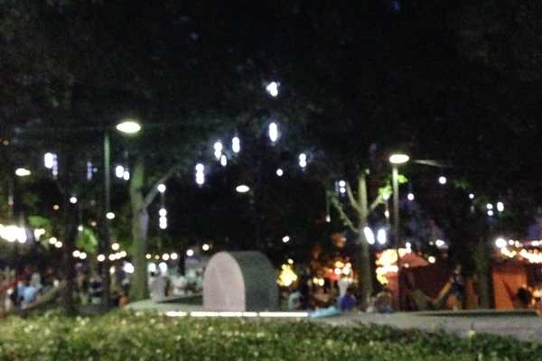
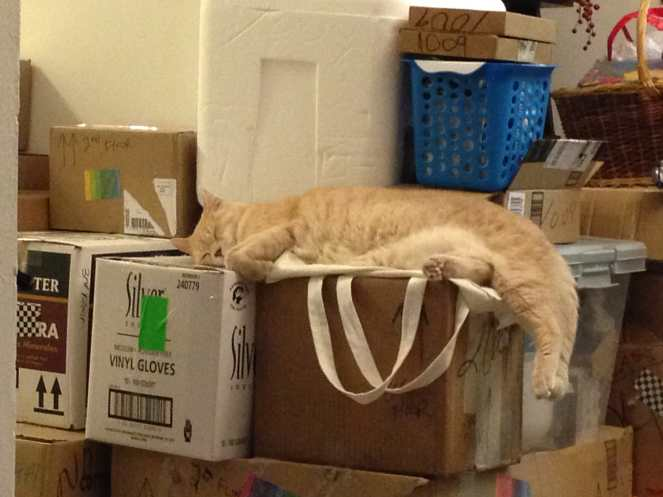

This weekend was a busy one! I can’t believe it’s already Monday- I feel like I didn’t get ANYTHING accomplished! I went to Jersey on Thursday night so that my sister, father and I could go on our annual crabbing trip on Friday, where we woke up SUPER early and sat in our tiny boat crabbing on the marina for 9 hours straight. We went home with only about 70 crabs, but we caught the two biggest crabs we EVER have in our many years of going!

I told my dad to measure the big boys, but I’m not sure if he did yet or not. They were at LEAST 7 inches across, if not more. Seriously gigantic monster crabs. I don’t eat them, and neither does my sister, so my dad is left to eating all 70 himself. He doesn’t mind, though! Plus he shares with our cat who loves them. 🙂 We had a good time, though I pulled something in my back pulling up the traps and have been pretty miserable since. The sunburn/windburn on my face and chest definitely aren’t helping, either. That’s okay, ’cause TRADITION!

Sissy came back with me to Philly late Saturday night and she, Husband and I went to

[Spruce Street Harbor Park](/spruce-street-harbor-park/ "Spruce Street Harbor Park")

. Having only gone during the day when it was totally dead, going at night on a weekend was like a whole different world! It was PACKED and all the lights on the trees and on the water twinkled all different colors. We took in the sights of the water and the boats and it was really pretty!

Between Thursday and Friday, I got to hang out with SEVEN different kitties, too! My furbabies, Lucky and Mabel; the cats we are sitting for our neighbors, Marshal, Samantha and Biggie; and my family’s cats, Spud and Porker! When we finally got back to Philly, Lucky and Mabel were extremely interested in my sister’s bag since it smelled of other kitties. Lucky tried to live inside it, even.

Lucky climbing in Jessie’s bag

Dad sharing crabs with Porker, who was very, very happy to have some.

Sunday was spent going to brunch, the bookstore, Macy’s, out for ice cream and then home to pack pack pack (which we probably only did for about 45 minutes total.) Lucky helped, of course.

Hope your weekend was eventful, too!
