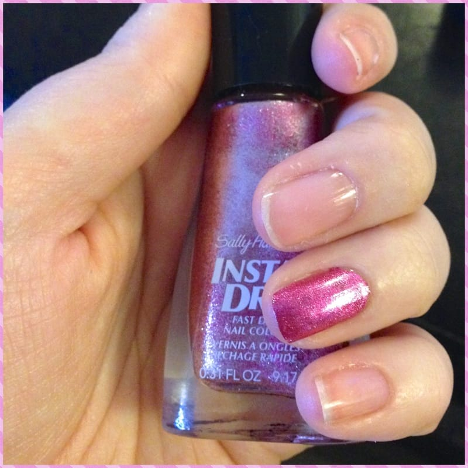
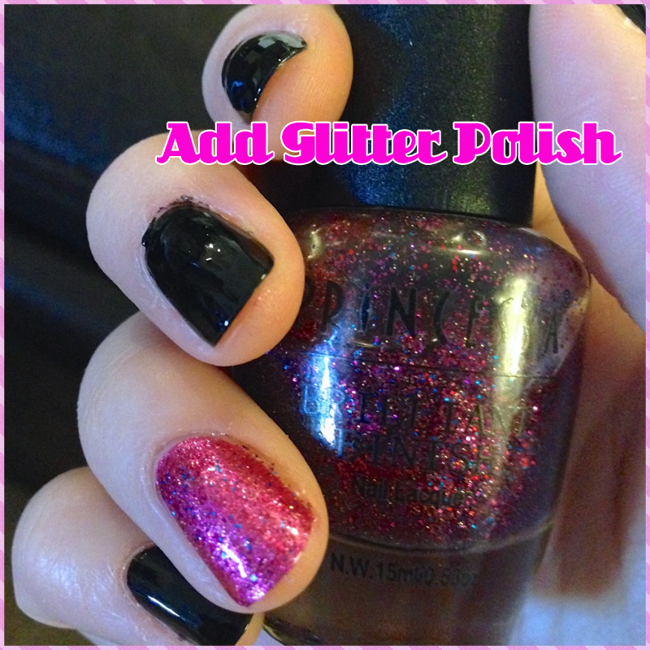

I mentioned

[last weekend](/blog/sunday-funday-issue-6/ "Sunday Funday: Issue 6")

that I was in Atlantic City for my friend’s bachelorette party! I also said that I did a fun nail design that was pretty perfect for the occasion, and that I’d share it this week! Well, here we are! Hope you like it as much as I do.

## Materials:

- Clear base and top coats (not pictured)

- Black glossy nail polish

- Pink clear-glitter nail polish

- Pink solid-sparkly nail polish (You’ll see the difference below!)

- Gold clear-glitter nail polish

## Instructions:

- After cleaning your nails, do a quick clear base coat on your nails.

- When the clear is dry, paint your ring fingers with one coat of the pink solid-sparkly nail polish. I used

  [Sally Hansen Insta-Dri in Pink Fast](http://amzn.to/1mmJPGQ "Sally Hansen Pink Fast")

  . When it’s dry, do a second coat.

- Next up, do one coat of a nice glossy black polish. My favorite is

  [Maybelline Color Show in Onyx Rush](http://amzn.to/1dIzSUb "Maybelline Color Show in Onyx Rush")

  . After the first coat is

  **totally dry**

  , do a second. Let that one dry too!

- Let all coats

  **totally 100% dry!**

  Now it’s time for glitter! Do one coat of pink clear-glitter over the pink nail.

- Pick two nails you want to also do some pink glitter on, and give it a little ombré look with ‘layers’ of glitter.

- On the remaining nails, do french tips with the gold glitter polish. Repeat glitter coats for extra sparkle!

- Finish off with a glossy clear top coat. Let dry and you’re ready to party!

I especially loved the black glossy nails with the gold glitter. It looked like I dipped them in gold foil! I will certainly be using this style again. Enjoy your hot pink and black sassy glitter bachelorette party nails!
