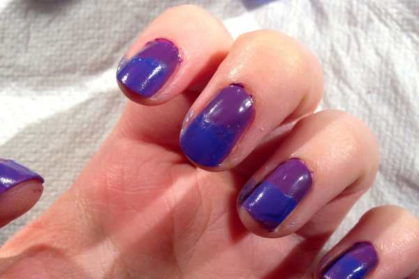
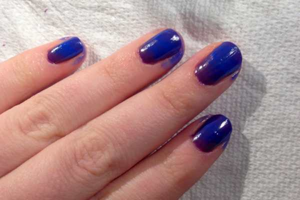
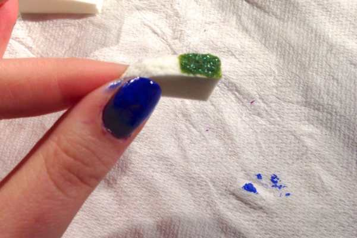
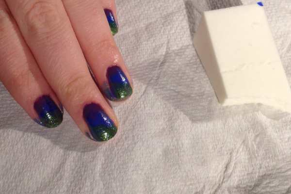
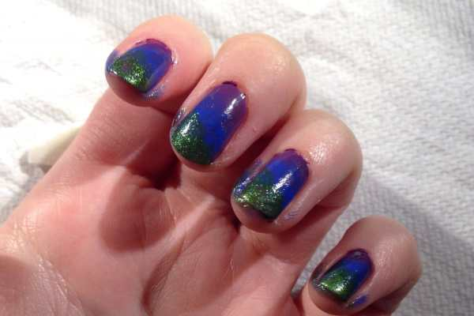
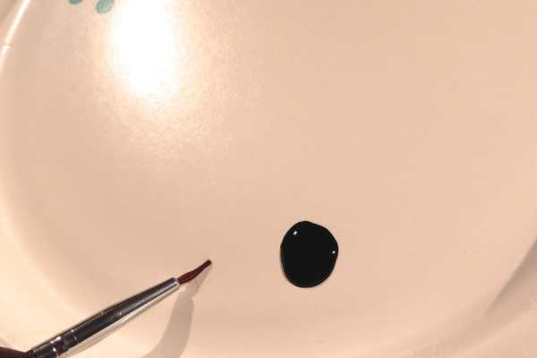
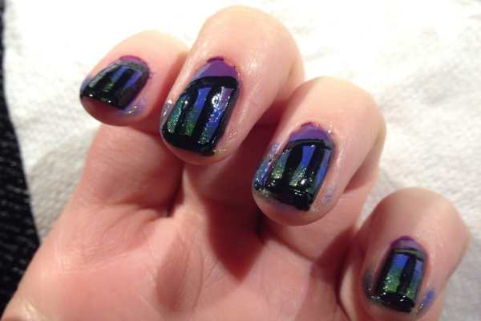
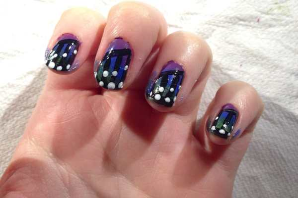
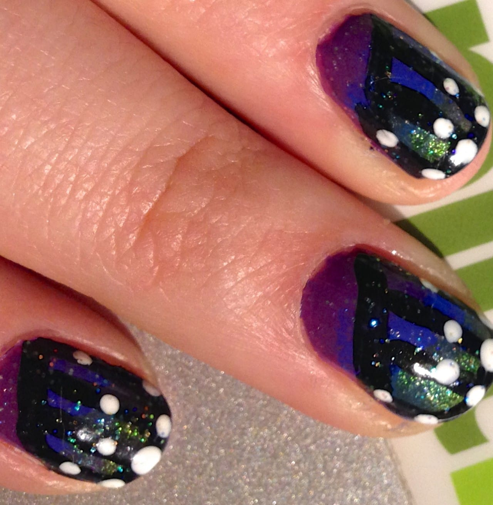

Project: Butterfly Wing Nail Art Design

A few weeks ago, I shared a nail art design I was inspired to try called

[Monarch Butterfly](/sunday-funday-issue-3/ "Sunday Funday: Issue 3")

nails! I was really psyched to try out the design so that I could wear them to the

[Philly Flower Show](/2014-philadelphia-flower-show-recap/ "2014 Philadelphia Flower Show Recap!")

and to visit the butterflies! I did just that, putting my own spin on the design to make it more abstract, and using an array of different colors.

## Materials:

- Clear base coat

- Black nail polish

- Purple nail polish

- Blue nail polish

- Green nail polish

- White nail polish

- Clear/white sparkly nail polish

- Dotting tool or toothpicks

- Nail art brush or thin small paintbrush

- Makeup sponge

If you have a glittery version of any of the above colors, feel free to use it for extra sparkle! My green polish was sparkly, too!

## Instructions:

- Shape your nails as normal, and start with a coat of clear polish. I used my

  [Nail Tek](http://amzn.to/1h4wz5g "Nail Tek")

  in lieu of top coat in this design.

- Do one coat of the purple polish on each of your nails. I used

  [NYC Expert Last Nail Polish in Pure Orchid](http://amzn.to/1f1llOw "NYC Nail Polish Pure Orchid")

  . Let dry completely. Do a second coat. Let dry! You MAY be able to get away with just one coat of purple in this layer, simply because you’re going to have other layers of other colors covering most of the purple up. Still, I didn’t like the idea of POSSIBLY seeing streaks, so I did two layers!

- Using one side of your makeup sponge, dab on some blue (I used

  [Sally Hansen Hard As Nails Xtreme Wear in Pacific Blue](http://amzn.to/1jjGyX6 "Sally Hansen Pacific Blue")

  ). You’re going to go for an ombré style, though once again, some will be covered by the other layers. Sponge paint the blue on, repeating steps until you are satisfied with the coverage. Don’t worry about the mess- this whole design is definitely a messy one!

- After the blue is all dry, you’ll move on to the green. I used

  [Confetti brand in My Favorite Martian](http://amzn.to/1h4x0wh "Confetti - My Favorite Martian ")

  . Use the other side of your makeup sponge and sponge paint on top of the blue, but not covering it all. You want to be able to see all three colors (see below).

- Once the green is dry, it’s time to do the “wing” details! As I said, I wanted it to be more abstract- the theme of the Flower Show was ARTiculture, and I wanted my nails to reflect that! People there still noticed my nails and knew they were butterfly wings though, so they weren’t so completely abstract that they were unidentifiable!

- Pour a little black nail polish on a paper plate and use your nail art brush to draw your lines. I drew a diagonal line, three to four straight lines from the diagonal to the tip of my fingernail, and then did the tips in black. Let dry.

- Next up is the white speckles on the butterfly wings. Use the large end of your dotting tool to make large spots and the small end to make some small spots on top of the black lines with your white nail polish.

- Instead of a clear top coat, use your sparkly nail polish to seal the deal and give your butterfly wings some all over glittery shine! I like Spoiled brand, color Shaken Snow Globe.

- Wait til nails are

  **110% dried**

  and then remove the excess polish from your skin! ENJOY!

Extreme close up!

Hope you liked my butterfly wing nail design! If you use it, let me know in the comments! I’d love to hear how it turns out for you! Happy Saturday! 🙂
