Last week was the Philly Flower Show, my favorite event of the year! I had grand plans of doing a fancy ombré look on my nails, but it was just NOT working out! Then I thought I’d make these tiny roses I made once before but my white polish got all sticky over time and didn’t work out either. Instead, I made little flowers that are super textured and abstract-y, which came out pretty cute for the Flower Show!

> So it’s not my best nail art of all time- that’s okay! I’m allowed a few mishaps, right? I’ve learned my lesson now on using polish that is too old, and have thrown that bottle away! In the future, I’ll make sure all my materials are fresh and able to be used.

If you want to learn how to make this design, but with your own touches to make it prettier, you can get the gist of it below!

## Materials:

- Yellow nail polish

- White nail polish

- Coral nail polish

- Teal nail polish

- Mint nail polish

- Clear top coat

- Dotting tool or toothpick

## Instructions:

- Starting with clean dry nails, do a coat of yellow and let dry.

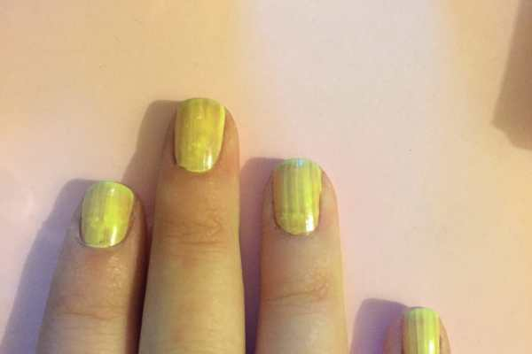

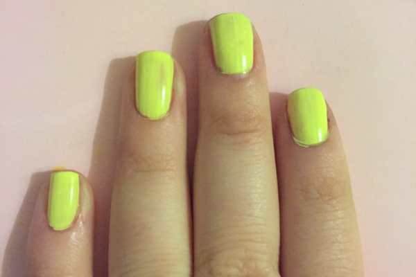

- You may need to do a second (or third, as I did!) coat of yellow if it’s not opaque enough yet. That happens with lighter shades sometimes.

* When the yellow is all dry, put a dot of teal (the leaves!) randomly on all your fingers except your thumbs. For your thumbs, draw out and elongate the leaf more (as pictured below)

- On top of the teal dots, put a tiny dot of mint green, and swirl it in to the teal while it’s still wet. Use the dotting tool or a toothpick to swirl it. Add a little mint green to the dotting tool to create a few little lines on the thumb’s leaves as well.

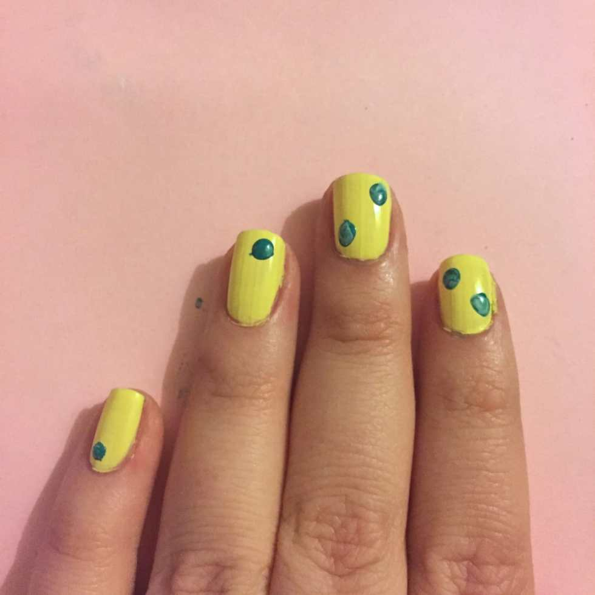

- Put white spots on all your nails where you want your pink flowers to go.

- Go back on top of all the white spots while still wet, and put a dab of pink on top. Immediately swirl with a clean dotting tool. If your polish isn’t old and sticky like my white is, it will swirl and make pretty little roses!

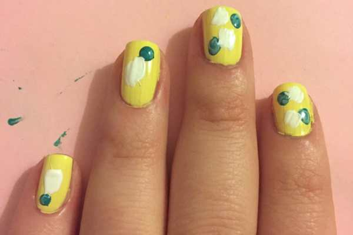

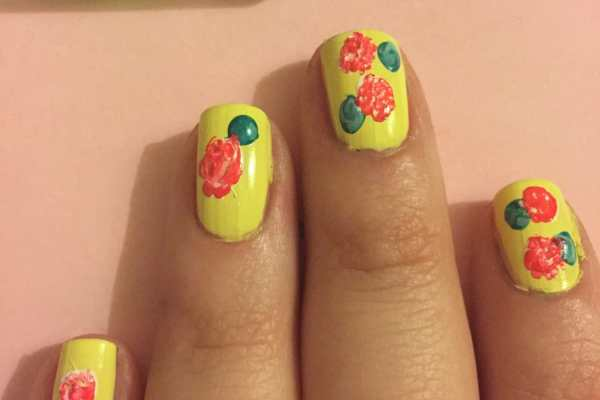

- For the thumbs, I painted some larger “petals” first in pink to see where I wanted them to go, then I covered the space with white and then pink on top of that. Then I swirled it a little.

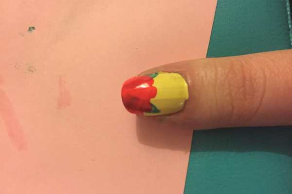

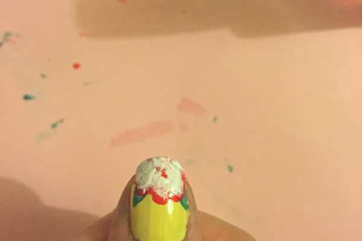

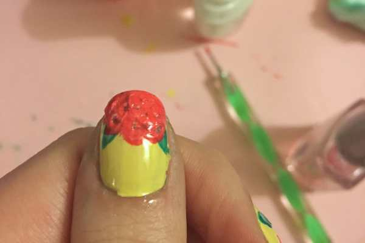

- I went back over all the nails with the dotting tool and pressed gently many times on each flower. If they weren’t going to swirl the way I wanted them to, they were at least going to be super texture-y, damnit!

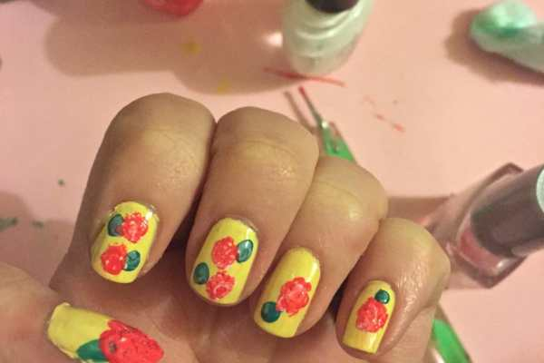

- I sealed them all with a top coat and when it was still drying, I made a little more texture with the tool again.

Am I in love with these nails? Not particularly. Do I hate them? Nope! I think they were a cute look for the Flower Show. They look pretty good next to some of the tulips there, don’t they?

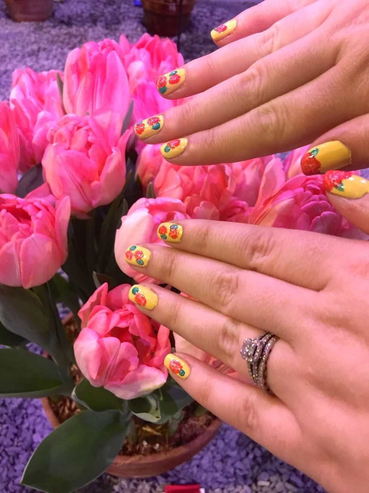

By the way, this is how they were SUPPOSED to look, as they did the first time I did them a long time ago! Aren’t they pretty!?

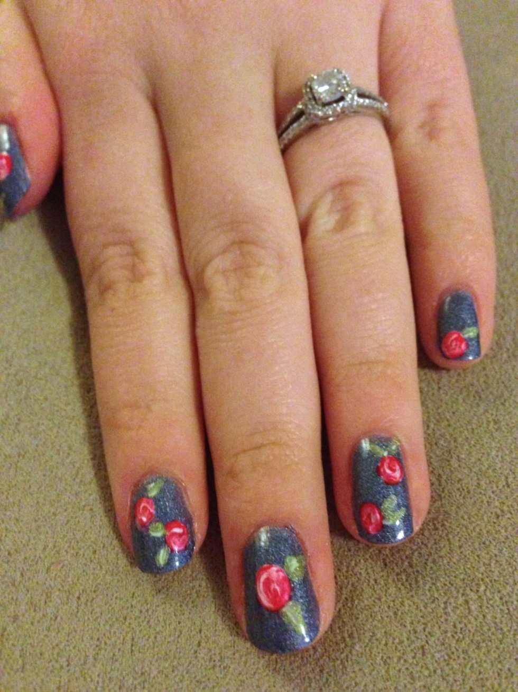

Any way, hope you find this tutorial useful! If you follow it up to the point of swirling the colors together (and your polish isn’t old and sticky), you’ll end up with a look like the one above. If you prefer texture, you can use the dotting tool to create it. No matter what you do, have fun with it!

Happy Manicure Monday!
