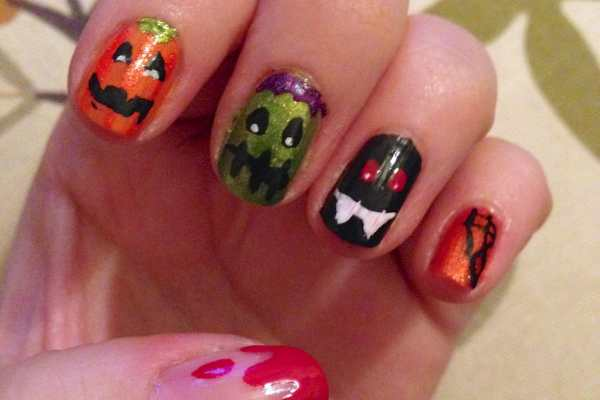
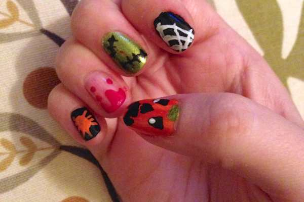
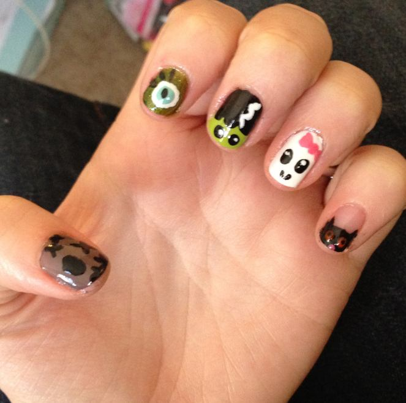

Yay! Halloween is almost here! Since the evening of Halloween I will be sporting a plain manicure to go with my costume (I’m dressing up as

_Blair Waldorf_

and Husband will be

_Chuck Bass_

. <3

_Gossip Girl_

<3 ), I decided to do my Halloween design early this year! Just like last year, I couldn’t decide on just one look and so I painted each of my nails a little differently. They all turned out pretty cute!

My nail art dotting tools, brushes and such are still packed away in a box, probably never to be discovered again (ugh, I hope that isn’t true!), and since I was painting these on the third floor of the house and the toothpicks were all the way in a cabinet on the first floor, I decided I would be lazy and use neither to make cleaner/crisper designs. I just winged it! Some came out perfectly fine with this method, and others definitely would have benefited from the tools. I’ll leave it up to you to decide what to use on yourself!

These nails may LOOK super involved and time consuming, but they were actually quite quick! I did them all from start to finish while watching one TV show! Here’s what you need to complete the looks.

## Materials:

- Clear base coat/top coat

- Light orange nail polish

- Dark orange nail polish (in sparkly, if possible!)

- Black nail polish

- Green sparkly nail polish

- Red nail polish

- White striper

- Purple sparkly striper

## Instructions:

Since there are quite a few different designs here, I’ll keep the instructions brief. Consider them more a set of “guidelines” as you paint your nails!

- With clean dry nails, paint everything with a clear base coat and let it dry.

- Pick which nails will be which color, and do one coat of that on specified nails. The nail with the blood drip will remain clear, so do a second coat of clear on that one during this round.

- Go back and do a second coat on all nails (minus the blood drip one).

- Since the blood drip one’s base will be dry first, you can begin with this/these nail(s). Make a red french tip with the polish and pull it down to look like messy blood. A couple of drops will make it look like it’s dripping! Easy peasy. Let dry.

- Whichever nails are to be used as pumpkins, you can use the opposite orange to make pumpkin stripes. Example: If you painted your nails with the darker orange as the base coat, use the lighter orange to make subtle vertical stripes. Let dry.

- For the Frankenstein, bat and pumpkin faces, when the nails are dry, just use your polish in the coordinating shades to paint on little faces, teeth, stitches, hair, etc. Let dry and put a tiny dot of white in the eyes.

- Stitching is just an imperfect line with more imperfect lines across it! You want it to look kind of messy- it’s spookier that way!

- The spiderwebs are simply three semi circles starting at the corner of the nail going outward, and then lines connecting them all to mimic a web.

- The spider is just a drop of paint and then little legs pulled out of that drop.

- When all are dry, finish them with top coat and let dry all the way while you watch more terrible TV. Done!

And here is last year’s design, in case you were curious! It was inspired by a tutorial I saw from

[_IHaveACupcake on YouTube_](https://www.youtube.com/watch?v=AGPQGATVagE "IHaveACupcake on YouTube")

! Check her out!

What designs will you do this Halloween? Which was your favorite?
